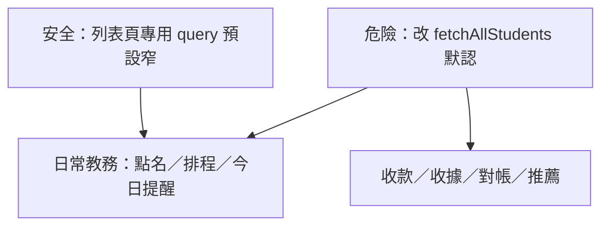

# 對抗性檢查：軟封存計劃（archive_cold_data）

> 日期：2026-08-01  
> 對象：`~/.cursor/plans/archive_cold_data_3e9934eb.plan.md`  
> 方法：對照計劃 × 實際日常流程程式路徑（學生／班別／排程／點名／繳費／請假／Inbox／對帳／前台／報表）  
> 結論先行：**方案可做，但若改錯共用 `fetchAllStudents`／`fetchAllClasses` 默認語意，日常運作會大面積受傷。**

---

## 總判

| 問題 | 判定 |
| --- | --- |
| 軟封存方向（唔刪、預設少 load、已畢業≠停補） | **通過** |
| 雙層窗（教務 vs 財務） | **通過**；對抗後更必要 |
| 對日常運作影響 | **有條件：低～中**（正確實作）／**高**（錯誤實作） |
| 最大對抗風險 | 把過濾塞進**共用 list helper**，令收款、學號、親屬、推薦人、深連結全滅 |

---

## 日常運作影響（按流程）

假設：**正確實作**＝只收窄「列表／瀏覽預設」；`getById`、點名 roster、已知 `studentId` 深連結、收款預選、財務匯出 **必須 bypass**。

| 日常流程 | 正確實作下影響 | 錯誤實作（共用 helper 默認過濾） |
| --- | --- | --- |
| 今日排程／點名 | **幾乎無感**（已有日期窗） | 舊堂／已畢業仍在冊可能撈唔到 → **高** |
| 明日提醒／WhatsApp | **低**（日期窗） | 聯絡人 lookup 被濾 → 提醒缺人 |
| 學生管理列表 | **正面**（更清） | 「顯示已畢業」失效 |
| 班別管理 | **低～正面**（本已偏今學年） | 舊班深連結／轉班失敗 |
| 收款登記 | **低**（若 picker 含搜尋已畢業／URL `studentId` 用 getById） | **高**：舊生收款頁空白 |
| 繳費紀錄／作廢／重印 | **低**（單據 id／合規窗） | **高**：舊單「消失」 |
| 請假／補堂 | **低～中**（待處理保留；舊未完結必須仍見） | **高**：長年未補堂被藏 → 假陽性對帳 |
| 前台報讀／學號 | **低**（選班偏今學年好） | **高**：學號撞已畢業生 max code |
| 一對一 | **低～中** | 舊年仍有未來堂嘅班被藏 |
| 堂數對帳 | **中正面**（減噪音）；要標「營運窗」 | 數字靜默變靚 → 管理誤判 |
| Inbox | **正面**（短窗本意） | 若蓋過管理頁增退窗 → audit 斷 |
| Mgmt 報表 | **中**（KPI 要標範圍） | 欠費／缺口靜默下降 |

**一句：** 對「今日教書、點名、收而家學費」影響可以好細；對「搵舊單、舊補堂、舊生收款、學號、親屬／推薦人」若唔開 bypass，就會傷日常。

---

## 對抗情境（按嚴重度）

### P0 — 實作紅線（必須寫死）

1. **唔好改 `fetchAllStudents()`／`fetchAllClasses()` 默認＝已過濾**  
   而家被收款、親屬、推薦人、前台學號、班別加生、宣傳配對共用。一改默認＝多條日常斷。  
   **要：** 新 API 如 `fetchStudentsForOpsList({ includeGraduated })`；舊 helper 保持「可全量／顯式參數」。

2. **學號生成唔可以只睇過濾後列表**  
   對抗：已畢業生握住最大 `student_code` → 新碼碰撞。  
   **要：** `nextStudentCode` 仍掃全庫（或 DB sequence／max 含已畢業）。

3. **深連結／已知 id 必須可讀**  
   `/Students/:id`、`/Payments?studentId=`、`getPaymentFull(id)`、`getClassById`、點名紙舊日。  
   對抗：舊收據開收款頁 → 學生揀唔到。

4. **禁止用「非活躍／非在讀／兩年無紀錄」自動當封存**  
   對抗：中一停、中五返仍係 `中學階段` → 被藏，違反你已定業務。

### P1 — 高機會踩雷

5. **未完成補堂／請假** 若跟「營運窗」一刀切，舊年未清個案從請假管理消失 → 堂數對帳變假綠。  
   **要：** 待處理／未完成狀態 **豁免年份窗**（或「待處理不限年＋已完成跟窗」）。

6. **收款／月費／推薦人／親屬 picker** 要能搜已畢業（或「包含舊生」），唔係淨列表隱藏。

7. **Portal 申請列表 join 學生** 唔可以因預設過濾變 `—`。

8. **宣傳配對** 已自濾已畢業；唔好再令上游 `fetchAllStudents` 連 `中學階段` 舊生都冇。

9. **一對一舊年班但仍有未來堂** — 班別歸年 ≠ 無未來課；列表過濾要以「仍有未來排程／就讀中」優先於純學年窗。

10. **Dashboard／對帳數字** 收窄後必須標「範圍：近兩學年／未含已畢業」，否則對抗成功條件＝管理層以為欠費沒了。

### P2 — 可接受摩擦

11. 行政第一次搵唔到舊生 → 靠頂欄「已隱藏 N｜顯示」＋通告。  
12. 繳費史 label 缺名（列仍在）→ picker／getById 補名。  
13. 行銷要舊生 → 匯出入口，唔靠教務列表。

---

## 對計劃嘅強制修補（對抗後）

寫入實作前必須遵守：

1. **Scoped list ≠ shared fetch 默認**  
2. **狀態豁免**：`pending` 請假／待補、pending 繳費、pending 推薦回贈 — 預設仍可見（可另標「跨年未清」）  
3. **學號／max code 全庫**  
4. **URL／id 路徑 bypass**  
5. **數字頁標範圍**（對帳、Mgmt KPI）  
6. **Feature flag** 可一鍵關過濾  

計劃原文「列表預設排除已畢業」仍然啱；對抗補充嘅係 **唔好落錯層**。

---

## 日常運作：幾時「幾乎無感」、幾時「要改習慣」

| 角色日常 | 預期 |
| --- | --- |
| 老師點名／睇自己班／請假（當期） | 幾乎無感，可能更快 |
| 行政收本期學費、加今學年報讀 | 幾乎無感 |
| 行政處理跨年未清補堂／舊單 dispute | **要改習慣**：開「包含更舊／已畢業」或走單據連結；若未做豁免會痛 |
| 結業季大量標已畢業 | 要 Confirm＋警示；列表突然短一截＝預期 |
| Christine／管理睇總覽 | 數字可能變（範圍收窄）；要文案，唔係 silently |

---

## 裁決

- **方案通過對抗性檢查的前提：** 實作紅線（P0）全部遵守。  
- **對日常運作：** 教務主路徑可受惠且低干擾；風險集中喺「共用 fetch、未清跨年個案、學號、收款深連結」。  
- **唔建議**未寫紅線就開工改 `fetchAllStudents`。  

相關計劃：[`archive_cold_data_3e9934eb.plan.md`](/Users/hoiyingfan/.cursor/plans/archive_cold_data_3e9934eb.plan.md)
