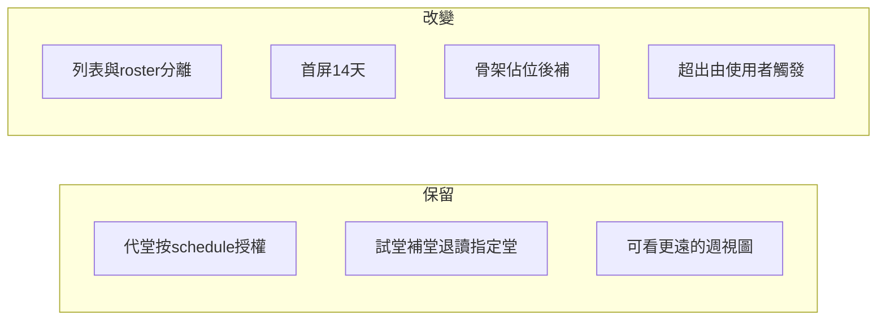

# 日常載入優化計畫（骨架＋按需＋保留設計意圖）

> 狀態：待確認後實作  
> 日期：2026-07-22

## 已確認的產品決策

| 頁面 | 決策 |
|------|------|
| 老師首頁 | 骨架先出；**今日優先**；**預設近 14 天**；更遠用箭咀／按鈕加載（可邊界 prefetch） |
| 排程管理 | 先顯示日期／班名／老師／時間；人數／badge **skeleton**；換區間 **保留舊列半透明**（stale-while-revalidate） |
| 權限／特殊學生 | **保留** roster RPC（代堂按堂授權、試堂／補堂／退讀日／指定堂次） |
| 未知 ≠ 0 | roster 未齊時人數欄／badge 用佔位符，禁止顯示「0 人」或空標記以免誤判 |

本計畫範圍鎖定 **P0：共用資料層 + 老師首頁 + 老師時間表 + 排程管理**。  
MgmtDashboard／LessonBalanceMismatch／班別詳情全歷史等列為 **P1 以後**，避免一次改爆回歸面。

---

## 設計意圖（改慢時必須守住）

- **大區間一次撈**：原意是翻週不重打 API → 改成「14 天內流暢 + 邊界明示加載」，仍可看更遠。
- **Roster 綁排程**：原意是老師 RLS 下仍能安全拿特殊學生 → 改成「需要人數／badge／點名時才打」，不是刪除。
- **重複 RPC**：多半是漏傳 context → 同一輪資料必須重用。

---

## Phase 0 — 服務層解耦（所有頁的地基）

檔案：`src/services/scheduleQueries.ts`、`src/services/attendanceQueries.ts`

1. **`fetchSchedulesInRange` 只撈排程列**
   - 不再內部呼叫 `WithRosterContext`。
   - `enrollCount` 暫定未知；呼叫端用 `rosterReady` 區分「未知」與「真的 0 人」。

2. **保留 `fetchSchedulesInRangeWithRosterContext`**
   - 給真正需要整段 context 的路徑；或改為「先 rows，再 optional 第二步補 roster」。

3. **輕量 enrich**
   - 列表班名以 `SCHEDULE_MANAGE_SELECT` 既有 join（classes／teachers）為準，避免為班名打 roster。

4. **`findSchedulesMissingAttendance(schedules, rosterContext?)`**
   - 可傳入既有 context；省略才自行打 RPC。

5. **呼叫點普查**（改完必過）：
   `TeacherTimetable`、`leaveQueries.fetchMakeupCandidateSchedules`、`teacherLeaveWizardQueries`、`lessonReminderQueries`、`TomorrowReminders` 等——確認要的是「列」還是「列+roster」。

**回歸守門：** 代堂老師仍只能經 roster 看獲授權堂次名單；混入無權 `schedule_id` 仍整次拒絕。

---

## Phase 1 — 老師首頁骨架 + 14 天 + 加載更多

檔案：`src/components/home/TeacherHomeView.tsx`、必要時 `TeacherWeekTimetable.tsx`

1. **常數**
   - 首屏：近 **14 天**（對齊產品決策）。
   - 每次加載：例如再 +14／−14 天。

2. **載入順序（骨架＋今日優先）**
   - 立刻：版面骨架、問候、今日／週視圖 skeleton。
   - 第一輪並行：今日堂次列 → 立刻填今日卡；近 14 天其餘列；輕量依老師撈班別。
   - 第二輪（不擋首屏）：今日＋未點名候選的 roster／alerts（重用 context）。
   - 請假／試堂列表：可第三輪。
   - 換週／加載：保留已載列，半透明或局部 skeleton，勿整頁清空。

3. **週視圖超出 14 天**
   - 左／右箭在資料邊界時：顯示「載入更早／更晚課堂」或等效提示，觸發 merge。
   - **禁止**回到一次撈 126 天。

4. **過去未點名**
   - 與週視圖窗口分離；獨立小查詢，勿為未點名把首屏窗口拉大。

---

## Phase 2 — 老師時間表同樣模型

檔案：`src/pages/TeacherTimetable.tsx`

- 拿掉 ±120 天一次載入。
- 與首頁一致：首屏約 14 天，翻出邊界再載。
- 日曆事件範圍與排程窗口對齊。

---

## Phase 3 — 排程管理：基本列先出 + 佔位符後補

檔案：`src/components/schedule/ScheduleManagePage.tsx`

1. **`reload` 兩段式 + stale-while-revalidate**
   - 換 `displayStart`：先保留舊列（半透明／`isStale`），並行撈新區間；新列到齊再替換。
   - 段 A：`fetchSchedulesInRange` + classrooms → 表格可互動。
   - 段 B：roster → 補 `enrollCount`、alerts；期間 `rosterLoading=true`。

2. **UI**
   - 報讀人數／badge：`rosterLoading` 時 skeleton，**不要顯示 0**（避免誤判未報讀）。
   - 篩選「未有學生報讀」：載入中禁用或提示「人數載入中」。
   - 狀態提示：「課堂已載入 · 標記載入中…」

3. **既有優點保留**
   - alerts／點名資格重用同一份 `rosterContext`。
   - `RANGE_DAYS = 14` 維持。

---

## 明確不做（本計畫）

- 刪除或繞過 `get_teacher_schedule_roster_context`
- 放寬老師對 `students`／`enrollments` 的基礎 RLS
- MgmtDashboard／堂數誤配全表掃描（另開 P1）
- ClassDetail／TeacherDetail 全歷史一次改完（另開 P1）

---

## 驗證清單

**老師帳**

- [ ] 首頁：骨架 → 近 14 天堂次 → badge／未點名後補
- [ ] 週視圖超出後按「載入」才有更遠堂次
- [ ] 代堂／試堂／補堂／退讀日語意正確
- [ ] 時間表頁不再一次打 240 天

**行政帳**

- [ ] 排程管理：列先出；人數／badge 為 skeleton 再變真值
- [ ] 載入中不會把「未知」當成「0 人」而誤篩
- [ ] 日視圖／展開點名／代堂指派回歸通過

**技術**

- [ ] `fetchSchedulesInRange` 呼叫端無意外依賴 roster
- [ ] Network：首屏無「全區間 roster × 多輪」
- [ ] `npm run build` + 相關 test

---

## 建議實作順序

1. Phase 0（解耦 + attendance context）
2. Phase 3（排程管理兩段式 + skeleton）
3. Phase 1（老師首頁）
4. Phase 2（時間表）

順序理由：先修資料層；排程管理先驗證「列／roster 分離 + skeleton」模式，再複製到首頁。
