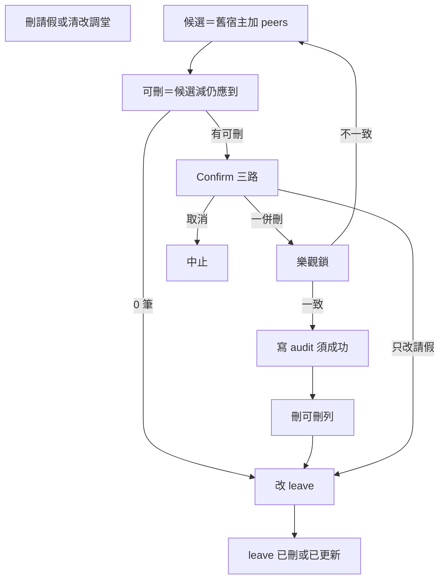

# 生命週期孤兒：明學操作方案

> 狀態：`A1 已落 code` · `A2 計劃定案可開工`（見 a2-kickoff 定案版；尚未寫 A2 code）  
> 日期：2026-07-31  
> 分題：[`docs/backlog/lifecycle-orphans.md`](../backlog/lifecycle-orphans.md)  
> 索引：[`docs/BACKLOG.md`](../BACKLOG.md)  
> 暫存實作（勿當已上線）：git branch `wip/lifecycle-orphans-impl`；另見 [`patches/`](./patches/README.md)  
> 外部審閱：[`review.md`](./2026-07-31-lifecycle-orphans-review.md)（#01）· [`review-02.md`](./2026-07-31-lifecycle-orphans-review-02.md)（#02）· [`review-03.md`](./2026-07-31-lifecycle-orphans-review-03.md)（#03）· [`review-04.md`](./2026-07-31-lifecycle-orphans-review-04.md)（#04；第一性）  
> 實作前對抗模擬：[`adversarial-sim.md`](./2026-07-31-lifecycle-orphans-adversarial-sim.md)（#01）· [`adversarial-sim-02.md`](./2026-07-31-lifecycle-orphans-adversarial-sim-02.md)（#02；A1／A2 切分後）  
> 第一性檢查：[`first-principles.md`](./2026-07-31-lifecycle-orphans-first-principles.md)  
> A2 開工說明（**定案版**，#05／#06）：[`a2-kickoff.md`](./2026-07-31-lifecycle-orphans-a2-kickoff.md)  
> 審閱 #05／#06：[`review-05`](./2026-07-31-lifecycle-orphans-review-05.md) · [`review-06`](./2026-07-31-lifecycle-orphans-review-06.md)  
> SELF 對抗：[`a2-adversarial-self`](./2026-07-31-lifecycle-orphans-a2-adversarial-self.md)

本檔＝操作／實作方案（含操作模擬）。A1 已落 code；**A2 依 kickoff 定案版實作**（先 A2a 再 A2b）。

---

## 審閱定案（2026-07-31 外部顧問）

### 審閱 #04（第一性檢查）— 全採納

對 [`2026-07-31-lifecycle-orphans-review-04.md`](./2026-07-31-lifecycle-orphans-review-04.md)／[`first-principles.md`](./2026-07-31-lifecycle-orphans-first-principles.md)：

| ID | 定案 |
| --- | --- |
| **FP-5 P0** | 階段 A 切 **A1（先上）／A2（隨後）**，見下節 |
| FP-1 | 保留三路；取消請假**預設＝一併刪**；「保留」加 ⚠️、二次 Confirm 或須選原因「學生確實出席」 |
| FP-2 | A1 驗收含 **production 現有孤兒已人工／腳本清**（與 code 分開）；O2 可過渡（mgmtRole＋audit service），RPC 後替換 |
| FP-3 | O6／上線說明寫明覆蓋範圍；**不改**計費白名單 |
| FP-4 | 維持 O1 路徑近似／O5 完整定義 |
| FP-6 | 老師失敗＋O6 SOP（轉行政請假管理） |
| FP-7 | 硬刪 Accept；計費列一併刪鍵文案強化；可選姓氏 `confirmInput` |

三題直答定案：保留不拿掉但降級摩擦；**可開工 A1**；最小驗收＝V1／V2／V3（見「驗收」）。

### 階段 A1／A2 切分（#04 P0）

**A1（必做，先上）** — 單獨可解林藝涵主路徑：

| ID | 內容 |
| --- | --- |
| **O1-audit** | 會拋錯的 audit；刪出席前置 |
| **O1** | 攔截 delete／update（清／改 `makeup_schedule_id`）；peers＋eligibility；三路 Confirm（預設一併刪＋保留摩擦）；樂觀鎖；執行序完整 |
| **O6** | 文件：取消路徑、覆蓋範圍（FP-3）、老師 SOP（FP-6）、勿硬刪已點名排程；**A1 未覆蓋 disposition 旁路**（用補課安排／詳情改類型）；**A1 期間勿開著點名紙未存時清該堂調堂** |
| **現況清** | 驗收：production 已知孤兒已人工清；runbook 須對照 eligibility，勿只憑「點名紙無名」刪 |

**A2（隨後；#05／#06 定案拆批）** — 細節以 [`a2-kickoff.md`](./2026-07-31-lifecycle-orphans-a2-kickoff.md) 為準：

| 批次 | ID | 內容 |
| --- | --- | --- |
| **A2a** | **GAP-P0-1** | eligibility：`otherMakeup` 排除目標 schedule 已取消／完成 |
| **A2a** | **O1-type** | disposition ≠ 調堂且 schedule 仍在 ≡ 清調堂；刪出席**先於** credit；强制清 schedule／對齊 type |
| **A2a** | **O1-rollcall** | Panel 重拉名冊＋`saveAttendanceStatus` 名冊檢查；只防寫回 |
| **A2a** | **O1t** | 試堂取消／刪／改期；强制一併刪；無保留路 |
| **A2b** | **O2** | admin＋alien 單列刪；主入口學生詳情出席區；過渡 mgmtRole＋audit |

### 審閱 #03 三題直答（對抗模擬評估）

對 [`2026-07-31-lifecycle-orphans-review-03.md`](./2026-07-31-lifecycle-orphans-review-03.md)：

| # | 問題 | 定案 |
| --- | --- | --- |
| 1 | ADV-P0-1 補 `otherMakeup`？ | **同意**。保留列＝enrollment ∪ activeTrial ∪ **otherMakeup**（同生其他 leave，排除本筆；`makeup_schedule_id` 非 null 且狀態非放棄／流失類）。Confirm 只列可刪列；可刪為空則只改 leave |
| 2 | ADV-P1-7 升 P0？ | **同意升 P0**；實作排入 **A2（O1-type）**（#04 切分；A1 期間旁路已知） |
| 3 | ADV-P1-6 點名寫回？ | **A2（O1-rollcall）**：存檔前重拉名冊，只 upsert 名冊內 |

另採納 #03：ADV-P1-1～4 寫入實作規範；ADV-P1-5／P1-8 寫入已知限制；S9 以 A2 修為準。

### 審閱 #02 三題直答

對 [`2026-07-31-lifecycle-orphans-review-02.md`](./2026-07-31-lifecycle-orphans-review-02.md)：

| # | 問題 | 定案 |
| --- | --- | --- |
| 1 | 新增 `O1-audit`？ | **同意**。A1 前置；未完成前不得刪 `attendance_details` |
| 2 | O1t 執行順序／改期 peers？ | **與 O1 同序**；實作在 **A2** |
| 3 | `schedule_id IS NULL` 階段 A–B 已知限制？ | **接受** |

### 審閱 #01 六題直答

對 [`2026-07-31-lifecycle-orphans-review.md`](./2026-07-31-lifecycle-orphans-review.md)。方向維持。

| # | 問題 | 定案 |
| --- | --- | --- |
| 1 | `updateLeaveMakeupRecord` 三種 `makeup_schedule_id` | 見「O1 變更矩陣」；type／disposition → **A2** |
| 2 | 執行順序 | 掃描 → Confirm → 樂觀鎖 → **audit（失敗中止）** → **刪 attendance** → **最後**改 leave |
| 3／6 | `updated_at` | 樂觀鎖用 DB **原字串**，禁 JS 重 format |
| 4 | O2 權限 | 目標 RPC＋角色表；**過渡**見 A2（#04 修訂 #01「未就緒不開」） |
| 5 | 試堂 | lightweight；**A2** |

### O1 可刪列（ADV-P0-1，定案）

```
peers = oldMakeupScheduleId ∪ same consecutive_group_id
候選列 = attendance_details WHERE student_id AND schedule_id IN peers
otherMakeup = 同生其他 leave_makeup_records
  （排除本筆；makeup_schedule_id IS NOT NULL；status 非放棄／流失等終態）
保留 schedule =
  變更後仍可見之 enrollment 應到
  ∪ active trial
  ∪ otherMakeup.makeup_schedule_id（及其 peers 若該 makeup 綁連堂）
可刪列 = 候選列 − 出席.schedule_id ∈ 保留 schedule
Confirm 只列可刪列
若可刪列為空 → 不刪出席，只改／刪 leave（可提示「因仍有報讀／試堂／其他調堂而保留出席」）
```

### O1 變更矩陣（`makeup_schedule_id`／類型）

```
prev = leave.makeup_schedule_id
next = patch.makeup_schedule_id   // undefined = 本 patch 不改此欄
prevType = leave.makeup_type
nextType = patch.makeup_type

if forDelete:
  scan → 可刪列(peers(prev)) if prev
else if nextType 從「調堂」變為非「調堂」且 prev != null:
  // ADV-P1-7 → A2（O1-type）；等同清調堂；强制 next schedule/date = null
  scan → 可刪列(peers(prev)) → Confirm
  patch 必須帶 makeup_schedule_id=null, makeup_date=null
else if next === undefined:
  no scan   // 只改 status／remarks 等
else if prev == null && next != null:
  no scan   // 首次綁調堂
else if prev != null && next == null:
  scan → 可刪列(peers(prev)) → Confirm
else if prev != null && next != null && next !== prev:
  scan → 可刪列(peers(prev)) → Confirm（建議刪舊，避免雙計）
```

`setLeaveTuitionDisposition`／列表改 disposition 若導致不再是「調堂」且仍有 `makeup_schedule_id`，必須走同一清調堂路徑（**A2 O1-type**）。  
詳情存檔／MakeupCell 改離調堂時現況已清 schedule → **走 A1** `next==null` 掃描（sim-02 POST04-P1-1）。

### 對抗模擬 #02 補丁（A1／A2 後；無新 P0）

見 [`adversarial-sim-02.md`](./2026-07-31-lifecycle-orphans-adversarial-sim-02.md)。已採納寫入：Confirm tone／二次取消語意、O1-type 旁路收窄、現況清 eligibility、A1 點名紀律。可選（不擋）：disposition 旁路提前併入 A1。

### Confirm UX（#04 FP-1／FP-7；sim-02 POST04-P1-2）

- **確認（預設鍵）**＝刪請假／清調堂 **並刪**可刪列  
  - `tone: destructive`；可刪列含任一計費 status → 鍵文案「⚠️ 刪除計費出席（影響已上堂數）」  
  - 可選：計費列 ≥ N 時 `confirmInput` 學生姓氏（只鎖確認鍵；**不**鎖保留鍵）  
- **替代**＝「⚠️ 保留出席（將脫離資格，仍計入已上堂數）」  
  - `alternateTone: default`（或 warning），**勿**用預設 destructive（避免保留看起來比刪除更危險）  
  - → **二次 Confirm**（或須選原因「學生確實出席」）；二次取消＝**整筆中止**（不改 leave），不是退回一併刪  
- **取消**＝整筆中止  
- 退讀（O4）：預設鍵＝保留出席（與取消請假相反）

### 完整執行順序（定案）

```
1. scan → 可刪列（eligibility 過濾）
2. 可刪列空 → 跳至 6（刪請假仍可有一般 Confirm；可提示保留原因）
3. Confirm（預設一併刪；保留需摩擦）；文案列可刪列；計費列才強調已上堂數
4. 取消 → abort；保留出席（過摩擦後）→ 跳至 6；一併刪 → 5
5. 逐筆：樂觀鎖 (id, status, updated_at 原字串)
   → 不一致則重掃重 Confirm
   → audit（必須成功；含清單）→ delete（列已不存在＝該筆成功／idempotent）
6. delete／update leave；若 5 已刪出席但 6 失敗 → UI 紅字「出席已刪、請假未改，請重試」
```

### 點名寫回防護（ADV-P1-6 → A2）

`confirmRollCall`：存檔前重拉 server 名冊，只 upsert 名冊內；名冊外略過。A1 期間並發寫回為已知風險。

---

## 背景與定案

**孤兒**＝上游「應到／資格」已沒有，但 `attendance_details`（或其他下游）仍在，且仍計入已上堂數／對帳。

現況要點（程式已確認）：

- 點名紙＝報讀 ∪ 試堂 ∪ 補堂（[`scheduleRosterQueries.ts`](../../src/services/scheduleRosterQueries.ts)）；出席＝歷史 upsert，計費只看 status 白名單（[`attendanceBilling.ts`](../../src/lib/attendanceBilling.ts)），**不看資格**。
- [`deleteLeaveMakeupRecord`](../../src/services/leaveQueries.ts)／[`updateLeaveMakeupRecord`](../../src/services/leaveQueries.ts) **不掃、不刪**出席；唯一刪出席 helper 是連堂補堂重存用的 [`deleteAttendanceStatusForSchedule`](../../src/services/attendanceQueries.ts)。
- [`AttendanceRecordsPage`](../../src/components/attendance/AttendanceRecordsPage.tsx) 唯讀；`attendance_details` **無** soft-delete／列級稽核欄；**有** `created_at`／`updated_at`（baseline `DEFAULT now()`）。
- 老師 RLS 對出席已無 DELETE（mgmt 才有 ALL）；攔截必須涵蓋所有清調堂路徑（含老師請假精靈），不能只改列表「刪除」按鈕。
- `logMgmtAuditAction`／`appendMgmtAuditLog` 現況失敗不擋主流程；**刪計費出席**路徑須另用可拋錯的 audit。

市場做法取捨（已定，不單押一家）：

| 來源 | 採用 |
| --- | --- |
| PowerSchool | 資格變更前掃描；有孤兒 → Confirm（可一併清或保留） |
| 現代 SMS | 刪出席寫 audit（who／when／why／列摘要）；失敗則不刪 |
| SIF | 行政單列刪工具（歷史／應急）；須 RPC／真權限 |
| Genesis | 唯讀健康檢查；**夜間不自動刪** |

鐵律：不靜默刪計費出席；真上課保留 vs 誤點／取消補堂用顯式清理。

---

## 目標行為（共用掃描）

新增 service 層能力（概念名）：`scanAttendanceOrphansForLeaveChange`／之後泛化 `scanAttendanceLackingEligibility`。

**O1 掃描範圍（取消請假／清／改調堂）**：

1. 若存在舊 `makeup_schedule_id`：該生在該堂 **及** peers 的出席為**候選列**。
2. 經 **可刪列＝候選−仍應到**（enrollment ∪ trial ∪ otherMakeup）過濾後才進 Confirm（審閱 #03／ADV-P0-1）。
3. 變更矩陣見「審閱定案」（`makeup_schedule_id` 清／改為 A1；type／disposition 離調堂為 **A2**）。
4. 不預設掃／刪 `leave_date` 當日原班出席。
5. Confirm 只列可刪列；計費列才強調已上堂數；**預設一併刪、保留需摩擦**（#04）。
6. `schedule_id IS NULL` 脫鉤列交 O5。

**Confirm 三路**（詳見「審閱定案 → Confirm UX」）：

- **確認（預設）**＝一併刪可刪列（計費列鍵文案加 ⚠️）
- **替代**＝⚠️ 保留出席 → 二次 Confirm 或選原因「學生確實出席」
- **取消**＝整筆中止

無出席列 → 維持現況單次 Confirm（或直接執行清調堂）。

攔截必須掛在 **service**（或所有呼叫前的同一 helper），覆蓋：

- [`LeaveManagementView`](../../src/components/leaves/LeaveManagementView.tsx) 刪除、詳情改非調堂、列表改類型、改調堂排程（type／disposition 攔截屬 **A2**）
- [`teacherLeaveWizardQueries`](../../src/services/teacherLeaveWizardQueries.ts) 清調堂：有孤兒則失敗，錯誤須含**學生姓名＋請假 id**；O6 寫轉行政 SOP

執行順序見「審閱定案」。本期**不加** `deleted_at`；還原靠重點名或 DB 備援。



---

## 分階段（實作順序）

### 階段 A — 止血（對齊林藝涵；切 A1／A2）

詳見「審閱定案 → 階段 A1／A2」。摘要：

| 批 | ID | 內容 |
| --- | --- | --- |
| **A1** | O1-audit、O1（含 eligibility／peers／預設一併刪）、O6、現況清 | 先上；解林藝涵主路徑 |
| **A2** | O1-rollcall、O1t、O1-type（disposition／type）、O2（可過渡） | 隨後；不擋 A1 |

### 階段 B — 可見性與死連結

| ID | 內容 |
| --- | --- |
| **O0** | 出席紀錄／排程詳情：對照當前名冊資格，標「資格已結束（歷史出席仍計）」（資訊標籤，**不**等於可刪）。避免與單堂「沒有報讀此堂」混淆。 |
| **O3** | 軟取消排程：掛該堂之調堂改回「待安排」；開著試堂 → Confirm；已有出席 → 掃描 Confirm。 |

### 階段 C — 同一套掃描擴面

| ID | 內容 |
| --- | --- |
| **O4** | 退讀／`purgeMistakenEnrollment`：變更前掃出席＋Confirm（退讀預設保留） |
| **O5** | Admin 健康檢查：無應到資格；**含** `schedule_id IS NULL`；**含** 事假／病假但無對應 leave 列（P2-3）；可多選清（Confirm＋audit）。**不做**夜間自動刪 |

功能實作完成後，更新 [`BACKLOG.md`](../BACKLOG.md)／分題狀態為 `done` 或分項勾選。

---

## 操作模擬與可預期問題

以下假設 **A1** 已上線（A2 另註）；標 **問題**＝方案需預先定死或實作時必測。

### 模擬 1：林藝涵型（取消已點名補堂）

1. 建請假 7/24、調堂綁 7/25 某節 → 點名紙有補堂生 → 點「出席」存檔。
2. 請假管理「刪除」→ 掃到 1～2 筆出席 → Confirm 顯示日期／狀態；**預設鍵＝一併刪**。
3. 選「一併刪」→ 請假沒了、出席沒了、已上堂數回退。

**問題：** 連堂若誤綁兩節或曾誤寫兩節，文案必須列出**每一** `schedule_id`，否則以為刪一筆其實剩一節仍計費。  
**問題：** 職員若選「保留出席」→ 點名紙無名但已上堂數仍＋；O0 未做前難發現 → **#04**：保留鍵加 ⚠️＋二次摩擦。

### 模擬 2：只清調堂、不刪請假列

詳情把補課安排改「待安排」或改綁別日（現況**無** Confirm）。

**問題：** 若攔截只接在「刪除」按鈕，此路徑繼續產孤兒 → **必須**接 `updateLeaveMakeupRecord` 在 `makeup_schedule_id` 變 null／變值時（**A1**）。  
**問題：** 改綁新日時：舊宿主已點名、新宿主未點——Confirm 應問是否刪**舊**宿主出席；預設建議「刪舊」，避免雙計。

### 模擬 3：學生其實有來補堂，行政誤取消請假

選「一併刪」→ 真實上課紀錄被硬刪，已上堂數少算。

**問題：** 無 soft-delete 則難還原（只能重點名）。緩解：計費列鍵文案 ⚠️；高風險可 `confirmInput` 姓氏；audit 可追溯但非還原。  
**問題：** 正確操作應走「保留出席」（過摩擦）或先不要刪請假。

### 模擬 4：老師請假精靈取消課堂並清調堂

精靈呼叫 `updateLeaveMakeupRecord` 清 `makeup_schedule_id`，可能無行政 Confirm UI。

**定案：** 有孤兒則**失敗**（姓名＋請假 id）；O6 SOP：通知行政 → 請假管理三路 Confirm → 完成後老師可繼續。不可靜默刪；不開老師刪出席。

### 模擬 5：取消請假但請假日原班已被點「缺席／請假」

只掃 makeup 宿主 → 請假日出席仍在。

**問題：** 通常應保留（當日事實）。若產品期望「刪請假＝當日當沒請過」而清原班狀態——**本方案明確不做**；避免與「不自動寫請假進點名」對稱被破壞。若日後要做，另開 Confirm 項。

### 模擬 6：軟取消整堂（O3 前）

取消排程後，調堂仍指向該 `makeup_schedule_id`，試堂仍「已預約」，出席仍計費。

**問題：** A1／A2 不管此路徑；職員以為堂沒了＝補堂沒了。O3 前靠訓練；O3 後清連結＋試堂提示。硬刪排程會 `schedule_id SET NULL` —— O5 規則要含脫鉤列。

### 模擬 7：退讀後歷史真上課（O4／O0）

退讀生效後點名紙無名，舊出席仍在且應計費。

**問題：** O0「已不在名單」易被理解成錯誤資料；標籤文案應用「資格已結束（歷史出席仍計）」類，**預設保留**。O4 Confirm 預設偏向「保留已點名」，與取消誤約補堂的「預設一併刪」相反——兩情境文案／預設按鈕必須分開。

### 模擬 8：權限與角色

Alien 刪請假並一併刪出席：依賴 mgmt DELETE RLS（可行）。Teacher 點名可寫不可刪：無法經 API 自刪孤兒。

**問題：** O2 僅 admin；alien 清歷史孤兒靠 O1 一併刪或請 admin。過渡 O2 仍 assert `mgmtRole`；文件寫明非 Auth 真權限，RPC 後替換。

### 模擬 9：並發

A 開點名紙含補堂生、B 同時刪請假一併刪出席、A 再按確定點名。

**定案（#04）**：**A2 O1-rollcall** — 存檔前重拉名冊，名冊外不 upsert。A1 期間為已知並發風險。

---

## 驗收

### A1 最小成功（#04 V1–V3）

- **V1**：取消已點名補堂之請假 → Confirm 列可刪列 → 一併刪 → 出席已刪、leave 已刪、已上堂數回退。
- **V2**：改調堂日 A→B → Confirm 列舊宿主可刪列 → 一併刪舊 → A 出席已刪、leave 已更新。
- **V3**：過摩擦後選保留出席 → leave 已改、attendance 仍在（O0／O5 前至少出席列表可見）。
- 取消請假但當日仍有報讀應到：出席**保留**（ADV-P0-1）。
- 老師精靈遇已點名補堂：失敗＋姓名／請假 id；O6 有轉行政 SOP。
- O6 寫明本版**覆蓋／未覆蓋**範圍（FP-3）。
- **production 現有已知孤兒已人工／腳本清**（與功能 code 分開）。

### A2 另驗

- disposition／type 離調堂：同清調堂攔截並清 schedule／date。
- 點名存檔不寫回已無名冊學生。
- 試堂有出席則取消／刪須一併刪；要留出席就勿取消。
- O2 admin 單列刪＋audit（過渡或 RPC）。

---

## 刻意不做／已知限制（方案本期／本檔定案）

- 夜間自動 reconcile 刪除
- `attendance_details.deleted_at` 大改 schema（O5 前可再評估 soft-delete）
- 刪請假時預設清請假日原班出席
- 把 O0「資格已結束」做成一鍵刪
- 落檔本方案時：不寫功能 code、不對 production 跑刪除 SQL（**驗收清現況**另依 runbook，非本檔自動執行）
- **`schedule_id IS NULL` 孤兒**歸 O5；A–B 僅手動 SQL
- **O1t 無「保留出席」路**（ADV-P1-5）
- **勿硬刪已點名排程**（ADV-P1-8；O6）
- **禁止**直接 cherry-pick `wip/lifecycle-orphans-impl`／`.parked` 當完工
- **A1 期間已知旁路**：列表學費 disposition→錄影等且 schedule 仍在（待 A2；詳情／MakeupCell 改類型已由 A1 覆蓋）；並發點名寫回（待 A2；O6 紀律）
- **計費定義不改**（status 白名單）；未攔截入口仍可能產孤兒（FP-3）
- **放棄補課仍掛 makeup_schedule_id**：名冊可能仍顯示（P2；非 A1 範圍）
