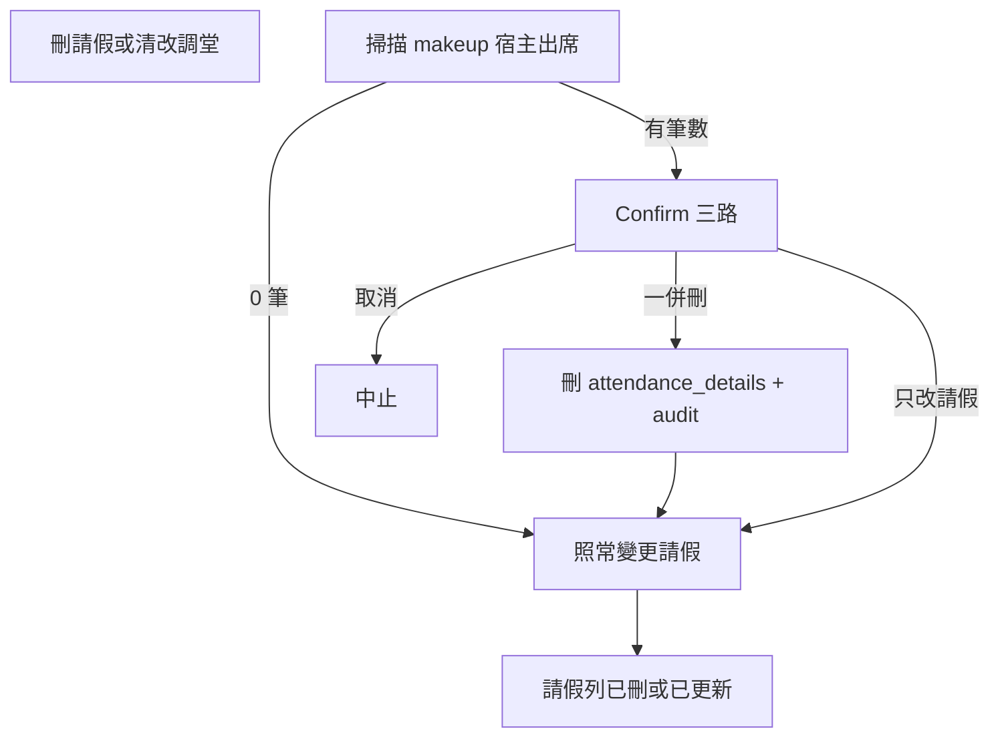

# 生命週期孤兒：明學操作方案

> 狀態：`方案已定／未實作`（功能 code 已從 main 撤回；僅供審閱與操作模擬）  
> 日期：2026-07-31  
> 分題：[`docs/backlog/lifecycle-orphans.md`](../backlog/lifecycle-orphans.md)  
> 索引：[`docs/BACKLOG.md`](../BACKLOG.md)  
> 暫存實作（勿當已上線）：git branch `wip/lifecycle-orphans-impl`（含誤交的實作快照）；另見 [`patches/`](./patches/README.md)

本檔＝操作／實作方案（含操作模擬）。**現階段不寫入應用程式功能。**

---

## 背景與定案

**孤兒**＝上游「應到／資格」已沒有，但 `attendance_details`（或其他下游）仍在，且仍計入已上堂數／對帳。

現況要點（程式已確認）：

- 點名紙＝報讀 ∪ 試堂 ∪ 補堂（[`scheduleRosterQueries.ts`](../../src/services/scheduleRosterQueries.ts)）；出席＝歷史 upsert，計費只看 status 白名單（[`attendanceBilling.ts`](../../src/lib/attendanceBilling.ts)），**不看資格**。
- [`deleteLeaveMakeupRecord`](../../src/services/leaveQueries.ts)／[`updateLeaveMakeupRecord`](../../src/services/leaveQueries.ts) **不掃、不刪**出席；唯一刪出席 helper 是連堂補堂重存用的 [`deleteAttendanceStatusForSchedule`](../../src/services/attendanceQueries.ts)。
- [`AttendanceRecordsPage`](../../src/components/attendance/AttendanceRecordsPage.tsx) 唯讀；`attendance_details` **無** soft-delete／列級稽核欄。
- 老師 RLS 對出席已無 DELETE（mgmt 才有 ALL）；攔截必須涵蓋所有清調堂路徑（含老師請假精靈），不能只改列表「刪除」按鈕。

市場做法取捨（已定，不單押一家）：

| 來源 | 採用 |
| --- | --- |
| PowerSchool | 資格變更前掃描；有孤兒 → Confirm（可一併清或保留） |
| 現代 SMS | 刪出席寫 `logMgmtAuditAction`（who／when／why／列摘要） |
| SIF | 行政單列刪工具（歷史／應急） |
| Genesis | 唯讀健康檢查；**夜間不自動刪** |

鐵律：不靜默刪計費出席；真上課保留 vs 誤點／取消補堂用顯式清理。

---

## 目標行為（共用掃描）

新增 service 層能力（概念名）：`scanAttendanceOrphansForLeaveChange`／之後泛化 `scanAttendanceLackingEligibility`。

**O1 掃描範圍（取消請假／清／改調堂）**：

1. 若存在 `makeup_schedule_id`：該生在該 `schedule_id` 的 `attendance_details`（補堂宿主——林藝涵主路徑）。
2. 若改綁新宿主：一併掃**舊** `makeup_schedule_id` 出席。
3. 不預設掃／刪 `leave_date` 當日原班出席（請假日本身若已點名，屬另一決策；預設保留）。
4. 連堂兩筆請假：逐筆掃描；Confirm 文案列出全部將刪列（日期、班、狀態、節次）。

**Confirm 三路**（沿用既有 [`confirmDialog`](../../src/lib/appConfirm.tsx) 的 `alternateText`）：

- 確認＝刪請假／清調堂 **並刪**列出之出席
- 替代＝只改請假／調堂、**保留**出席（明示將成孤兒／已上堂數仍計）
- 取消＝整筆中止

無出席列 → 維持現況單次 Confirm（或直接執行清調堂）。

攔截必須掛在 **service**（或所有呼叫前的同一 helper），覆蓋：

- [`LeaveManagementView`](../../src/components/leaves/LeaveManagementView.tsx) 刪除、詳情改非調堂、列表改類型、改調堂排程
- [`teacherLeaveWizardQueries`](../../src/services/teacherLeaveWizardQueries.ts) 清調堂（無 UI 時：有孤兒則拋錯／回傳需確認碼，避免精靈靜默產孤兒）

刪出席重用／包一層 `deleteAttendanceStatusForSchedule`；每次刪寫 audit（actor、student、schedule、status、reason=`leave_cancel` 等）。本期**不加** `deleted_at` 欄（硬刪＋audit）；還原靠重點名或 DB 備援。

---

## 分階段（實作順序）

### 階段 A — 止血（對齊林藝涵）

| ID | 內容 |
| --- | --- |
| **O1** | 上節攔截＋Confirm；優先 |
| **O6** | [`LEAVE_MAKEUP_CONSECUTIVE.md`](../manual/LEAVE_MAKEUP_CONSECUTIVE.md) 加「取消請假／清調堂」；[`ATTENDANCE_BILLING.md`](../ATTENDANCE_BILLING.md) 寫反操作與孤兒定義 |
| **O2** | `/AttendanceRecords`（或學生詳情出席）admin 單列刪＋audit；應急清歷史案。角色：**僅 admin**（alien 走請假攔截一併刪，不開自由刪） |

個案應急（方案外、人工）：用分題 SELECT 核對後刪；注意文件示例年份勿照抄錯年。

### 階段 B — 可見性與死連結

| ID | 內容 |
| --- | --- |
| **O0** | 出席紀錄／排程詳情：對照當前名冊資格，標「已不在名單」（資訊標籤，**不**等於可刪）。避免與單堂「沒有報讀此堂」混淆。 |
| **O3** | 軟取消排程：掛該堂之調堂改回「待安排」（對齊老師請假精靈）；開著試堂 → Confirm 改取消或提示。仍不靜默刪出席；若該堂已有出席 → 同一套掃描 Confirm。 |

### 階段 C — 同一套掃描擴面

| ID | 內容 |
| --- | --- |
| **O4** | 退讀／`purgeMistakenEnrollment`／試堂取消・改期：變更前掃出席＋Confirm（共用 API） |
| **O5** | Admin 健康檢查頁／區塊：列出「無對應應到資格」的 `attendance_details`；可多選一鍵清（仍 Confirm＋audit）。**不做**排程自動刪。 |

功能實作完成後，更新 [`BACKLOG.md`](../BACKLOG.md)／分題狀態為 `done` 或分項勾選。

---

## 操作模擬與可預期問題

以下假設階段 A 已上線；標 **問題**＝方案需預先定死或實作時必測。

### 模擬 1：林藝涵型（取消已點名補堂）

1. 建請假 7/24、調堂綁 7/25 某節 → 點名紙有補堂生 → 點「出席」存檔。
2. 請假管理「刪除」→ 掃到 1～2 筆出席 → Confirm 顯示日期／狀態。
3. 選「一併刪」→ 請假沒了、出席沒了、已上堂數回退。

**問題：** 連堂若誤綁兩節或曾誤寫兩節，文案必須列出**每一** `schedule_id`，否則以為刪一筆其實剩一節仍計費。  
**問題：** 職員若選「只刪請假、保留出席」→ 點名紙無名但已上堂數仍＋；O0 未做前仍難發現——Confirm 文案要寫清楚後果。

### 模擬 2：只清調堂、不刪請假列

詳情把補課安排改「待安排」或改綁別日（現況**無** Confirm）。

**問題：** 若攔截只接在「刪除」按鈕，此路徑繼續產孤兒 → **必須**接 `updateLeaveMakeupRecord` 在 `makeup_schedule_id` 變 null／變值時。  
**問題：** 改綁新日時：舊宿主已點名、新宿主未點——Confirm 應問是否刪**舊**宿主出席；預設建議「刪舊」，避免雙計。

### 模擬 3：學生其實有來補堂，行政誤取消請假

選「一併刪」→ 真實上課紀錄被硬刪，已上堂數少算。

**問題：** 無 soft-delete 則難還原（只能重點名）。緩解：Confirm 列明狀態與「此動作影響已上堂數」；高風險可要求 `confirmInput` 輸入學生姓氏；audit 可追溯但非還原。  
**問題：** 正確操作應選「保留出席」或先不要刪請假——訓練與文案要對齊。

### 模擬 4：老師請假精靈取消課堂並清調堂

精靈呼叫 `updateLeaveMakeupRecord` 清 `makeup_schedule_id`，可能無行政 Confirm UI。

**問題：** 若 service 直接刪出席＝靜默刪（違鐵律）；若直接擋＝精靈中斷。定案：**有孤兒則失敗並回傳筆數**，要求改走請假管理處理，或精靈內嵌同一 Confirm（若該流有 UI）。不可靜默刪。

### 模擬 5：取消請假但請假日原班已被點「缺席／請假」

只掃 makeup 宿主 → 請假日出席仍在。

**問題：** 通常應保留（當日事實）。若產品期望「刪請假＝當日當沒請過」而清原班狀態——**本方案明確不做**；避免與「不自動寫請假進點名」對稱被破壞。若日後要做，另開 Confirm 項。

### 模擬 6：軟取消整堂（O3 前）

取消排程後，調堂仍指向該 `makeup_schedule_id`，試堂仍「已預約」，出席仍計費。

**問題：** 階段 A 不管此路徑；職員以為堂沒了＝補堂沒了。O3 前靠訓練；O3 後清連結＋試堂提示。硬刪排程會 `schedule_id SET NULL`，健康檢查更難對 —— O5 規則要含「schedule_id IS NULL 且無法對上資格」的脫鉤列。

### 模擬 7：退讀後歷史真上課（O4／O0）

退讀生效後點名紙無名，舊出席仍在且應計費。

**問題：** O0「已不在名單」易被理解成錯誤資料；標籤文案應用「資格已結束（歷史出席仍計）」類，**預設保留**。O4 Confirm 預設偏向「保留已點名」，與取消誤約補堂的「預設一併刪」相反——兩情境文案／預設按鈕必須分開，不可共用同一句「建議刪除」。

### 模擬 8：權限與角色

Alien 刪請假並一併刪出席：依賴 mgmt DELETE RLS（可行）。Teacher 點名可寫不可刪：無法經 API 自刪孤兒。

**問題：** O2 僅 admin 時，alien 清歷史孤兒只能靠 O1 一併刪或請 admin——可接受。前端隱藏不足；O2 刪除 API 仍應 assert admin（對齊 [`mgmtRole`](../../src/lib/mgmtRole.ts)，知悉非 Auth 真權限；長期靠 RLS／RPC）。

### 模擬 9：並發

A 開點名紙含補堂生、B 同時刪請假一併刪出席、A 再按確定點名。

**問題：** `confirmRollCall` 只 upsert 當前名單——若 A 的客戶端名單仍含已刪資格的學生，可能**寫回**出席。緩解：存檔前重拉名冊；或存檔時以 server 名冊為準忽略本地多餘人。屬實作必測；方案列為 O1／點名紙交叉風險。

### 模擬 10：對帳／欠費 RPC

已上堂數主路徑用白名單；部分 RPC 仍用舊 LIKE。刪孤兒後列表與欠費若不一致，屬既有計費債，非本方案主修，但 O5／驗收應用同一套 `isBillableAttendanceStatus` 對照。

---

## 驗收（階段 A 最低）

- 刪已點名補堂之請假：Confirm 列出筆數；一併刪後點名紙與出席紀錄皆無、已上堂數減少。
- 選保留出席：請假沒了、出席仍在（已知孤兒）。
- 改「待安排」／改調堂日：同樣攔截，非僅「刪除」鍵。
- 老師精靈遇已點名補堂：不靜默刪，可失敗提示。
- Admin O2 可刪單列並有 audit；teacher 無刪入口。
- 文件 O6 已寫取消路徑。

---

## 刻意不做（方案本期／本檔定案）

- 夜間自動 reconcile 刪除
- `attendance_details.deleted_at` 大改 schema（留待真要還原再議）
- 刪請假時預設清請假日原班出席
- 把 O0「已不在名單」做成一鍵刪
- 落檔本方案時：不寫功能 code、不對 production 跑刪除 SQL
