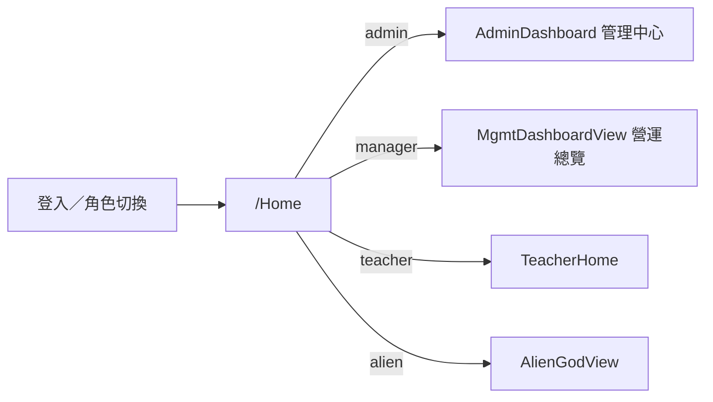

# 管理層角色分流（manager）— 實作計劃

> 日期：2026-08-01  
> 狀態：**done**（第一期已落地；RLS 讀寫分離屬第二期）  
> Backlog：[mgmt-manager-role.md](../backlog/mgmt-manager-role.md)  
> 審查報告：[2026-08-01-mgmt-manager-role-review.md](../audits/2026-08-01-mgmt-manager-role-review.md)（有條件通過；3 紅必改＋5 黃補強，已全數吸收）  
> 性質：開工清單；**非** patch  
> 範圍：第一期只做「誰看什麼」；不做新儀表板內容／出糧引擎

---

## 0. 定案摘要

| 角色 | 定位 | `/Home` |
| --- | --- | --- |
| `admin`（行政） | 日常：前台、報讀、收款、點名、請假 | 現有 `AdminDashboard`（管理中心） |
| `manager`（管理層） | 少做日常；看收入／營運分析／算堂相關 | 重用 `MgmtDashboardView`（營運總覽） |
| `teacher`／`alien` | **本期不改矩陣** | 維持現狀 |

雙角色沿用 `app_user_roles`／`switch_my_mgmt_role`。

---

## 0.1 三條硬規則（定案，不可協商）

1. **首頁固定**：`manager` 的 `/Home` 一律為營運總覽（`MgmtDashboardView`）。
2. **日常入口不顯示**：側欄／深連結不含前台精靈、明日提醒、進行點名、話術庫、家長報讀申請、試堂、宣傳配對、課室、老師請假處理、約房審批、收款登記。
3. **敏感主控仍限 admin|alien**：UI＋service assert 用 **必須存在的** `isAdminOrAlien()`：
   - 收款登記／作廢寫入
   - 點名列刪除／強制改寫出席
   - **優惠折扣**維護（manager **無**入口；維持僅 admin＋alien）
   - 用戶角色授予／系統設定（仍僅 alien）
   - 本人雙角色切換仍走 `switch_my_mgmt_role`

### 0.2 權限語義表

| 層級 | manager 第一期 |
| --- | --- |
| **可看** | 營運總覽、人數報表、中學出席、收件匣、學生／班別／老師／檔期／排程／校曆／教學紀錄／請假管理／出席一覽、繳費紀錄（唯讀）、堂數對帳、增退 |
| **可編（有限）** | 非金錢／非點名破壞性監督項（排程狀態、班別資料等）；無唯讀模式則「可進頁＋藏寫入鈕」 |
| **不可** | 收款、前台／試堂日常、點名刪改、優惠折扣、用戶／系統、角色授予 |

**RLS**：`is_mgmt_staff()` 仍含 manager（否則讀取全滅）。第一期 = UI＋守衛＋assert；標已知債；第二期拆 reader／writer。

**Helper 語義**：

| Helper | 定義 | 用途 |
| --- | --- | --- |
| `isMgmtStaff()` | `admin \| manager \| alien` | 一般職員讀取權（非破壞性） |
| `isAdminOrAlien()` | `admin \| alien` | **必做**。破壞性／敏感操作守衛 |
| `isManager()` | `manager` | manager 專屬 UI 分支 |
| `canAccessMgmtDashboard()` | `manager \| alien` | 營運總覽／分析頁守衛（刻意排除 admin） |

---

### 0.3 第一期明確不做

- 全新管理儀表板設計
- 出糧引擎（仍用中學出席統計作算堂）
- WhatsApp 自動推送、成績知識點、招生 CRM 漏斗重建
- 改 alien／teacher 側欄矩陣



---

## 1. 側欄可見矩陣

改 [`src/lib/navStructure.ts`](../../src/lib/navStructure.ts) 的 `Role` 與各葉 `roles`。

| 區塊 | admin | manager | 備註 |
| --- | --- | --- | --- |
| 首頁／所有功能／收件匣 | ✓ | ✓ | |
| 前台精靈／明日提醒／進行點名／話術庫 | ✓ | — | |
| 學生／一對一／增退／堂數對帳 | ✓ | ✓（監督） | |
| 家長報讀申請／試堂／宣傳配對 | ✓ | — | |
| 人數報表／中學出席統計／營運總覽 | — | ✓ | admin **刻意**失去側欄入口 |
| 班別／老師／檔期 | ✓ | ✓ | |
| 課室／老師請假處理／約房審批 | ✓ | — | |
| 排程／校曆／教學紀錄／請假管理／出席紀錄 | ✓ | ✓ | |
| 收款登記 | ✓ | — | |
| 繳費紀錄 | ✓ | ✓（唯讀監督） | |
| 優惠折扣 | ✓ | — | **僅 admin＋alien**（manager 無入口；覆寫早期草案） |
| 阿Po／AI 報表／用戶／報錯／系統日志／推薦回贈 | — | — | 仍僅 alien |

手機底欄 [`src/lib/mobileNav.ts`](../../src/lib/mobileNav.ts)：manager 建議「首頁／排程／收件匣／所有功能」（首頁已是營運總覽，勿重複加總覽 tab）。

---

## 2. 改動清單（開工時）

### 2.1 前端角色型別

| # | 檔 | 做咩 |
| --- | --- | --- |
| T1 | `src/lib/mgmtRole.ts` | `MgmtRole` 加 `"manager"`；標籤「管理層」；`isMgmtStaff` = admin\|manager\|alien；**必須**新增 `isManager`／`isAdminOrAlien`／`canAccessMgmtDashboard` |
| T2 | `src/lib/navStructure.ts` | ⚠️ `Role`（獨立於 `MgmtRole`）也要加 `"manager"`；按 §1 矩陣改各葉 `roles` |
| T3 | 硬編碼三角色處 | `RequireMgmtRoles`、`authRoleQueries.normalizeRole`、inbox `parseAudienceRoles`／`normalizeAudienceRoles`、各頁本地 `Role` type 一併掃 |
| T4 | 破壞性操作 | 刪點名等維持 admin\|alien，用 `isAdminOrAlien()`，**勿**因 `isMgmtStaff` 擴張而誤開 |

### 2.2 首頁與營運總覽

| # | 檔 | 做咩 |
| --- | --- | --- |
| H1 | `src/pages/Home.tsx` | `manager` → render `MgmtDashboardView` |
| H2 | `src/pages/MgmtDashboard.tsx` | 守衛改 `RequireMgmtRoles roles={["manager","alien"]}` 或 `canAccessMgmtDashboard()`（**不可**用 `isMgmtStaff()`；admin 深連結應被擋） |
| H3 | `src/pages/EnrollmentReports.tsx`、`SecondaryAttendanceReport.tsx` | 同理不可用 `isMgmtStaff()`；改用 explicit manager\|alien |

### 2.3 側欄

| # | 檔 | 做咩 |
| --- | --- | --- |
| N1 | `src/lib/navStructure.ts` | `Role` 加 manager；按 §1 矩陣改各葉 `roles`；優惠折扣**不加** manager） |
| N2 | `src/lib/mobileNav.ts` | manager 底欄「首頁／排程／收件匣／所有功能」 |

### 2.4 頁級守衛（典型；實作時對照矩陣逐頁）

| 頁 | roles |
| --- | --- |
| `PaymentHistory`、`LeaveManagement`、`Teachers`、學生／班別監督頁 | 加 `manager` |
| `EnrollmentReports`、`SecondaryAttendanceReport`、`MgmtDashboard` | `manager`＋alien（admin 拿掉）；**不可**用 `isMgmtStaff()` |
| `Payments`、`TrialSessions`、前台／課室／約房審批／老師請假處理等 | 維持 admin（＋alien），**不含** manager；用 `isAdminOrAlien()` |
| `PaymentDiscounts` | 維持 admin＋alien（manager **無**入口） |
| `Students` | teacher redirect 不變；manager 可進 |
| `AttendanceRecordsPage`、`StudentDetailView` | 刪除／強制改寫用 `isAdminOrAlien()`，不因 `isMgmtStaff` 含 manager 而放行 |
| `UserManagement` | 維持僅 alien |
| `FrontDeskWizard`、`TeacherLeaveWizard` | manager 不應進入；維持 teacher redirect + admin\|alien 守衛 |

### 2.5 DB migration（只新增檔）

`supabase/migrations/YYYYMMDDHHMMSS_mgmt_manager_role.sql`：

⚠️ **PostgreSQL 不支援直接 ALTER CHECK constraint**，必須 DROP + ADD：

```sql
-- app_user_roles.role
alter table public.app_user_roles
  drop constraint if exists app_user_roles_role_check;  -- 先確認實際 constraint 名
alter table public.app_user_roles
  add constraint app_user_roles_role_check
  check (role in ('admin', 'teacher', 'alien', 'manager'));

-- mgmt_active_roles.active_role
alter table public.mgmt_active_roles
  drop constraint if exists mgmt_active_roles_active_role_check;
alter table public.mgmt_active_roles
  add constraint mgmt_active_roles_active_role_check
  check (active_role in ('admin', 'teacher', 'alien', 'manager'));

-- app_users.role（確認是否存在 CHECK constraint，若有一併處理）
alter table public.app_users
  drop constraint if exists app_users_role_check;
alter table public.app_users
  add constraint app_users_role_check
  check (role in ('admin', 'teacher', 'alien', 'manager', 'student'));
```

**RLS 函數更新**：

```sql
-- is_mgmt_staff() → 含 manager（否則讀取全滅）
create or replace function public.is_mgmt_staff()
returns boolean language sql stable security invoker set search_path = public
as $$
  select coalesce(public.current_app_role(), '') in ('admin', 'manager', 'alien');
$$;

-- get_my_mgmt_profile() 內 in ('admin','teacher','alien') → 加 'manager'
-- 全局 grep current_app_role() in/not in (...)，所有枚舉處加 'manager'
-- 尤其是 roster、排程 RLS 等用 not in ('admin','alien','teacher') 判斷「非職員」處
```

**Rollback SQL**（附於 migration 檔註解中）：

```sql
-- rollback
alter table public.app_user_roles drop constraint if exists app_user_roles_role_check;
alter table public.app_user_roles add constraint app_user_roles_role_check check (role in ('admin', 'teacher', 'alien'));
alter table public.mgmt_active_roles drop constraint if exists mgmt_active_roles_active_role_check;
alter table public.mgmt_active_roles add constraint mgmt_active_roles_active_role_check check (active_role in ('admin', 'teacher', 'alien'));
-- app_users 同理
create or replace function public.is_mgmt_staff()
returns boolean language sql stable security invoker set search_path = public
as $$ select coalesce(public.current_app_role(), '') in ('admin', 'alien'); $$;
```

套用：`npm run db:apply -- <檔>`（禁全量 `db push`）。

用戶指派：用戶管理加「管理層」選項；**不**硬編碼某人，由營運授予 `app_user_roles`。

### 2.6 收件匣／通知

| # | 做咩 |
| --- | --- |
| I1 | `inboxQueries`／`InboxView`：`audience_roles` 解析與選項加 manager；手動發佈 UI 預設加 manager（可取消勾選） |
| I2 | 作廢付款等系統通知 audience：`admin`＋`manager`＋`alien`（預設含 manager） |
| I3 | Edge `void-payment` 的 `audience_roles` 同步加 `"manager"` |

### 2.7 文件

- `docs/TERMINOLOGY.md`、`AGENTS.md`、`docs/AGENT_HANDOFF.md` §6：四角色
- `docs/audits/2026-08-01-mgmt-manager-role-review.md`：在計劃中加連結
- backlog：開工 → `in_progress`；完成後移已完成表

---

## 3. 完整檔案改動 checklist（審查驗證後）

### Type / Helper

| # | 檔案 | 改動 |
|---|---|---|
| T1.1 | `src/lib/mgmtRole.ts` | `MgmtRole` 加 `"manager"`；所有 guard/label 函數補 manager 分支；**必須**新增 `isManager()`、`isAdminOrAlien()`、`canAccessMgmtDashboard()`；`isMgmtStaff()` = `admin \| manager \| alien` |
| T1.2 | `src/lib/navStructure.ts` | ⚠️ `Role`（獨立於 `MgmtRole`）加 `"manager"`；按矩陣改 `roles` |
| T1.3 | `src/lib/mobileNav.ts` | switch 加 manager case |
| T1.4 | `src/components/auth/RequireMgmtRoles.tsx` | `ROLE_LABEL` 加 `manager: "管理層"` |

### 首頁與分析頁

| # | 檔案 | 改動 |
|---|---|---|
| H1 | `src/pages/Home.tsx` | 加 `if (role === "manager") return <MgmtDashboardView />` |
| H2 | `src/pages/MgmtDashboard.tsx` | 守衛改 explicit manager\|alien（**不可**用 `isMgmtStaff()`） |
| H3 | `src/pages/EnrollmentReports.tsx` | 守衛改 manager\|alien |
| H3.2 | `src/pages/SecondaryAttendanceReport.tsx` | 守衛改 manager\|alien |

### 頁級守衛

| # | 檔案 | 改動 |
|---|---|---|
| G1 | `src/pages/PaymentHistory.tsx` | `RequireMgmtRoles` 加 `"manager"` |
| G2 | `src/pages/LeaveManagement.tsx` | `RequireMgmtRoles` 加 `"manager"` |
| G3 | `src/pages/Teachers.tsx` | `RequireMgmtRoles` 加 `"manager"` |
| G4 | `src/pages/Payments.tsx` | 維持 `["admin", "alien"]`（`isAdminOrAlien`） |
| G5 | `src/pages/TrialSessions.tsx` | 維持 `["admin", "alien"]` |
| G6 | `src/pages/PaymentDiscounts.tsx` | 維持 `["admin", "alien"]`（**不加** manager） |
| G7 | `src/pages/UserManagement.tsx` | 維持 `["alien"]` |
| G8 | 破壞性按鈕／操作 | 全部改用 `isAdminOrAlien()`，不用 `isMgmtStaff()` |

### 服務層

| # | 檔案 | 改動 |
|---|---|---|
| S1 | `src/services/authRoleQueries.ts` | `normalizeRole()` 加 `"manager"` |
| S2 | `src/services/inboxQueries.ts` | `parseAudienceRoles()` 加 `"manager"` |
| S3 | `src/services/inboxEventWrite.ts` | `normalizeAudienceRoles()` 加 `"manager"` |
| S4 | `src/services/mgmtGodViewQueries.ts` | actor label 補 manager 分支 |

### UI 組件

| # | 檔案 | 改動 |
|---|---|---|
| U1 | `src/components/inbox/InboxView.tsx` | `AUDIENCE_ROLE_OPTIONS` 加 manager；預設 audience 加 manager；`canPublish` 維持 alien only |
| U2 | `src/components/users/UserManagementView.tsx` | `ROLE_OPTIONS` 加 manager；`roleMeta()` 加 manager 分支；`sortedRows` 排序：alien=0, admin=1, manager=2, teacher=3 |
| U3 | `src/pages/Login.tsx` | 不需改，但驗證 manager 可正常登入 |

### 收件匣／通知

| # | 位置 | 改動 |
|---|---|---|
| I1 | `src/services/inboxQueries.ts` | `parseAudienceRoles()` 加 manager |
| I2 | `src/services/inboxEventWrite.ts` | `normalizeAudienceRoles()` 加 manager；系統通知預設含 manager |
| I3 | `supabase/functions/void-payment/index.ts` | `audience_roles: ["admin", "manager", "alien"]` |

### DB Migration（1 個新檔）

| # | 操作 |
|---|---|
| DB1 | `app_user_roles.role` CHECK → DROP + ADD 含 manager |
| DB2 | `mgmt_active_roles.active_role` CHECK → DROP + ADD 含 manager |
| DB3 | `app_users.role` CHECK → 確認存在，一併處理 |
| DB4 | `is_mgmt_staff()` → REPLACE 含 manager |
| DB5 | `get_my_mgmt_profile()` 內枚舉 → 加 `'manager'` |
| DB6 | 全局 grep `current_app_role() in/not in (...)`，**必須**逐個加 `'manager'`（勿只寫「評估」） |
| DB7 | `switch_my_mgmt_role` 不需改（僅依賴 CHECK constraint） |
| DB8 | Migration 註解附 rollback SQL |

### Edge Function

| # | 檔案 | 改動 |
|---|---|---|
| E1 | `supabase/functions/void-payment/index.ts` | `audience_roles` 加 `"manager"` |

### 文件

| # | 檔案 | 改動 |
|---|---|---|
| D1 | `docs/TERMINOLOGY.md` | 三角色 → 四角色；加 manager／管理層 |
| D2 | `AGENTS.md`（根目錄） | 鐵則 § 與 checklist § 加 manager |
| D3 | `docs/AGENT_HANDOFF.md` §6 | 加 manager |
| D4 | `docs/BACKLOG.md` | 開工改 status；完成移已完成 |
| D5 | `docs/backlog/mgmt-manager-role.md` | 同步更新；加硬規則摘要；連審查報告 |

---

## 4. 驗收

- [ ] `npm run build`＋`npm run ui:check`
- [ ] manager：首頁＝營運總覽；側欄無前台／收款登記／優惠折扣；有人數報表／中學出席／繳費紀錄
- [ ] admin：首頁仍係管理中心；側欄無營運總覽／人數報表／中學出席
- [ ] teacher／alien 行為不變；雙角色切換仍走 `switch_my_mgmt_role`
- [ ] migration local `db:apply` 成功（確認 constraint 名正確）
- [ ] `switch_my_mgmt_role` → manager 通
- [ ] manager 深連結 `/Payments`、`/TrialSessions`、`/PaymentDiscounts` 被擋
- [ ] admin 深連結 `/MgmtDashboard`、`/EnrollmentReports`、`/SecondaryAttendanceReport` 被擋
- [ ] 雙角色 admin+manager 切換首頁／側欄正確
- [ ] manager 收得到作廢付款系統通知
- [ ] `isMgmtStaff` 變更後抽樣 RLS 行為正確

---

## 5. 與市場研究對照（第二期 roadmap，另開 backlog）

現有營運總覽已有：KPI、收入趨勢、漏斗欄位、退讀、欠費逾期、滿班／營運警示、科目分佈。

| 優先 | 研究建議 | 現況 | 備註 |
| --- | --- | --- | --- |
| 1 | 續費／流失預警（結束日前 N 天） | 無獨立模組 | 第二期最優先 |
| 2 | 招生漏斗實數據＋渠道標籤 | funnel 欄位有、渠道主檔無 | 第二期 |
| 3 | 分級催繳／提醒 | 人手 WhatsApp | 第二期（接 [tuition-late-fee-enforcement](../backlog/tuition-late-fee-enforcement.md)） |
| 4 | 教師績效看板（非出糧引擎） | 中學出席統計 | 第二期 |
| 5 | 成績／知識點進步 | 無成績主檔 | 第二期＋資料模型 |
| 6 | 多校區／AI 推薦 | 無 | 長期 |
| — | RLS manager 讀寫分離 | 現為 UI 隔離 | 第二期同步收緊 |

---

## 6. 風險與邊界

- 前端隱藏 ≠ RLS：第一期 manager 視同 `is_mgmt_staff` 可寫；第二期再收緊收款／前台寫入（標已知債）
- admin 失去營運總覽側欄是**刻意**的；若要「行政偶爾看」需改矩陣後再改
- 與 [role-ops-hardening](../backlog/role-ops-hardening.md)（老師藏金錢）分開；勿混 commit
- 優惠折扣 manager **無**入口（覆寫早期草案中「開給 manager」的假設）

---

## 7. 相關檔索引

| 用途 | 路徑 |
| --- | --- |
| 產品定案／矩陣摘要 | [`docs/backlog/mgmt-manager-role.md`](../backlog/mgmt-manager-role.md) |
| 顧問審查報告（紅黃項、完整 checklist） | [`docs/audits/2026-08-01-mgmt-manager-role-review.md`](../audits/2026-08-01-mgmt-manager-role-review.md) |
| Backlog 索引列 | [`docs/BACKLOG.md`](../BACKLOG.md) |
| 現有營運總覽 UI | `src/components/mgmtDashboard/MgmtDashboardView.tsx` |
| 行政首頁 | `src/components/home/AdminDashboard.tsx` |
| 側欄 | `src/lib/navStructure.ts` |
| 角色 helper | `src/lib/mgmtRole.ts` |
