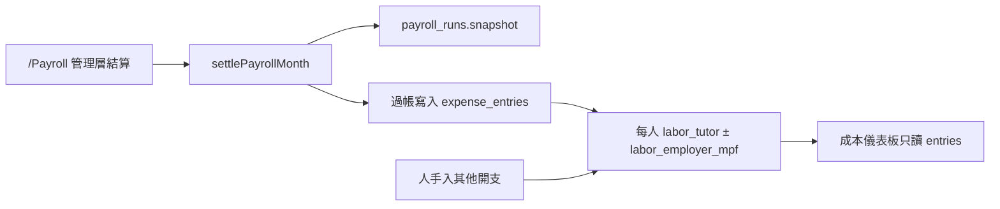

# HK 成本帳（管理分析＋計糧過帳）— 設計計劃

> 日期：2026-08-05  
> 狀態：**實作中**（migration＋UI＋計糧過帳＋ETL 已接；7 月非薪金已確認，剩按金 1 筆；7 月計糧仍審閱中→薪金 void／過帳待結算）  
> 索引：[`docs/BACKLOG.md`](../BACKLOG.md) · 分題 [`docs/backlog/hk-expense-cost-stats.md`](../backlog/hk-expense-cost-stats.md)

---

## 0. 這頁／這帳係做乜

**不是**把 Excel／Notion 搬進系統。  
**是**為管理層建立可分析嘅 HK 成本資料面，支撐決策，並預留將來「學費收入 × 成本 → 純利／純利率」報表。

| 層 | 含義 | 而家 |
| --- | --- | --- |
| 毛利 | 收入 − 可歸因直接成本（績效主攻人工） | `/StaffPerformance` 近似 |
| 科／班／老師貢獻 | 收入 − 該維度可歸因成本 | 未做；成本帳要有足夠粒度 |
| 純利 | 收入 − 全部成本（直接＋間接） | **未做**；本工程補「完整成本腿」 |

本期做成本帳＋分析面；**唔做**純利報表頁。但科目分組、過帳粒度、月口徑必須令將來純利報表可以組合，唔使重造成本。

---

## 1. 管理層要答到嘅問題（設計起點）

1. 某月 HK **真實總成本**幾多？結構點（人工／租金／教材／其他）？
2. 邊個老師人工幾多？同公司利益／收入點比？（接績效；將來接純利）
3. 邊科／邊班成本同收益點？（本期過帳預留歸因維度；完整科班報表可下一波）
4. 未確認／待分類會唔會令趨勢不可信？

入帳、計糧過帳、科目，全部服務以上問題。

---

## 2. 決策鎖定

| 項目 | 決定 |
| --- | --- |
| 產品目標 | 管理分析用成本帳；預留將來純利組合 |
| 範圍 | 只 HK；唔做 CN、收據／OCR、報銷工作流、複式 |
| 角色 | **manager／alien** 可見可入；admin／teacher／finance 無側欄入口 |
| 人工來源 | **計糧「已結算」後自動過帳**入成本帳（做法乙）；禁止當日常再手抄一份導師薪酬 |
| 過帳粒度 | **至少到每位老師**（薪酬；僱主強積金可分行或同人兩欄位語意分開科目）；預留班／科歸因欄，唔先做 lesson 級報表 |
| 非計糧人工 | 另科「非計糧人工」人手入（前台等）；長遠期望計糧引擎覆蓋更多人 |
| 其他開支 | 系統人手入帳；規則建議科目＋人手確認 |
| 歷史 Excel／Notion | **只係過渡原料**（例如分析 7 月）；匯入後遷就新模型；之後唔再用兩本帳 |
| 來源追蹤 | **唔做產品欄**「呢筆來自 Notion／Excel」；匯入冪等用內部 key 即可 |
| 舊欄位邏輯 | 歷史遷就新系統，唔係新系統遷就 Notion／Excel |
| 雙源重疊 | 唔自動對銷；覆核 void。有計糧過帳嘅月：歷史「薪金類」列應 void／唔當成本 |
| 報銷 | 不理「已報銷」；`staff_advance` 只係支付渠道 |
| 同績效 | 不取代；績效＝毛利向；本帳＝全成本向；將來純利另頁組合 |
| 頁面防呆橫幅 | **唔強制**給人類睇長文；邊界寫喺計劃／實作約束（禁「毛利／淨利／盈虧」誤標；KPI 命名要準） |

---

## 3. 月口徑（將來純利必須同一套）

| 成本類型 | 歸月規則 |
| --- | --- |
| 計糧過帳之人工／僱主強積金 | 跟計糧 `month_key`（同 `/Payroll`） |
| 其他開支 | 跟 `spent_on`（付款／入帳日） |

儀表板揀「YYYY-MM」＝該月計糧人工（若已結算已過帳）＋該月 `spent_on` 落喺該月嘅其他開支。  
將來純利報表必須沿用同一歸月定義（收入側另定，但成本側唔改口）。

---

## 4. 科目結構（先新系統，再對歷史驗漏）

設計原則：跟明學營運習慣＋已有 Supabase（老師、計糧、將來收入），**唔**以 Excel「清單名稱」或 Notion「費用類別」做主模型。歷史匯入時先 map 入呢套；對唔上嘅先 `pending_review`。歷史抽樣只用來發現**漏咗嘅科目／例外**（退學費、按金等）。

### 4.1 分組（硬性）

- `direct`：可歸因教學／營運直接成本（人工、教材等）→ 將來毛利／科班貢獻會用到  
- `overhead`：公司層間接（租金、水電、清潔、軟件等）→ 進純利；**本期唔攤去老師**

### 4.2 建議種子科目（可調 label／code；實作前可再對一輪營運）

**Direct**

| code（例） | 用途 |
| --- | --- |
| `labor_tutor` | 導師／計糧覆蓋人員薪酬（結算過帳預設） |
| `labor_employer_mpf` | 僱主強積金（公司成本） |
| `labor_non_payroll` | 未入計糧引擎之人工（人手） |
| `materials` | 教材（可選 `subject`） |
| `direct_other` | 其他直接成本 |

**Overhead**

| code（例） | 用途 |
| --- | --- |
| `rent_mgmt` | 租金及管理費 |
| `utilities_net` | 水電／上網電話等 |
| `cleaning` | 清潔 |
| `software` | 軟件訂閱 |
| `supplies` | 文具雜物 |
| `marketing` | 廣告／印刷 |
| `team_welfare` | 團建／餐飲 |
| `overhead_other` | 其他間接 |

退款／退學費：**唔當成本科目自動入帳**；規則強制 pending＋hint，或 void（同學費流程另處理）。

---

## 5. 資料模型（設計稿）

```text
expense_ledger_accounts
  id, code unique, label
  account_group  -- 'direct' | 'overhead'
  subject text null   -- 教材等可選分科
  sort_order, active
  -- 只 HK：可用 region check 或唔加 region 欄

expense_category_rules
  pattern, ledger_account_id null, force_pending, hint, priority, active
  -- 服務日常入帳建議；由新帳習慣設計，唔係 Notion map 表
  -- 退款／按金／清潔劑邊界等用歷史樣本驗收，唔用歷史定義模型

expense_entries
  spent_on date
  title, amount_hkd <> 0
  pay_method          -- 正規化枚舉（bank_card/cashbox/…）
  owner_label         -- 負責人／填表（一個夠）
  ledger_account_id null
  ledger_status       -- pending_review | confirmed
  suggested_* / suggestion_hint   -- 可留建議；唔必永久存 rule id
  notes
  voided_at / void_reason / voided_by_label
  -- 歸因（管理分析／將來純利；可 null）
  teacher_id null     -- 計糧過帳必填（有老師時）
  class_id null       -- 預留；本期可不填
  subject_code null   -- 預留
  -- 過帳來源（系統用，唔係「Excel/Notion 產品標籤」）
  origin text         -- 'manual' | 'payroll_settle' | 'history_import'
  origin_key text null unique where not null
    -- payroll: payroll|{month_key}|{teacher_id}|labor_tutor 等
  created_by_label, created_at, updated_at
```

**明確唔加（本期）**：`reimbursement_status`、收據 storage、`source_system=excel|notion` 產品欄、CN。

RLS／審計（實作必做）：manager／alien；禁硬刪；confirmed 鎖金額／日期／科目（改類先 reopen）；ledger／rules 寫入限 alien（或等同）；`ledger_account_id` RESTRICT。

---

## 6. 計糧 → 成本帳過帳（核心）



### 6.1 觸發

- 在現有 `settlePayrollMonth` 成功路徑（或緊接其後嘅 service）執行過帳。  
- 只處理 `status = 已結算` 之 snapshot。  
- `origin_key` 冪等：重跑／重試唔雙倍。

### 6.2 寫入內容（每老師）

- 一筆（或等價）`labor_tutor`：`amount = gross`，`spent_on = month_key 月末日或約定代表日`，`teacher_id`，`title` 含姓名＋計糧月  
- 一筆 `labor_employer_mpf`：`amount = employerMpf`（0 可跳過）  
- 預設 `ledger_status`：建議 **`confirmed`**（已經管理層結算）或 `pending_review` 只准改**科目分類**、唔准改金額——實作鎖定：**金額／老師／月鎖定；科目可 reopen 再分類**  
- 排除老師：跟計糧結算當下 snapshot 內實際列入結算者（與 `/Payroll` 一致）

### 6.3 反結算／重算

- 而家已結算不可重算；若將來開放：先 void 該 `month_key` 所有 `origin=payroll_settle` 列，再過帳。  
- 本期可只實作「結算 → 過帳」；文件註明 void 規則。

### 6.4 禁止雙計

- 人手入帳：title／規則若似薪金 → hint「應由計糧過帳」，`force_pending`  
- 歷史匯入：薪金類 → pending＋hint；該月若已有 payroll 過帳 → 覆核時 void 歷史薪金列

### 6.5 點解唔「live 讀 snapshot」

Live 合併兩盤帳睇唔到一本完整月成本、亦難再分類／同將來純利組合。  
**真相**：計糧 snapshot＝薪酬計算來源；**成本帳 entries＝管理成本／將來純利嘅成本腿**。過帳係橋，唔係請人再抄。

---

## 7. 人手入帳同建議規則

日常（非人工或非計糧）：

1. 填表 → suggest（code／rules 表）→ 預填科目 → `pending_review`  
2. 確認後入彙總；可批量確認已有科目者  
3. void 處理重複／非成本

規則由**新科目＋營運用詞**設計；用 Notion／Excel 樣本做驗收（退款、按金、清潔劑、租金），唔把舊類別當主 taxonomy。

支付方式：正規化枚舉＋繁中顯示（Cashbox／公司卡等）。

---

## 8. UI／路由

| 項目 | 決定 |
| --- | --- |
| 路由 | `/HkExpenses`（名可再定） |
| 側欄 | 智能分析 → **成本統計**（manager／alien） |
| Tab | **分析／儀表板**｜**明細／入帳** |

**分析／儀表板（本期要有分析意味，唔止合計）**

- 該月總成本、direct／overhead 拆分  
- 人工合計（來自過帳）＋可下鑽老師列表（2B）  
- 其他科目結構（長條／表）  
- 待覆核金額／筆數（影響可信度）  
- 近 N 月趨勢  

**明細／入帳**

- 人手新增、篩選、確認、void、改分類  
- 計糧過帳列：標示來源、金額不可改、可改科目（政策如上）  

UI：共用 `Select`／`Input type="date"`／`Tag`；禁 native select／alert／confirm。  
頁面唔靠長橫幅教「唔係損益表」；用正確 KPI 用詞同導航即可。

---

## 9. 歷史過渡匯入

- 一次性：Excel HK 月表 ∪ Notion CSV → map 入新欄位 → 多為 `pending_review`  
- `origin = history_import`，`origin_key` 冪等  
- 欄位擇優（說明垃圾時用較長描述）等屬 ETL 細節，寫喺 import script，唔污染產品模型  
- 匯入後停用兩本帳做新單  
- 有 payroll 過帳嘅月：歷史薪金列覆核 void  

---

## 10. 將來純利報表（本期不做；接駁面）

另題／下波產品：

- 收入：現有學費／扣堂／收款世界（月口徑另定，須對齊文件）  
- 成本：本帳 `confirmed` 且未 void；毛利用 subset（direct／可歸因）；純利用全部  
- 老師／科班：用 `teacher_id`／預留 `class_id`／`subject_code` 聯收入  
- `/StaffPerformance` 可繼續專毛利；純利唔塞進績效頁硬充

本期驗收唔要求純利數字；要求資料面唔阻未來。

---

## 11. 落地順序

1. 定案科目種子＋月口徑＋過帳狀態政策（本計劃）  
2. Migration（accounts／rules／entries＋RLS＋鎖／void）→ `npm run db:apply -- <檔>`  
3. `expenseQueries`＋suggest／payMethod；入帳／明細 UI  
4. 接 `settlePayrollMonth` 過帳＋冪等；分析頁老師下鑽  
5. 歷史 ETL（過渡月）；void 雙計薪金  
6. build／lint；角色 RLS；抽樣驗收  

---

## 12. 驗收（設計向）

- 計糧結算某月後，成本帳出現該月每位老師人工（＋僱主 MPF），儀表板月總含呢啲數  
- 同月再結算重試唔雙倍  
- 人手入租金等 → 確認後入 overhead；月結構睇到  
- 無計糧過帳時，唔靠手抄導師薪當正式人工（規則擋／hint）  
- 科目有 direct／overhead；entries 可掛 `teacher_id`  
- manager／alien 可進；admin JWT 直打被拒  
- 歷史匯入可重跑冪等；唔迫使產品顯示 excel／notion 來源  

---

## 13. 明確不做（本期）

- 純利／純利率報表頁  
- 間接費用攤去老師  
- 課節級成本報表（預留欄位即可）  
- CN、OCR、報銷狀態機、複式  
- Live 讀 snapshot 當月成本主路徑  
- 繼續用 Excel／Notion 日常入帳  

---

## 14. 相關

- 舊方向（已取代）：[`2026-08-04-hk-expense-cost-stats.md`](./2026-08-04-hk-expense-cost-stats.md)  
- 計糧：[`../backlog/payroll-engine.md`](../backlog/payroll-engine.md)、`settlePayrollMonth`（[`src/services/payrollQueries.ts`](../../src/services/payrollQueries.ts)）  
- 員工績效（毛利）：[`2026-08-02-staff-performance-analytics.md`](./2026-08-02-staff-performance-analytics.md)  
- 角色：[`../backlog/mgmt-manager-role.md`](../backlog/mgmt-manager-role.md)  
