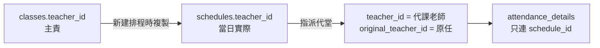

# 同班偶發代課（代堂）— 營運與開發指引

介面用語繁體中文。程式錨點：`src/services/scheduleQueries.ts`（`assignScheduleSubstitute` / `clearScheduleSubstitute` / `isClearScheduleSubstituteBlocked`）、`src/lib/scheduleSubstitute.ts`、migration `20260715210933_schedule_substitute_teacher.sql`。  
營運政策索引：[`OPS_POLICIES.md`](../_INDEX.md)。  
**前線守則（前台／行政執行）：** [`manual/SUBSTITUTE_AND_CLASS_TEACHER_FRONTLINE.md`](../../playbooks/frontdesk/SUBSTITUTE_AND_CLASS_TEACHER_FRONTLINE.md)。

班別／排程／功能愈多時，**最容易犯錯的是把「班別主責老師」與「當日實際上堂老師」混為一談**。本檔記錄正確做法與已知行政風險，避免同類問題重演。

---

## 1. 資料模型（必須分清兩層）

| 層級 | 欄位 | 含義 |
| --- | --- | --- |
| 班別 | `classes.teacher_id` | **常任／主責老師**（一班一個；「我的班別」等依此） |
| 排程堂次 | `schedules.teacher_id` | **當日實際上堂老師**（可與主責不同） |
| 代堂標記 | `schedules.original_teacher_id` | 指派代堂前的原任老師；有值＝此堂為代堂 |

新建排程時會從班別主責複製 `teacher_id`。之後若有人代上，應改**該堂排程**，不要改班別主責。

**防呆（2026-07）：** 老師時間表／排程管理／點名紙皆以 `schedules.teacher_id`（或 `original_teacher_id`）篩選。若排程 `teacher_id` 空白，即使 `classes.teacher_id` 已指定，老師登入也看不到該堂。因此：

1. 批量排程前必須已指定班別負責老師（前端會拒絕）。
2. DB：`schedules` INSERT 時若未帶 `teacher_id`，自動取 `classes.teacher_id`。
3. DB：班別首次指定／更換主責時，回填該班仍空白且非代堂的排程（不覆寫已有老師或代堂列）。

點名（`attendance_details`）掛 `schedule_id`／`class_id`，**不另存老師**；畫面上「誰上這堂」是讀排程的 `teacher_id`（缺則回退班別主責）。寫入點名仍要求當日 `schedules.teacher_id`＝登入老師。

---

## 2. 正確營運做法

### 偶發／輪流代課（同一班、不同日子不同老師）

1. **班別主責維持常任老師**（例如 Kenneth）。
2. 代課日在排程用「**指派代堂**／更改代堂」寫上實際老師（例如 Liam）。
3. 歷史補錄亦同：每一堂排程各自設正確的當日老師；可用代堂或建立時直接指定 `schedules.teacher_id`。
4. **不要**為了偶發代課去改 `classes.teacher_id`（會影響「我的班別」、報讀報表主責歸屬，並與已過去堂次語意錯位）。

### 永久換主責

才改班別 `teacher_id`。注意：小組課改班別老師**不會**自動改寫既有排程的 `teacher_id`（歷史可保留）；一對一另有同步邏輯，見 `privateTutoringQueries`。

---

## 3. 案例（文覺稼＋文覺瑩數學必修・一對二）

背景：同一班，4/7–15/7 期間 Kenneth Li 與 Liam Lai **按日輪替**上堂，需準確記錄「哪一天是誰上」。

| 日期 | 時段 | 當日老師 |
| --- | --- | --- |
| 4/7 六 | 10:15–12:45 | Kenneth Li |
| 5/7 日 | 10:15–12:45 | Liam Lai |
| 6/7 一 | 14:00–16:30 | Liam Lai |
| 7/7 二 | 10:15–12:45 | Kenneth Li |
| 8/7 三 | 14:00–16:30 | Liam Lai |
| 9/7 四 | 14:00–16:30 | Kenneth Li |
| 10/7 五 | 10:15–12:45 | Kenneth Li |
| 11/7 | 10:15–12:45 | Kenneth Li |
| 12/7 | 10:15–12:45 | Kenneth Li |
| 13/7 | 17:45–20:15 | Kenneth Li |
| 14/7 | 17:45–20:15 | Liam Lai |
| 15/7 | 14:00–16:30 | Kenneth Li |

**入系統原則**：開一班（主責可訂為較常上者或行政常任），每堂排程的 `teacher_id`＝上表當日老師；非主責的日子用「指派代堂」標出，並一併完成點名。

---

## 4. 會否造成行政問題？

### 日常運作：OK

| 能力 | 行為 |
| --- | --- |
| 時間表 | 當日老師與原任（`original_teacher_id`）皆可見該堂 |
| 排程名單 | 班別主責、當日老師與原任透過 `get_teacher_schedule_roster_context(schedule_id[])` 讀取該堂最小名單資料；不因此取得整班 `students` 權限 |
| 點名寫入 | **僅當日 `schedules.teacher_id`** 可寫；原任通常可看不可改 |
| 連堂 | 代堂以連堂組一併處理 |

產品已有「代堂」一等公民功能，偶發 Liam 代 Kenneth **不是 schema 缺口**。

### 真正要小心的行政／報表風險

| 風險 | 說明 | 應對 |
| --- | --- | --- |
| 老師堂數／出勤歸屬偏主責 | 部分查詢曾偏 `classes.teacher_id` | 算薪／「誰上了幾堂」必須以 **`schedules.teacher_id`** 為準；老師詳情出勤已改（2026-08） |
| 事後取消代堂改寫歷史 | 點名列**沒有凍結當日老師** | **已點名禁止取消代堂**（`clearScheduleSubstitute`＋UI）；要改用「更改代堂」 |
| 「我的班別」不含代課班 | 代課老師不會在班別列表擁有該班，只透過當日排程進入 | 預期行為；額外提醒暫緩 |
| 撞堂僅警告 | 指派代堂時雙重預約未必硬擋 | 警告後行政可確認繼續 |
| 連堂 | 代堂以連堂組一併處理 | **只可整組代堂**（產品定案） |
| 空白排程老師 | 殘留 `teacher_id` null | 排程管理／詳情對行政以上警告 |
| 換主責 vs 開新班 | 同班換常任應用換主責，勿停舊開新 | 見前線守則；同步未來堂／一對一只改未來待加強 |
| 結算後改代堂／主責 | 多程序錯誤 | 異常處理；引擎不自動重算 |
| 提醒點名 | 催促對象是當日老師 | 預期行為 |

---

## 5. 開發／改功能檢查清單

之後加報表、薪資、老師首頁、匯出、篩選時，問自己：

1. 這份數字要的是 **主責** 還是 **當日實際上堂**？
2. 篩選／RLS 是否同時考慮 `schedules.teacher_id` **與** `original_teacher_id`（原任仍需可見）？
3. 是否會在點名後 `clearScheduleSubstitute`，導致歷史歸屬漂移？
4. 小組課改 `classes.teacher_id` 時，要不要動未來排程？**已過去堂次應保留當日老師**。
5. 班別愈多、代課愈頻時：UI／匯出應顯示「主責／當日／代堂」標示，避免只顯示一個老師名造成誤解。
6. 代堂名單查詢必須以 `schedule_id` 呼叫排程限定 RPC；不可把 `teacher_can_access_class` 擴闊為「曾代過堂即可永久讀整班」。

### 排程限定名單契約

- RPC：`public.get_teacher_schedule_roster_context(uuid[])`
- teacher：每一個傳入排程都必須通過 `teacher_can_access_schedule`；混入無權排程會整次拒絕。
- admin／alien：可按指定排程載入；每次 DB 呼叫最多 100 個排程，前端 service 會分批。
- 回傳內容只供排程／點名：班別顯示與期數設定、就讀中報讀、單堂選堂、試堂、補堂、請假、該堂出席，以及姓名／英文名／年級／學校／單一聯絡電話。
- 不回傳付款、地址、家庭關係或完整學生檔案；亦不改動 `students`、`student_class_enrollments` 的基礎 RLS。
- 點名寫入不經此 RPC，仍由 `teacher_can_write_attendance(class_id, schedule_id)` 判斷。

相關 UI：「指派代堂」「更改／取消代堂」在排程管理／排程詳情；請假流程「即日代堂」見 `TeacherLeaveWizardView`。

---

## 6. 一句話總結

> **班別記常任，排程記當日；偶發代課只改排程（代堂），算堂數看排程老師，已點名勿清代堂。**
