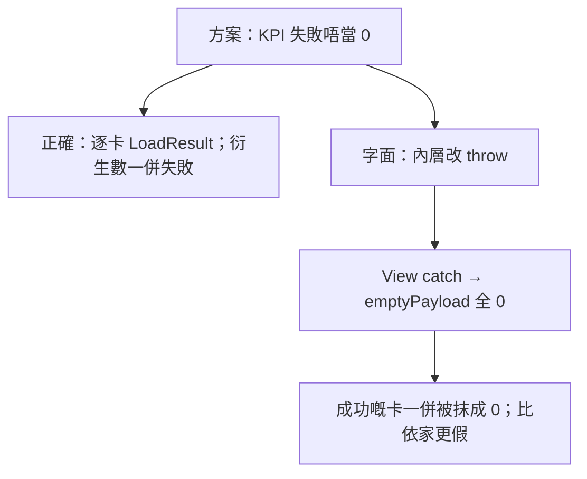

# 對抗檢查：前端架構邊界方案（落地後遺）

| 欄位 | 值 |
| --- | --- |
| 日期 | 2026-08-16 |
| 對象 | 當時 [`frontend-architecture-boundaries.md`](../topics/frontend-architecture-boundaries.md) 建議波次 |
| 其後 | 同日第一性審核＋[計劃](../plans/2026-08-16-frontend-architecture-boundaries.md) 已吸收部分紅線；**與計劃衝突以計劃為準** |
| 方法 | 指引第 2 條：假設方案已按字面實施，對讀實際共用路徑 |
| 不含 | 實作 |

**結論先行：** 方向啱，波次 1–2 值得做。但若按字面「失敗改 throw／拆 tab／reuse 現有 trial query／搬 `insertScheduleRow`」，有機會令營運總覽、老師首頁、點名頁、報讀熱路徑 **比依家更差**。

---

## 總判

| 問題 | 判定 |
| --- | --- |
| 先收直打 DB、再拆 God files | **通過** |
| 失敗／真 0／真空三態 | **通過**；對抗後必須連衍生數一齊定 |
| 對日常運作影響（正確實作） | **低～中正面** |
| 對日常運作影響（字面／偷懶實作） | **高**（總覽整頁歸零、老師首頁試堂常紅、點名誤以為載入失敗） |
| 最大對抗風險 | 把「唔好 return 0」做成 `throw`，而 `MgmtDashboardView` catch 仍 `setData(emptyPayload)` |

---

## 日常運作（假設已落地）

| 日常 | 正確實作 | 字面／偷懶實作 |
| --- | --- | --- |
| 管理層開營運總覽 | 壞卡「未能載入」；好卡仍有數 | 一條試堂 count timeout → **整頁 0**（見 P0-1） |
| 匯出總覽 CSV 寄 WhatsApp | 失敗列寫「未能載入」 | 仍輸出數字 0（見 P1-5） |
| 老師首頁未來試堂 | 瘦 query、class_id 範圍不變 | reuse `fetchTrialsWithRelations` → 老師 RLS 打唔開 `payments` embed → 試堂位常紅（見 P0-2） |
| 進行點名 | 待補徽章獨立失敗，仍可點名 | `setErr` 同排程載入共用紅條 → 老師以為點名壞咗（見 P1-7） |
| 報讀／點名／請假熱路徑 | fetch 搬家、語意不變 | `!supabase` 由回空變成 throw；或 lib→service 環狀 import（見 P1-8） |
| 學生／班別詳情 | 角色旗標留父層 | 每個 tab 自己 `isAdminOrAlien()` → 已修 CTA 又漏（見 P1-6） |
| 加堂／補堂／私人課程預約／批課室 | 簽名同代堂鐵則不變 | 搬家時同步 `classes.teacher_id` → 代堂歷史錯（見 P0-4） |
| P0-1 staging 收緊 RLS 當日 | 總覽變紅＝偵測到政策問題 | 無預告 → 管理層當系統死 |

---

## P0 — 實作紅線

### P0-1　唔好把「唔 return 0」做成 throw，除非同一 PR 改 View

現況：`countTrials` 等失敗 `return 0`；`sumPaidAmount` 失敗 **已經 throw**。`MgmtDashboardView.load` catch 會 `setData(emptyPayload)`——全 KPI 變 0。

最容易嘅改法係抄 `sumPaidAmount`：`if (error) throw error`。試堂一 timeout，`Promise.all` 整橛失敗，**連已成功嘅實收都俾 emptyPayload 抹掉**。

**要：** 內層回 `{ ok: number } | { error }`；View **禁止**用 `emptyPayload` 當 catch 後備。整次網絡死先用頁級錯誤。Summary 同 full 兩段同一契約。

### P0-2　老師首頁試堂：新函式，禁止 reuse 管理頁 query

`TeacherHomeView` 而家：按老師 `class_id` chunk、`trial_date >= today`，embed 只有學生名同班名。

`trialQueries.fetchTrialsWithRelations` 另有 `payments!payment_id`、`teachers`、`outcome`、價錢。老師 JWT 對付款 embed 好易 RLS 失敗。

**要：** 新 `fetchUpcomingTrialsForClassIds`，select／日期窗／class 範圍同而家字面一致；只搬屋、唔升級 query。

### P0-3　Count KPI 唔存在 `empty` 態

對「新報讀人數／實收／在讀人次」，**成功嘅 0 就係 0**。把 `0` 當成 `empty` → 月初無人報讀會顯示「未能載入」。

轉化率要分三種：真 0 堂試堂（N/A）、試堂 count **失敗**（未能載入）、有試堂而 0% 轉化（真 0%）。

**要：** 計數用 `{ ok: number } | { error }`。衍生數任一輸入係 error → 該衍生數 error，禁止把 error 當 0 再除。

### P0-4　搬 `insertScheduleRow` 唔准改寫入副作用

被排程頁、連堂批次、補堂、私人課程預約、課室占用、批課室申請共用。搬家 PR「順手」對齊 `classes.teacher_id` 會令代堂、計糧、出勤一齊錯。

**要：** 搬家＝檔案位置＋import；簽名、連堂、學年 confirm、**唔寫 classes.teacher_id** 維持。

---

## P1 — 方案未考慮、高機會踩

### P1-1　衍生數同告警仍會「假靚」

- `deltaPct`：上期失敗當 0 → 環比暴升。
- 漏斗、sparkline。
- `opsAlerts` 用 `unpaidCount`；失敗當 0 → 欠費告警消失。
- `countAttendanceVisits` error 就 `break`，已累積 chunk 當全月。

**要：** 環比／漏斗／告警／分項人次：輸入有 error 就標不完整或隱藏。

### P1-2　兩段 fetch 會互相覆蓋；亦同效能題打架

先 summary paint，再 full **整份覆蓋**。Full 若 throw 會觸發 P0-1。Count 下放而兩段各打一次＝更多 round trip。

**要：** 錯誤語意同兩段覆蓋同一 PR 定；禁止加劇查詢次數。

### P1-3　`MgmtStatCard`／`KpiCardModel` 被三個產品面共用

營運總覽、職員表現、HK 成本統計共用卡。改 `value` 或 status 會一併打到未列入驗收嘅頁。

**要：** 失敗態可選、舊呼叫方不變；或同一 PR 改齊三面。

### P1-4　產品 KPI 規格 1–7 尚未落地

波次 2 只加載入契約，唔為而家每張卡做精美空態文案。

### P1-5　CSV 仍可把失敗寫成 0

`exportMgmtDashboardCsv` 直接寫 `k.value`。卡面修咗、匯出未修＝仍傳假零表。

**要：** 失敗列數值空或「未能載入」；禁止輸出 0。

### P1-6　拆 tab 會打散已修過嘅角色旗標同未儲存閘

`canViewMoney`／`canMutateLeave`、`tabLoadedRef`、`unsavedLeave`、`?tab=` 深連結集中喺父層。P0-2 前拆，權限 PR 爆炸半徑變大。

**要：** 角色同未儲存閘留父層。波次 3 避詳情頁直到 P0-2，或接受 N 檔跟進。

### P1-7　點名頁待補失敗唔可以共用 `err`

`err` 而家＝排程列表載入失敗。待補只係標題徽章。`ilike("%待補%")` 同 `"待補課"` 亦唔同學串。

**要：** 徽章獨立未知態。status 字串本波維持 ilike。

### P1-8　`enrollmentPeriod.ts` 唔止三條 fetch；熱路徑禁改語意

仲有 `enrollmentVisibleOnScheduleDate`（async、打 DB；無 caller）。`!supabase` 而家回空／regular，唔 throw。新檔唔好 import `classQueries`（環狀 → 運行時 undefined）。

### P1-9　`reportUserFacingError` 放大噪音

總覽每卡失敗若都報一次，一次 timeout 就灌爆系統問題頁。組合層每卡最多一條；唔好雙報。

---

## P2 — 次要

1. 拆檔變成分散式 God（父層仍持 40+ state）。
2. `insertPaymentForStudent` 無 caller；唔好搬活去收款主路徑。
3. Grep 閘唔等於分層乾淨。
4. 「先補測試再刪舊路徑」造成雙實作；限同一 PR 搬完即刪 inline。
5. 本機 mock 仍全綠假數，production 先有未能載入。
6. 每 slice 三態測試若 mock 成個 Supabase 會拖產品 PR。

---

## 同其他進行中主題嘅碰撞

| 主題 | 落地後 |
| --- | --- |
| P0-1／P0-2 權限 | 失敗變可見＝RLS 探測器。P0-2 前拆詳情 tab 令角色旗標要改 N 檔。 |
| 總覽／計糧 perf | 錯誤語意唔准加 round trip。 |
| KPI 規格 1–7 | 契約可先做；唔好為舊卡做一輪精美空態又作廢。 |
| 流動介面 | 抽 tab 漏傳 `isMobile` → 分叉回歸。 |
| 代堂／私人課程 | 波次 4 排程寫入搬家係最高危共用核。 |

---

## 建議

波次 1–2 可以做，但必須守 P0。波次 3 詳情頁宜等 P0-2。波次 4 `insertScheduleRow` 搬家視為獨立高危。唔需要取消主題；要防止「失敗變 throw＋emptyPayload」呢條最短路徑。
