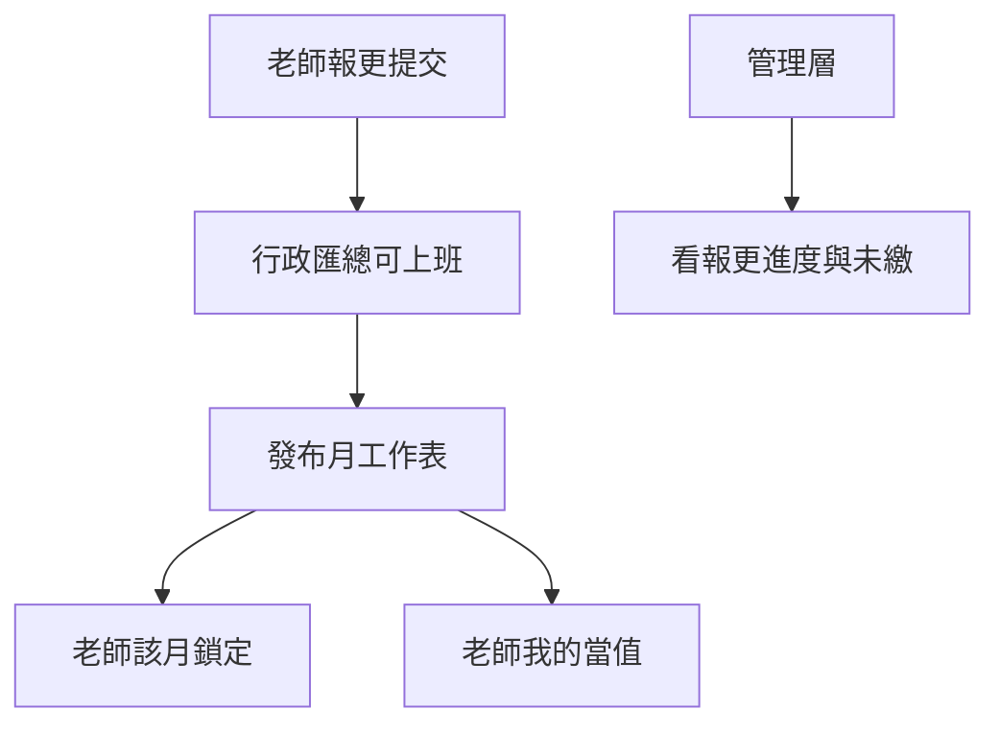

# 功課輔導班 — UI 設計 v2（全角色）

> 日期：2026-08-01  
> 性質：**第二輪介面設計**，以角色為軸。取代首輪「單一行政六分頁」為主的敘事。  
> 沙盒：`/prototype/HomeworkTutoring`（頂部切換角色；假資料、不接 DB）  
> 產品依據：[`docs/product/topics/homework-tutoring.md`](../backlog/homework-tutoring.md)  
> 首輪線框備查：[`2026-08-01-homework-tutoring-ui-design.md`](./2026-08-01-homework-tutoring-ui-design.md)

---

## 0. 設計原則

1. **一角色一任務重心**：行政做日常；管理層監督；老師報更與看自己當值。
2. **與專科班區隔**：無點名扣堂、無請假補堂；日曆服務課室與當值。
3. **每日功課進度（影相＋打字）不進本系統**：繼續 Notion；本設計不畫學生日誌／相簿。
4. **薪酬不畫**：交計糧引擎。
5. **共用規範**：底線分頁、篩選用標籤、金額未定顯示「—」、書面語。

---

## 1. 角色任務矩陣

| 任務 | admin／alien | manager | teacher |
| --- | --- | --- | --- |
| 本月營運數字 | 完整 | 完整 | — |
| 學生報讀（檔次、逢星期幾） | 讀寫 | 監督為主（可讀） | — |
| 月費／收款入口 | 讀寫 | 讀＋異常 | — |
| 報更進度／催交 | 讀寫 | 讀 | — |
| 填報自己可當值 | 可代填 | 次要 | **主路徑** |
| 月工作表發布、改課室 | 讀寫 | 可發布 | — |
| 我的／全員當值 | 全員 | 全員 | **只自己** |
| 功輔校曆 | 讀寫 | 讀寫 | 讀 |
| 價目／時段設定 | 讀寫 | 讀 | — |

**編更 D1**：老師自助報更為主；行政可代填／覆寫；管理層看齊交進度。

---

## 2. 導航與沙盒殼

```
頂部：沙盒橫幅｜角色切換［行政｜管理層｜老師］｜（老師時）示範老師 Select
標題：功課輔導｜{學年}學年｜{月份}
儀表板四格：僅行政／管理層顯示（標題下、分頁上）
其下：該角色之分頁內容
```

正式產品日後：行政入口獨立；老師側欄「功輔報更」；管理層掛監督向入口。本輪不掛 `navStructure`。

---

## 3. 行政／外星人 — 工作台

分頁：概覽｜學生報讀｜月費｜當值編更｜功輔校曆｜設定

### 3.1 概覽

- 儀表板（全域，見上）
- 放大「今日當值」（課室／時段／導師）
- 提醒：未繳、未交報更人數、校曆提示

### 3.2 學生報讀

- 搜尋＋標籤篩選（年級／日數檔／狀態／生效月）
- 欄：姓名、學號、年級、價目檔、**逢星期幾**、生效月、狀態
- 新增報讀：日數檔＋逢星期幾（日數須一致）

### 3.3 月費

- 應繳金額「—」；［收款］示意走現有繳費入口

### 3.4 當值編更

1. **報更進度**：每位老師 未交／草稿／已提交；可代填  
2. **可上班時段**：匯總格（含行政覆寫標記）  
3. **月工作表**：課室＋全日／上下節；發布／撤回  

### 3.5 功輔校曆／設定

同首輪；設定含時段、價目結構、計費表空狀態；末節讓房待定註記。

---

## 4. 管理層 — 監督台

分頁：監督首屏｜本月當值｜報更進度｜月費異常

- **首屏**：報更齊交率、未繳人數、當值覆蓋、關注項（少表單）
- **本月當值**：全員月曆唯讀為主
- **報更進度**：列表；不以代填為主 CTA
- **月費異常**：未繳名單
- 可切角色至「行政」看完整工作台（沙盒）

---

## 5. 老師 — 個人功輔

分頁：功輔報更｜我的當值｜放假日

### 5.1 功輔報更（主頁）

- 選月份（示範下月 10 月）
- 狀態：草稿／已提交／已鎖定（月工作表已發布）
- 月曆點格循環：全日 → 上節 → 下節 → 不可
- 截止提示（示範：上月 25 日）
- 儲存草稿｜提交｜撤回修改
- 文案註明：**不是**「老師檔期規劃」專科頁

### 5.2 我的當值

- 已發布月份中，自己的課室／時段／上或下節

### 5.3 放假日

- 功輔校曆唯讀

不做：學生名單、收款、發布編更、價目。

---

## 6. 跨角色流程



---

## 7. 狀態 Tag

| 文案 | 用途 |
| --- | --- |
| 在籍／暫停／結束 | 報讀 |
| 未收款／已收款 | 月費 |
| 未交／草稿／已提交／行政覆寫 | 報更 |
| 草稿／已發布／已鎖定 | 月工作表／老師端 |
| 功輔放假 | 校曆 |
| 全日／上節／下節 | 當值 |

---

## 8. 明確不做

- 正式側欄、DB、RLS
- 每日功課進度（Notion）
- 計糧、末節自動讓房、真實價錢
- 家長端
- 與專科 `TeacherAvailability` 共用表

---

## 9. 驗收

- 本文件三角色畫面齊全
- 沙盒可切三角色；老師走完報更→行政見進度→發布後老師見「我的當值」
