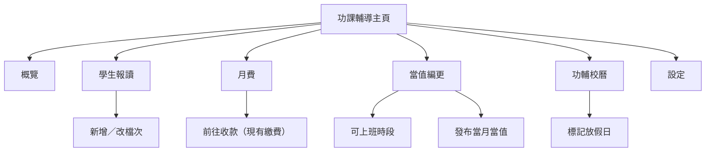

# 功課輔導班 — UI 設計（首輪）

> 日期：2026-08-01  
> 性質：**介面設計稿（首輪）**。全角色重設計見 **[v2](./2026-08-01-homework-tutoring-ui-design-v2-roles.md)**。  
> 可開啟沙盒：~~`/prototype/HomeworkTutoring`~~（**2026-08-29 已刪**）  
> 產品依據：[`docs/product/topics/homework-tutoring.md`](../backlog/homework-tutoring.md)  
> UI 規範：[`docs/meta/UI_DESIGN_INSTRUCTIONS.md`](../UI_DESIGN_INSTRUCTIONS.md)  
> 沙盒程式：~~`src/prototypes/homeworkTutoring/`~~（已刪；正式畫面 `src/components/homeworkTutoring/`）

---

## 0. 設計目標

1. **與專科班明顯區隔**：無點名扣堂、無請假、無補堂；日曆與排程只服務課室佔用與導師當值。
2. **一班制**：全體功輔學生歸同一「場次」；報讀差異只在年級與每週日數價目檔。
3. **按月繳費**：已繳即可於開放時段使用；出席不影響收費（價錢與部分月份計費表後補，介面先預留欄位）。
4. **行政／管理層為主**：編更、校曆、報讀、收款入口；老師僅需查看自己當值（首輪可選）。
5. **手機可用**：名單瀏覽、當月當值一覽、標記放假；複雜編更以桌面為主、手機可檢視與小改。

---

## 1. 資訊架構與導航

### 1.1 建議入口

側欄新增一級或掛在「學生與班務」下：

| 項目 | 建議路由（示意） | 角色 |
| --- | --- | --- |
| 功課輔導 | `/HomeworkTutoring` | admin、manager、alien |
| （老師）我的功輔當值 | 可併入現有「時間表」，或子頁 `/TeacherHomeworkDuty` | teacher（可選，第二輪） |

**不**把功輔學生混進小組班列表當普通 `group` 班；亦**不**掛進請假管理。

### 1.2 主頁分頁（單一產品殼）

```
功課輔導
├── 概覽
├── 學生報讀
├── 月費
├── 當值編更
├── 功輔校曆
└── 設定（價目／時段 — 金額可空）
```

桌面：底線式分頁（與學生詳情一致：`border-b-2 border-primary`），**不用** Radix pill `TabsList`。  
手機：以 `Select` 切換分頁（同學生詳情）。



---

## 2. 各畫面線框

### 2.1 概覽

用途：一眼看到本月營運狀態（非專科「今日點名」）。

```
┌─────────────────────────────────────────────────────────────┐
│  功課輔導                              學年 2627  │ 2026年9月 │
├─────────────────────────────────────────────────────────────┤
│  ┌──────────┐ ┌──────────┐ ┌──────────┐ ┌──────────┐       │
│  │ 在籍學生  │ │ 本月已繳  │ │ 本月未繳  │ │ 本月當值日│       │
│  │    28    │ │    22    │ │     6    │ │  22 日   │       │
│  └──────────┘ └──────────┘ └──────────┘ └──────────┘       │
│                                                             │
│  今日當值                                                    │
│  課室：17E　時段：15:15–19:30　導師：全日 · 陳老師           │
│  ［查看本月編更］                                           │
│                                                             │
│  提醒（示例）                                                │
│  • 尚有 6 人未繳 9 月月費          ［前往月費］              │
│  • 10 月編更尚未發布               ［前往編更］              │
│  • 功輔校曆 9 月尚未完整設定       ［前往校曆］              │
└─────────────────────────────────────────────────────────────┘
```

**不做**：今日學生點名清單、補堂佇列、逾期罰款標籤。

---

### 2.2 學生報讀

用途：管理誰在籍、哪個價目檔（年級 × 每週三日／四日／五日）。

```
┌─────────────────────────────────────────────────────────────┐
│  學生報讀          ［搜尋姓名／學號］  年級▼  日數檔▼  狀態▼ │
│                                         ［新增報讀］         │
├─────────────────────────────────────────────────────────────┤
│  姓名     學號    年級   價目檔   逢星期幾      生效月    狀態  │
│  王小明   S0123   中二   四日    一／二／四／五  2026-09   在籍  │
│  李小華   S0456   中四   五日    一至五         2026-09   在籍  │
│  …                                                          │
└─────────────────────────────────────────────────────────────┘
```

**新增／編輯報讀（Dialog）**

```
┌─────────────────────────────┐
│  新增功輔報讀                │
│  學生 *        ［可搜尋選擇］ │
│  年級 *        ［Select］    │
│  每週日數檔 *  ○三日 ○四日 ○五日 │
│  逢星期幾 *    ［一二三四五標籤］│ ← 日數須與價目檔一致
│  生效月份 *    ［月選擇］    │
│  備註                        │
│                             │
│  說明：紀錄慣常到校星期；     │
│  不限制實際到校；不設請假補堂。│
│                             │
│        ［取消］  ［儲存］    │
└─────────────────────────────┘
```

狀態建議：`在籍`／`暫停`／`結束`（Tag + `statusToTagTone`）。  
**禁止**出現：補課、請假、剩餘堂數、扣堂。

手機：卡片列表（姓名、檔次、狀態）；詳情／編輯用 bottom sheet 或 Dialog。

---

### 2.3 月費

用途：按曆月查看誰應繳／已繳；實際收款走現有繳費流程（單一入口，見 UI 規範 §15）。

```
┌─────────────────────────────────────────────────────────────┐
│  月費          ［2026年9月 ▼］     ［匯出］                   │
│  已繳 22　未繳 6　金額合計 $—（價錢後補時顯示 —）              │
├─────────────────────────────────────────────────────────────┤
│  學生      價目檔     應繳金額    收款狀態      操作          │
│  王小明    每週四日   $—         未收款        ［收款］      │
│  李小華    每週五日   $—         已收款        ［查看單據］  │
└─────────────────────────────────────────────────────────────┘
```

- 金額欄：價錢未定前顯示「—」或「待定」，**不**假造數字。
- 「部分月份收費較低」：設定齊備後，該月應繳自動帶入計費表；UI 可在金額旁顯示小字「本月按優惠／減收表」。
- ［收款］：跳轉或開啟現有繳費流程，並帶入學生與「功輔月費」項目（實作階段再對接；本設計只定入口）。
- **不**顯示第 N 堂罰款、禁止入室。

---

### 2.4 當值編更（核心）

分兩步：**可上班時段** → **月工作表（發布）**。

#### 2.4.1 可上班時段（admin／manager 代填）

```
┌─────────────────────────────────────────────────────────────┐
│  可上班時段 — 2026年10月                                     │
│  老師 ［全部 ▼］   ［從上月複製］                              │
├─────────────────────────────────────────────────────────────┤
│         一   二   三   四   五                               │
│  陳老師  全日 全日 上節  —   下節                             │
│  王老師  下節  —   全日 全日 全日                             │
│  …                                                          │
│  圖例：全日｜上節｜下節｜不可                                 │
│  點格循環切換；或點格開小選單。                               │
│                                                             │
│                              ［儲存草稿］                     │
└─────────────────────────────────────────────────────────────┘
```

暫定分界說明（頁腳或設定）：上節 15:15–17:30、下節 17:30–19:30（可調）。

#### 2.4.2 月工作表

```
┌─────────────────────────────────────────────────────────────┐
│  月工作表 — 2026年10月     狀態：草稿｜已發布                  │
│  預設課室 ［17E ▼］   ［自動编排建議］ ［發布］ ［撤回草稿］   │
├──────┬────────────┬──────────────┬──────────┬───────────────┤
│ 日期 │ 放假？      │ 課室         │ 當值     │ 操作          │
├──────┼────────────┼──────────────┼──────────┼───────────────┤
│ 10/2 │             │ 17E          │ 全日 陳  │ ［改］        │
│ 10/3 │             │ 17E          │ 上 陳／下 王 │ ［改］     │
│ 10/4 │ 功輔放假    │ —            │ —        │               │
│ …    │             │              │          │               │
└──────┴────────────┴──────────────┴──────────┴───────────────┘
```

**單日編輯（Dialog）**

```
┌──────────────────────────────┐
│  編輯當值 — 10月3日（五）     │
│  □ 本日功輔放假               │
│  課室 *     ［Select］        │
│  模式       ○全日 ○分上下節   │
│  全日導師   ［Select］        │
│  — 或 —                      │
│  上節導師   ［Select］        │
│  下節導師   ［Select］        │
│  衝突提示：王老師 17:45 已有   │
│  專科班（硬性禁止發布）        │
│           ［取消］ ［儲存］   │
└──────────────────────────────┘
```

月曆檢視（可切換）：

```
        十月 2026
  一    二    三    四    五
  陳    陳    陳/王  放假  王
 17E   17E   17E    —   17D
```

發布後：排程／專科排課畫面應能看到該課室時段已被功輔佔用（實作階段；本設計要求「發布＝對外生效」的心智模型）。

**不做**：學生點名紙、代堂補課、按學生鐘點收費。

手機：月曆格簡覽＋點日看詳情 sheet；「自動编排」可桌面限定。

---

### 2.5 功輔校曆

與全校「校曆」分開；只影響功輔開放日。

```
┌─────────────────────────────────────────────────────────────┐
│  功輔校曆          ［2026年9月 ▼］                            │
│  ［從專科校曆匯入公眾假期（可選）］  ［新增放假］               │
├─────────────────────────────────────────────────────────────┤
│  月曆：上課日＝實色；放假＝斜線或灰色 Tag「功輔放假」           │
│                                                             │
│  本月放假列表                                                │
│  9/18  中秋翌日（功輔放假）     ［刪］                        │
│  9/30  校方進修日（功輔放假）   ［刪］                        │
└─────────────────────────────────────────────────────────────┘
```

九月月曆未公布前：頁面可空狀態「尚未設定；不影響先建報讀名單」，並在概覽提醒。

與編更聯動：放假日在月工作表自動列為放假、不可派當值（可人手覆寫須 Confirm）。

---

### 2.6 設定

```
┌─────────────────────────────────────────────────────────────┐
│  設定                                                        │
│  開放時段（顯示）  15:30–19:30（佔用自 15:15）                 │
│  上下節分界       ［17:30］                                   │
│                                                             │
│  價目表（年級 × 每週日數）                                    │
│  年級 │ 三日／月 │ 四日／月 │ 五日／月                        │
│  中一 │   —     │   —     │   —                              │
│  …    │         │         │                                  │
│  ［編輯價目］— 金額未定前可只建結構、金額留空                   │
│                                                             │
│  部分月份計費表（後補）                                       │
│  空狀態：尚未匯入；齊備後按月覆寫應繳金額                      │
└─────────────────────────────────────────────────────────────┘
```

末節讓房（C2）：**首輪 UI 不畫自動規則**；僅在設定底部註「末節撥予專科：規則待定」。

---

## 3. 與現有模組的邊界

| 現有模組 | 功輔關係 |
| --- | --- |
| 班別管理／小組課 | 不混用列表；功輔獨立入口 |
| 排程管理 | 發布當值後顯示課室佔用；無學生堂次點名 |
| 校曆 | 分開；可選「匯入公眾假期」作草稿 |
| 請假管理 | **不出現**功輔學生流程 |
| 繳費 | 月費［收款］走現有單一收款入口 |
| 一對一 | 無關 |
| 計糧 | 本設計不含；當值資料日後可供計糧，本期不畫薪酬 UI |

---

## 4. 角色與權限（介面層）

| 動作 | admin | manager | alien | teacher |
| --- | --- | --- | --- | --- |
| 查看概覽／名單／編更／校曆 | ✓ | ✓ | ✓ | 僅自己當值（可選） |
| 新增報讀、改檔次 | ✓ | ✓ | ✓ | — |
| 代填可上班、發布編更 | ✓ | ✓ | ✓ | — |
| 編輯功輔校曆、價目 | ✓ | ✓ | ✓ | — |
| 收款 | ✓ | ✓ | ✓ | — |

前端隱藏不代表權限安全；實作階段另訂 RLS。

---

## 5. 狀態與文案（Tag）

| 文案 | 用途 |
| --- | --- |
| 在籍／暫停／結束 | 報讀 |
| 未收款／已收款／部份（若日後分期） | 月費 |
| 草稿／已發布 | 月工作表 |
| 功輔放假 | 校曆與編更 |
| 全日／上節／下節 | 當值 |

金額未定：界面統一「—」或「待定」，避免 `$0` 被誤解為免費。

---

## 6. 空狀態與防呆

| 情境 | 處理 |
| --- | --- |
| 無報讀學生 | 空狀態＋［新增報讀］ |
| 價目金額全空 | 月費列表可建、收款前提示「價錢未設定」 |
| 校曆未設 | 可編更；放假日為空；概覽提醒 |
| 發布時導師與專科撞期 | 阻擋發布＋列出衝突 |
| 發布時課室撞期 | 阻擋發布＋列出衝突 |
| 對功輔學生按「請假」 | 不提供入口；若從學生詳情誤入，不展示功輔補堂 |

---

## 7. 手機優先級（首輪）

| 優先 | 畫面 |
| --- | --- |
| P0 | 概覽、學生報讀列表、月費列表、當月當值月曆檢視 |
| P1 | 新增報讀、單日改當值、標記放假 |
| P2 | 可上班時段大表、自動编排、價目矩陣編輯（建議桌面） |

---

## 8. 首輪刻意不做（UI 亦不畫）

- 學生點名、請假、補堂
- 按出席計費或扣堂
- 逾期罰款／禁止入室
- 末節自動讓房精靈
- 老師自助填可上班（第二輪）
- 薪酬／時薪畫面
- 真實路由、元件、資料表

---

## 9. 請營運確認

1. 側欄用獨立「功課輔導」是否合適，抑或掛在現有某組之下？
2. 老師端要否第一輪就看到「我的功輔當值」？
3. 月費列表是否需要與專科月費提醒合併顯示，還是嚴格分開？
4. 上下節分界 17:30、佔用自 15:15 的文案是否照示？
5. 「自動编排建議」要否首輪就有，還是只人手填月工作表？

確認後再更新 backlog；**仍不開始頁面與資料庫**，直至價錢／校曆等阻塞項有分期決定。
