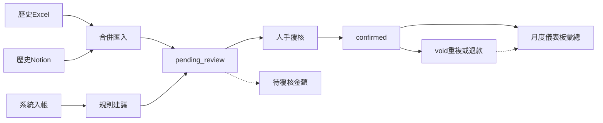

# HK 成本統計（儀表板＋入帳）— 實作計劃（已取代）

> **已取代**：產品方向改為「管理分析＋計糧過帳＋預留純利」。請用  
> [`2026-08-05-hk-expense-cost-stats.md`](./2026-08-05-hk-expense-cost-stats.md)  
> 與分題 [`../backlog/hk-expense-cost-stats.md`](../backlog/hk-expense-cost-stats.md)。  
> 下文僅作 2026-08-04 歷史備查（Excel／Notion 對齊語態；live／雙源細節已過時）。

> 日期：2026-08-04（修訂：納入 Notion 日記帳）  
> 狀態：**superseded**（2026-08-05）  
> 索引：[`docs/product/BACKLOG.md`](../BACKLOG.md) · 分題 [`docs/product/topics/hk-expense-cost-stats.md`](../backlog/hk-expense-cost-stats.md)  
> 歷史資料來源（只匯入一次，之後改系統入帳）：  
> 1. Excel：`…/Accounting/26-27 會計年度/26-27 mainhope accounting .xlsx`（**只 HK 月表**）  
> 2. Notion：`明學日記帳紀錄` CSV（2025-04～2026-08，150 筆；私人和共用匯出）  
> 對抗模擬：營運入帳／技術 RLS／跨模組語意（2026-08-04）；結論已寫入下方「最低安全組」

---

## 0. 目標

為 HK 建立**公司開支日記帳＋月度成本儀表板**：

- **日常**：系統內入帳（對齊統一欄位，唔再依賴 Excel／Notion）
- 規則自動建議分類帳＋人手覆核
- 儀表板睇已確認總開支／分類趨勢；待覆核另欄顯示
- **歷史**：Excel＋Notion **合併匯入** → 一律 `pending_review`，人手確認後先入彙總

**明確不是**：員工績效、計糧引擎、正式損益、CN 帳、收據上傳／OCR、複式記帳、報銷工作流（歷史「已報銷」不理）。

---

## 1. 決策鎖定

| 項目 | 決定 |
| --- | --- |
| 範圍 | 只 HK；唔做 CN 檔／收據／OCR |
| 角色 | **manager／alien** 可見可入；admin／teacher／finance 無側欄入口 |
| 分類 | 規則建議＋人手覆核；`pending_review` **不入**分類彙總 |
| 與 StaffPerformance | 不取代、不做自動對賬 |
| 與計糧 | 獨立；日記帳薪金列＝出糧紀錄語意，非正式應計 |
| Excel／Notion | **只係歷史資料**；匯入後停止用兩本帳入新單；日後一律系統入帳 |
| 歷史匯入 | Excel HK 月表 ∪ Notion CSV → `pending_review`，不自動 `confirmed` |
| 報銷 | **不理**歷史「已報銷／員工先付」語意；唔加報銷狀態欄 |
| 雙來源重疊 | **唔做自動對銷**；靠 `source_key` 各源冪等＋覆核時人手 void 重複列（見 §6.3） |

---

## 1.1 Notion 日記帳對計劃的修正（2026-08-04）

抽樣：150 列；類別 10 種；支付以 Cashbox 為主（107）；127 列有圖（本期唔入庫）。

### 對產品／模型要改

| 發現 | 計劃修正 |
| --- | --- |
| 支付方式只有「Cashbox 即取／公司銀行卡／員工自行先付」 | `pay_method` 正規化枚舉加對照表（§3）；Excel「CASH BOX／銀行／現金／余sir／內地還款」一併 map |
| 類別＝前線粗分（文具雜物、團建聚餐…），同 Excel「清單名稱」粒度唔同 | Seed 科目仍以 Excel 清單為主；Notion 類別做**匯入時次級建議**（title 規則 miss 先用類別 map） |
| 「費用說明」常垃圾（如 `888`），真正描述在「報銷相關紀錄」 | 匯入 `title`＝優先較長／非純數字嘅說明；兩者都有則 `title`＋notes 互備 |
| 「其他費用」內混有租金、PT 工資、Microsoft、退學費、內地稅 | 加強 title 規則（退款／租金／工資／軟件）；唔信 Notion 類別 alone |
| 「功課班」內有退學費、淘寶、導師工資 | 同類別唔能一刀切科目；仍靠 title＋人手 |
| 已報銷 32 筆 | **忽略**報銷狀態；只取日期／金額／說明／支付／填表人 |
| 圖片路徑 | 本期不存；可選把檔名寫入 `receipt_label` 文字，唔做 storage |
| 日期跨 2025-04～2026-08 | 歷史窗以「兩源實際列」為準，唔鎖死 APR–JUL（Excel 仍按其有嘅月表） |

### Notion 類別 → 建議科目（匯入次級；可被 title 規則蓋過）

| Notion `費用類別` | 建議 ledger（Excel 清單語意） | 備註 |
| --- | --- | --- |
| 上網或電話費 | 費用 - 上網或電話費 | 對齊 |
| 教材 | 成本 - 教材（科目未分科則「其他」／待揀） | 分科要人手 |
| 前台人工 | 成本 - 其他直接成本 | 同原計劃 |
| 兼職工資 | **留空**＋hint「薪金類、請人手揀科」 | 同泛用人工 |
| 交通費 | 費用 - 其他費用 | 或下波加交通科目 |
| 傳單印刷 | 費用 - 其他費用（廣告／印刷） | title 有「廣告」可另規則 |
| 團建聚餐 | 費用 - 其他費用 | |
| 文具雜物 | 費用 - 其他費用（文具） | 若 Excel 有文具科則對齊 |
| 其他費用 | **唔自動填**（只靠 title 規則） | 雜項最多 |
| 功課班 | **唔自動填** | 內含退款／工資／物料 |

### 由 Notion 加／調高的 title 規則

| 優先 | pattern | 行為 |
| --- | --- | --- |
| 最高 | `退學費`／`退一堂`／`退.*班`／`退款` | **唔當成本**：`force_pending`、account 空、hint「或為退款／學費退回，請 void 或另處理」 |
| 高 | `按金` | 維持：唔建議租金 |
| 高 | `清潔人工`／`清潔`（但唔蓋「清潔劑」） | 清潔費；pattern 用詞邊界，避免「清潔劑」→清潔費 |
| 高 | `前台`／`行政` | 其他直接成本 |
| 高 | `mpf`／`強積金` | 導師薪金(強積金） |
| 中 | `電費`／`租金`／`管理費`／`寬頻`／`電話`／軟件牌名 | 維持原表 |
| 中 | `廣告`／`banner`／`傳單`／`海報`／`小冊子` | 其他費用＋hint 宣傳印刷 |
| 低 | 泛用 `人工`／`薪`／`工資`／`兼職` | 唔自動分科 |

禁止：低優先「人工」蓋過「清潔人工」「前台」；「清潔」蓋過「清潔劑」（用較長／較具體 pattern 優先：`清潔劑`→其他／文具）。

---

## 2. 最低安全組（對抗模擬必做）

以下由三角度模擬（營運／RLS／跨模組）抽出，**實作時必須納入**，唔算可選。

### 2.1 RLS／審計

1. **唔用** `is_mgmt_staff()`（會令 admin API 讀寫開支）。三表 RLS：  
   `current_app_role() in ('manager', 'alien')`（SELECT／INSERT／UPDATE）。
2. **禁硬刪**（無 DELETE policy）；加 `voided_at`／`void_reason`／`voided_by_label`；儀表板只計 `voided_at is null`。
3. **`confirmed` 鎖定**：不可直接改 `amount_hkd`／`spent_on`／`ledger_account_id`；改類須先回 `pending_review`（trigger 或 service 分函式 `confirmEntry`／`reopenForRecategorize`）。
4. **規則表／ledger 寫入**：seed 後，`expense_category_rules` 寫入限 **alien**（manager 只讀）；ledger accounts 同期（避免規則被污染）。
5. FK：`ledger_account_id` → `ON DELETE RESTRICT`；確認時 account 須 `active`。

### 2.2 建議規則優先序

Suggest 定序：`priority DESC`，同優先則 `length(pattern) DESC`，再 `id`。  
完整 seed 表＝原 §2.2 租金／清潔／MPF 等 **＋** §1.1 Notion 增補（退款最高優先）。

### 2.3 儀表板防呆／文案

- 頁首固定：  
  **「HK 公司開支日記帳（現金／付款日）。唔係員工績效、唔係計糧、唔係損益表。」**  
  次行：**「與員工績效人工、計糧結果不做自動對賬；歷史 Excel／Notion 已停止入新單，以本頁已確認分類為彙總來源。」**
- KPI 拆卡（禁止「毛利／淨利／盈虧」字眼）：  
  - **已確認開支合計**  
  - **直接／間接**（僅 confirmed）  
  - **待覆核金額／筆數**（不入分類）  
- 待覆核佔當月總流出 > 30% → 警告：「分類趨勢未可靠」。
- 月份篩選旁：**「統計月＝開支日期（付款／入帳日），唔係計糧所屬月。例：4 月付 3 月薪 → 計入 4 月。」**
- 分類圖／長條只標「已確認」。

### 2.4 匯入冪等

- `import_batch_id`（nullable）＋ `source_key`（見 §6）**UNIQUE**（允許 null source_key 給人手入帳）。
- 重跑唔重複列；一律 `pending_review`。
- `source_system`：`excel`｜`notion`｜`manual`（manual 時 source_key 通常 null）。

---

## 3. 資料模型

```text
expense_ledger_accounts
  id uuid PK
  code text unique          -- 穩定碼，供 seed／規則引用
  label text                -- 顯示名（對齊 Excel 清單名稱）
  account_group text        -- 'direct' | 'overhead'
  subject text null         -- 中文／英文／數學／理科／功輔 等
  sort_order int
  active boolean default true
  region text not null default 'HK' check (region = 'HK')

expense_category_rules
  id uuid PK
  pattern text not null     -- substring；匹配時 lower()
  ledger_account_id uuid null FK → accounts (RESTRICT)
    -- null = 規則命中但故意不自動填科目（例如泛用「人工」、退款）
  force_pending boolean default false  -- true：只提示、suggested 可空
  hint text null            -- UI 提示（按金／退款／請人手揀科）
  priority int not null default 100
  active boolean default true

expense_entries
  id uuid PK
  region text not null default 'HK' check (region = 'HK')
  spent_on date not null
  title text not null
  amount_hkd numeric(12,2) not null check (amount_hkd <> 0)
  pay_method text not null
    -- 正規化：bank_card | cashbox | staff_advance | cash | yusir | cn_repay | other
    -- UI 顯示繁中標籤（公司銀行卡／Cashbox／員工自行先付／現金／余sir／內地還款／其他）
  owner_label text not null default ''   -- Excel 負責人／Notion 填表人員
  receipt_label text null                -- 單據文字；Notion 可選填原檔名
  ledger_account_id uuid null FK → accounts (RESTRICT)
  ledger_status text not null
    check (ledger_status in ('pending_review', 'confirmed'))
  suggested_ledger_account_id uuid null FK
  suggestion_rule_id uuid null FK → rules (SET NULL)
  suggestion_hint text null
  notes text null
  source_system text not null default 'manual'
    check (source_system in ('manual', 'excel', 'notion'))
  created_by_label text not null default ''
  import_batch_id text null
  source_key text null
  voided_at timestamptz null
  void_reason text null
  voided_by_label text null
  created_at / updated_at timestamptz

  unique (source_key) where source_key is not null
  -- confirmed 時 ledger_account_id 必須 not null（trigger 或 check 約束能表達則加）
```

**唔加**：`reimbursement_status`、收據 blob、CN region。

Seed `expense_ledger_accounts` 對齊 Excel「清單名稱」（分科薪金／分科教材／強積金／間接費用等）。  
本期**不加**「前台／行政」新科目（用「其他直接成本」＋規則）；若覆核體驗差再下一波加科。

### 支付方式對照（匯入＋UI）

| 來源原文 | 正規化 `pay_method` |
| --- | --- |
| 公司銀行卡／銀行 | `bank_card` |
| Cashbox 即取／CASH BOX／現金盒 | `cashbox` |
| 員工自行先付 | `staff_advance`（當支付渠道；**唔**推報銷狀態） |
| 現金 | `cash` |
| 余sir | `yusir` |
| 內地還款 | `cn_repay` |
| 其他／空 | `other` |

---

## 4. 服務與純邏輯

| 路徑 | 職責 |
| --- | --- |
| `src/lib/expenseCategorySuggest.ts` | 純函式：title + rules → `{ accountId, ruleId, hint } \| null`；另可選 `notionCategory` 次級 map |
| `src/lib/expensePayMethod.ts` | 原文 → 正規化枚舉＋顯示標籤 |
| `src/services/expenseQueries.ts` | list ledgers／rules；CRUD entries；confirm／reopen／void；月彙總（硬編碼 confirmed + 未 void） |
| `src/services/expenseImport.ts` | 接受已 parse 列（excel／notion）；寫 source_key；跑 suggest；批量 insert |
| 組件 | 不直打 `supabase.from` |

入帳流程（系統日常）：

1. 填表 → suggest → 預填 suggested（可改）→ 存成 `pending_review`。
2. **實作選擇（鎖定）**：新建預設 `pending_review`；同頁「確認」／批量「確認建議」（須已有 `ledger_account_id`）。
3. 批量確認：多選 pending 且已有科目者一次 `confirmed`。

---

## 5. UI／路由

| 項目 | 決定 |
| --- | --- |
| 路由 | `/HkExpenses` |
| 側欄 | 智能分析 → **成本統計**（manager／alien） |
| 頁 | `src/pages/HkExpenses.tsx` → `src/components/hkExpenses/` |
| Tab | **儀表板**｜**入帳／明細**（含待覆核佇列） |

儀表板：月份 `Select`；KPI 三卡；分類長條（confirmed）；月趨勢（近 N 月 confirmed）；待分類警告。  
入帳／明細：統一欄位；`Select` 分類帳／支付方式；顯示「建議：…」＋ hint；Tag 顯示 pending／confirmed／已作廢；篩選 pending、來源（manual／excel／notion）、無建議。  
歷史匯入：alien／manager 工具區「匯入批次」或 CLI；唔做常駐雙帳同步。

UI 規範：共用 `Select`／`Input type="date"`／`Tag`；禁 native `<select>`／`alert`／`confirm`。



---

## 6. 歷史匯入（Excel ∪ Notion）

### 6.1 原則

- 一次性（可重跑冪等）；之後**停用**兩源入新單，改系統。
- 一律 `pending_review`；`source_system`＝`excel`｜`notion`。
- 回傳：新增／跳過（已存在 source_key）／失敗列數。

### 6.2 `source_key`

| 來源 | 格式 |
| --- | --- |
| Excel | `HK\|excel\|{yyyy-mm}\|{rowHash}`（日期＋項目＋金額＋付款方式） |
| Notion | `HK\|notion\|{建立時間或列穩定 id}\|{date}\|{amount}\|{titleHash}` |

### 6.3 雙源重疊（唔自動對銷）

Notion「其他費用」可有租金／軟件／工資，Excel 月表亦可能有同一筆。  
**本期不做**金額＋日期模糊匹配自動合併。  
覆核 UX：篩選同月＋相近金額；發現重複 → **void** 其中一條並寫 `void_reason`（如「與 Excel 重複」）。  
儀表板文案可一句：「歷史雙源可能重疊，請先清待覆核。」

### 6.4 Notion 列映射

| Notion 欄 | → entry |
| --- | --- |
| 日期 | `spent_on`（`dd/mm/yyyy`） |
| 費用說明／報銷相關紀錄 | `title`／`notes`（見 §1.1 標題品質） |
| 金額 | `amount_hkd`（去 `HK$`／逗號） |
| 支付方式 | 正規化 `pay_method` |
| 填表人員 | `owner_label` |
| 費用類別 | 只供次級 suggest；可寫入 `notes` 前綴 `[Notion:文具雜物]` |
| 報銷處理／已報銷 | **丟棄** |
| 檔案和媒體 | 可選 `receipt_label`＝檔名；唔下載 |

### 6.5 Excel 列映射

維持原計劃：日期序列→date、項目、金額、付款方式、負責人、單據。

腳本：`scripts/import-hk-expenses-from-xlsx.mjs`＋`scripts/import-hk-expenses-from-notion-csv.mjs`（或單一 CLI 兩 subcommand）；核心寫入走 `expenseImport` service。

---

## 7. 落地順序

1. Backlog 索引列＋`docs/product/topics/hk-expense-cost-stats.md`（連本計劃）— **本輪文件**
2. Migration（表＋seed ledger／rules 含 Notion 增補＋RLS＋confirmed／void trigger）→ `npm run db:apply -- <檔>`
3. `expenseCategorySuggest`／`expensePayMethod`＋`expenseQueries`／`expenseImport`
4. 路由／側欄＋入帳／覆核／void UI
5. 儀表板 KPI／趨勢／待覆核警告＋頁首文案
6. Excel＋Notion 歷史合併匯入（pending）；抽樣覆核退款／重複
7. `npm run build`／`lint`；角色與「租金／退款建議」驗收

---

## 8. 驗收

- 「11號舖租金管理費」→ 建議「費用 - 租金及管理費」→ 確認後當月**已確認**KPI／分類含該額
- 「綠悠軒…按金及上期租金」→ **唔**自動當純租金（其他費用或 pending＋hint）
- 「清潔人工x4」→ 清潔費；「清潔劑」→ **唔**當清潔人工
- 「馬尉喬退功課班」／「學生…退一堂」→ pending＋退款 hint，唔入成本建議
- Notion「Cashbox 即取」→ UI 顯示 Cashbox；`staff_advance` 無報銷狀態
- 無匹配 → 待覆核；唔入分類加總
- manager／alien 可進；admin 側欄無入口；admin JWT 直打表應被 RLS 拒
- 不可 DELETE 已確認列；void 後唔入彙總
- 只 HK；無 CN 路徑
- 頁上有口徑橫幅；無「毛利／淨利」字眼
- 同月抽「薪金類 confirmed」與員工績效「總人工」：UI 不暗示應相等
- 重跑同一 Notion／Excel 檔：跳過已有 `source_key`，唔雙倍

---

## 9. 明確不做（本期）

- CN、收據上傳／OCR、Notion 圖片入 storage
- 報銷狀態機／「已報銷」對賬
- Excel↔Notion 自動去重合併
- 完整總分類帳／現金簿／複式
- 與 `/StaffPerformance`／計糧自動對賬
- 營運總覽加「已收款 − 開支」
- `service_month`（所屬薪金月）欄——下波若誤讀嚴重再加
- 新科目「前台／行政」（先用其他直接）
- 繼續用 Excel／Notion 做日常入帳（歷史完即停）

---

## 10. 相關

- 員工績效：[`2026-08-02-staff-performance-analytics.md`](./2026-08-02-staff-performance-analytics.md)、`/StaffPerformance`
- 計糧：[`../backlog/payroll-engine.md`](../backlog/payroll-engine.md)
- 角色：[`../backlog/mgmt-manager-role.md`](../backlog/mgmt-manager-role.md)
- Migration 套用：skill `apply-supabase-migration`、[`../SUPABASE_MIGRATION_APPLY.md`](../SUPABASE_MIGRATION_APPLY.md)
- Notion 匯出樣本（本機）：`Downloads/私人和共用 7/明學日記帳紀錄 *.csv`（唔入 repo）
