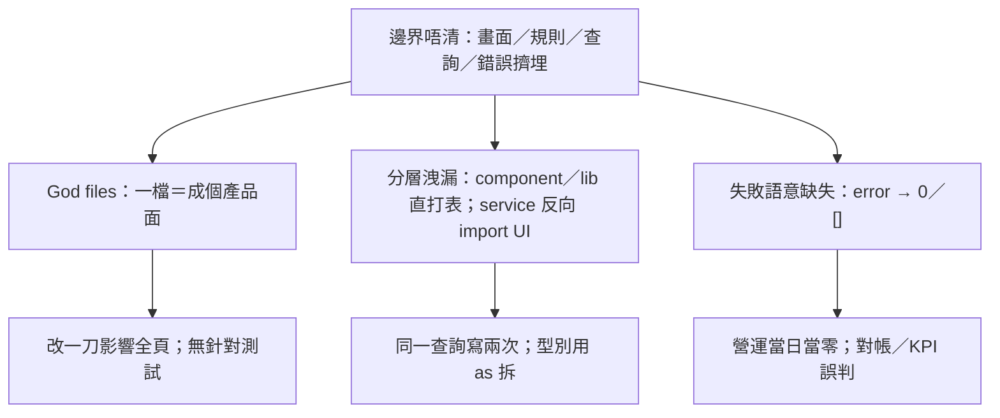

# 前端架構邊界／God files 收斂

| 欄位 | 值 |
| --- | --- |
| 狀態 | `open`（已盤點＋第一性審核；未開工） |
| 優先 | 高 |
| 範圍 | P1-2、P2-5：鎖分層；KPI 失敗唔當 0；寫入錯位先搬。**唔以拆完 God file JSX 為關閉條件** |
| 不含 | 權限真源／RLS（見 [`tech-debt-hardening.md`](./tech-debt-hardening.md)）；查詢效能（見 [`page-load-perf-payroll-mgmt.md`](./page-load-perf-payroll-mgmt.md)）；generated types（見 [`database-contract-advisor-hygiene.md`](./database-contract-advisor-hygiene.md)）；TanStack Query／目錄切片／全庫重寫 |
| 索引 | [`BACKLOG.md`](../BACKLOG.md) |
| 計劃 | [`2026-08-16-frontend-architecture-boundaries.md`](../plans/2026-08-16-frontend-architecture-boundaries.md)（顧問＋定案；與本檔衝突以計劃為準） |
| 稽核 | [`2026-08-14-tech-debt-review.md`](../audits/2026-08-14-tech-debt-review.md) |
| 對抗 | [`2026-08-16-frontend-architecture-boundaries-adversarial.md`](../audits/2026-08-16-frontend-architecture-boundaries-adversarial.md)（落地後遺；與計劃衝突以計劃為準） |
| 盤點 | 2026-08-16 對代碼再核對；行數與 08-14 稽核幾乎相同；同日第一性審核 |

## 一句

分層約定寫咗但未守；最危險係查詢失敗被畫成「今日零」。本期鎖分層＋修 KPI 謊言即可關閉；拆大 View 只喺切片能自己擁有狀態、或第二畫面已共用時先做。因果同審核見[計劃](../plans/2026-08-16-frontend-architecture-boundaries.md)。

---

## 規定係咩（對照依家）

`AGENTS.md` 寫死：

| 路徑 | 應做 | 依家常見違規 |
| --- | --- | --- |
| `src/pages/` | 薄頁面／路由 | 多數已做到（例如 `StudentDetail.tsx` 只 render View） |
| `src/components/<領域>/` | 畫面與領域邏輯 | 單一 View 同時做 4–7 個業務區塊＋數十個 dialog |
| `src/services/` | **所有** `supabase.from(...)`；map 成具名型別 | 多數查詢已喺 service；仍有 component／`lib` 直打表；單檔混多個 bounded context |
| `src/lib/` | 純工具（不含 React／DB） | `enrollmentPeriod.ts` 夾咗三條查詢 |
| 資料流 | **component → service → lib** | service 反向 import `components/` 的 UI helper／型別 |

呢條唔係品味。Component 直打 DB＝select／join／錯誤語意散落畫面，RLS／欄位一改要搵齊 JSX；God file＝一個 PR 同時碰報讀、請假、收款、點名，回歸範圍無法隔離。

---

## 問題其實有三層（同一根因）

2026-08-14 把 P1-2（God files）同 P2-5（直打 DB＋dashboard 當 0）合併，因為三者同源：**邊界唔清，先堆、再吞錯誤**。分開睇會以為「只係檔案太大」；一齊睇先見到點解改功能會互相踩。



### 層 A — God files：一個畫面檔＝成條產品線

行數本身唔係罪。罪係 **一個 React 元件擁有多個可獨立失敗、獨立測試的業務區塊**，state／handler／JSX 全綁死。

2026-08-16 量度（不含 `*.test.ts`；與 08-14 稽核對得上）：

| 檔 | 行 | `useState` | 實際塞咗咩（可獨立切片） |
| --- | --- | --- | --- |
| `StudentDetailView.tsx` | 3,143 | 69 | 7 個 tab：基本資料、報讀（含待補／退讀）、繳費（含作廢）、上課紀錄、請假、未來排程、更動紀錄 |
| `ClassDetailView.tsx` | 3,060 | 71 | 4 個 tab：基本／編輯、學生名單／加報讀、增退紀錄、排程（加堂／取消／補堂／私人課程預約／連堂） |
| `ScheduleManagePage.tsx` | 2,936 | 54 | 列表／按日、日視圖、加堂、搬房衝突、取消、代堂、點名入口、展開名冊；日視圖 grid 已抽出，**編排仍全在父檔** |
| `PaymentsPageView.tsx` | 2,088 | 42 | 選學生、學費行、優惠、逾期罰款、收據預覽、實收 vs 出單 |
| `PrivateTutoringView.tsx` | 1,995 | — | 稽核未列；私人課程列表＋預約＋退讀，規模已近收款頁 |
| `studentQueries.ts` | 2,024 | — | 學生 CRUD＋狀態正規化＋報讀／退讀／衝突＋**學生繳費／出席／請假／更動** |
| `classQueries.ts` | 1,930 | — | 班 CRUD＋名單＋**排程 CRUD／詳情 context**＋科目／課程／學年／老師／課室 option |
| `mgmtDashboardQueries.ts` | 1,555 | — | 稽核未當 God file 列；KPI 組裝＋靜默 0 的主戰場 |

下一檔已過 1,400 行、同一病（暫非首波）：`StudentsListPage` 1,552、`LeaveManagementView` 1,537、`FinancePayrollView` 1,442、`TrialSessionsView` 1,417。

**已有的好跡象（拆檔時要跟，唔好推倒）：**

- `StudentDetailView` 已把資料分成 `reloadCore`（首屏）同 `ensureTabData`（按 tab 懶載）。資料邊界已存在，只係 JSX／state 未搬走。
- `ScheduleManagePage` 已抽出 `DayViewGrid`、`MobileDayViewGrid`、`AssignSubstituteDialog`、`CancelReasonDialog`。父檔仍擁有全部編排。
- `pages/` 多數已係一行 wrapper。唔使再拆 page。

**壞跡象：**

- `studentQueries.insertPaymentForStudent`、`fetchPaymentsForStudent`、`fetchAttendanceForStudent`、`fetchLeaveForStudent` 住喺學生 query 檔——收款／點名／請假頁同學生詳情搶同一桶。
- `classQueries` 同時擁有 `insertScheduleRow`／`fetchScheduleDetailContext`，同 `scheduleQueries.ts`（827 行）職責重疊。改排程規則要猜打邊個檔。
- 測試幾乎碰唔到呢批檔。全庫約 19 個 `*.test.ts`，多數喺 `lib/`；`mgmtDashboardQueries.test.ts` 只測純函式（`previousPeriod`、單價），**無**「查詢失敗唔好當 0」。`studentQueries`／`classQueries`／三大 View **零測試**。

### 層 B — 分層洩漏：誰准打 DB、誰准 import 誰

**Component 直打表（資料查詢，唔計 auth）：**

| 位置 | 做咩 | 應去邊 |
| --- | --- | --- |
| `TeacherHomeView.tsx` | `supabase.from("trial_sessions")`＋手動 unwrap `students`／`classes`／`courses` | `trialQueries.ts`（該檔已有試堂列表／學生試堂摘要，缺「依班 id 拉未來試堂」） |
| `RollCallPage.tsx` | `leave_makeup_records` head count（`status` ilike `%待補%`） | `leaveQueries.ts`；失敗時 `if (!error)` 先 set，**error 當無待補** |

其餘 `components/`／`pages/` 的 `supabase` 多數係 `auth.signOut`／`getSession`／`isSupabaseConfigured`，**唔算本主題違規**（屬 Auth 客戶端，跟 P0-2）。

**`lib/` 打 DB（違反「純工具」）：**

`src/lib/enrollmentPeriod.ts` 上半係純函式（期數／單堂／價錢），下半有：

- `fetchAcademicYearPeriods`
- `fetchClassEnrollmentConfig`
- `fetchClassEnrollmentConfigsByIds`

`lib` 被 `services/`、`components/`、其他 `lib/` 廣泛 import。查詢住喺呢度＝純規則同 PostgREST 綁死，亦令 service 經「工具檔」間接拿 `supabaseClient`。應遷去例如 `enrollmentPeriodQueries.ts`，本檔只留純函式。

**反向依賴（service → component）：**

| service | 打入 component |
| --- | --- |
| `mgmtDashboardQueries.ts`、`staffPerformanceQueries.ts` | `@/components/mgmtDashboard/types` |
| `payrollQueries.ts`、`expenseQueries.ts` | `@/components/payroll/mockData` |
| `batchScheduleHelpers.ts`、`scheduleMakeupQueries.ts`、`teacherAvailabilityQueries.ts` | `@/components/classes/classesUi` |
| `mgmtGodViewQueries.ts` | `@/components/home/format` |

資料層不應依賴畫面模組。型別應落 `services/` 或中性 `lib/`；時間格 helper 應落 `lib/`。依家 Vite 未必報 cycle，但拆 God file 時一搬型別就容易環狀 import。

**舊聚合層：** `src/api/entities.ts`＋`services/queries.ts` 仍 `select("*")` 全表。新功能禁止再用；清殘渣屬 [`dead-surface-cleanup.md`](./dead-surface-cleanup.md)，本主題只要求新路徑唔好再加。

### 層 C — 失敗、真 0、真空資料三種狀態混為一種

產品已踩過一次：出席紀錄列表 timeout 後 `setRows([])`，KPI 全 0，前線以為無人點名。已修，見 [`attendance-records-range-query.md`](./attendance-records-range-query.md)。**營運總覽未跟呢條契約。**

`fetchMgmtDashboardSummary` 用 `Promise.all` 組 KPI。內層多數失敗只 `console.warn` 然後 `return 0`／`[]`／`break`：

| 函式 | 失敗時 |
| --- | --- |
| `countEnrollmentEvents`（新報讀／退讀） | `return 0` |
| `countTrials`／`countConvertedTrials` | `return 0`（轉化率會變成「無法計算」或 0%，視分子分母邊邊被吞） |
| `countActiveEnrollmentSeats` | `return 0` |
| `countAttendanceVisits` | `break`，已累積嘅 chunk 當完整月 |
| `fetchWithdrawalAnalysis` | 空物件 |
| `fetchRecentWithdrawals` | `[]` |
| `sumConsumedLessonValue`／單價 map | 略過／中斷 |

`KpiCardModel.value` 係 `number`；`status` 只有「正常／注意／警示」。`MgmtStatCard` 一定 render 數字。上層 `MgmtDashboardView` 只喺 **整次** `fetchMgmtDashboard*` throw 先 `setErr`；單一 KPI 失敗唔 throw，畫面照樣綠卡寫 `0`。

對照：`TeacherHomeView` 已用 `Promise.allSettled`，部分失敗會出「部分首頁資料暫時未能載入」——但同時 `setTrials([])`，列表仍真空。方向啱，契約未統一。

`ScheduleManagePage.reloadStats` 的 `catch { /* ignore */ }` 同樣把今日堂數／人數失敗藏起。

---

## 影響（點解係 P1，唔係「之後重構」）

1. **改功能成本同回歸範圍失控。** 學生詳情一次過 import 報讀、繳費、點名生命週期、請假、待補、親屬、未來排程。一個「退讀確認文案」PR 要讀 3,000 行，CI 亦無切片測試可擋。`studentQueries` 被約 23 個檔 import、`classQueries` 約 40 個——一改 map 形狀，爆炸半徑係成個後台。
2. **同一規則兩份實作。** 老師首頁試堂 join 寫喺 JSX 旁邊；試堂管理頁用 `trialQueries.fetchTrialsWithRelations`。欄位／status／日期窗一改，只修一邊。點名頁待補 count 的 `ilike("%待補%")` 亦唔經 leave service，易同請假狀態枚舉分叉。
3. **營運數字不可信。** 管理層首頁係 manager 登陸後第一屏。試堂表 RLS／timeout／欄位改名時，新報讀／試堂／在讀人次可以靜默變 0，卡面仍「正常」。對帳、轉化率、退讀目標差會跟住錯。呢類 bug 唔會紅，只會錯。
4. **測試補唔入。** God file 無法為「退讀」寫單元測試而不啟動成個詳情頁。結果測試集中喺 `lib/` 純函式，高風險畫面零覆蓋。品質閘（P0-3）擋唔到行為回歸。
5. **同其他主題搶同一批檔。** 報讀包裝、逾期罰款、代堂、軟封存、流動介面都要改 `StudentDetailView`／`ClassDetailView`／`ScheduleManagePage`。唔拆界，之後每個產品 PR 都喺同一座山打洞。

**唔係本主題會解決、但易混淆：**

- 營運總覽／計糧**慢**：查詢次數同 live 重算，見 [`page-load-perf-payroll-mgmt.md`](./page-load-perf-payroll-mgmt.md)。本主題只要求失敗唔好扮 0；唔改快取策略。
- 權限真源：`localStorage.mgmt_role` vs Auth，見 [`tech-debt-hardening.md`](./tech-debt-hardening.md)。Layout `signOut` 唔搬。
- `select *` 全表學生：請假／試堂頁，見 [`soft-archive-query-scope.md`](./soft-archive-query-scope.md)。

---

## 第一性審核（2026-08-16）

完整因果同給顧問嘅挑戰項見[計劃](../plans/2026-08-16-frontend-architecture-boundaries.md)。結論：

- 真正工作＝失敗≠0、查詢只寫一次、變更可隔離。行數係代理。
- 波次 1–2 留；eslint 鎖層併入 1。KPI 用 `{ ok: number } | { error }`，唔做第三個 `empty` 變體。
- 波次 3 改：預設抽 hook；搬 JSX 要符合 island／第二消費者／可測。唔為行數抽 `ClassScheduleTab`。
- 波次 4 收窄：只搬寫入錯位（學生檔不准 insert payment）。
- 本期可喺唔拆三大 View 之下關閉。React Query／feature-sliced 唔納入。

---

## 要點改（原則）

以計劃 §4 為準。摘要：

1. 先守邊界，再考慮搬家。
2. 抽檔合格線：自己擁有載入／錯誤／寫入，**或**第二畫面已共用，**或** hook／純函式有三態測試。否則唔抽。
3. 重用跟現有 UI／收款入口指引；業務區塊得第二消費者先共用 JSX。
4. 錯誤走頁內紅字，唔用 2 秒 banner。真 0／真空＝成功而空；失敗永遠唔畫成 0。
5. component → service → lib，eslint 鎖。寫入一個聚合根一個出口。

```ts
type CountResult = { ok: number } | { error: string }
type ListResult<T> = { ok: T[] } | { error: string }
```

---

## 建議波次

### 波次 1 — 鎖分層

試堂／待補／`enrollmentPeriod` fetch 收回 service；eslint 禁止 component／pages／lib 資料面 `supabase.from`／`rpc`（auth 除外）。

### 波次 2 — 營運數字可信（可單獨關閉用戶傷害）

`mgmtDashboardQueries` 唔再 `return 0`；卡面「—」／「資料未能載入」；頁頂可加「部分指標未能載入」。`reloadStats` 唔 `ignore`。抄出席紀錄契約。

### 波次 3 — 機會主義 island／hook

有產品 PR 先順手。預設 `useXxxTab`。請假／更動／出席讀可成 island。唔切收款精靈、唔抽通用 LeaveBlock。

### 波次 4 — 寫入錯位（唔擋本期關閉）

付款寫入離開 `studentQueries`；排程 CRUD 離開 `classQueries`；`classesUi` 時間格遷 `lib/`。

---

## 驗收（本期關閉）

- eslint 鎖層；`src/components/**`、`src/pages/**`、`src/lib/**` 無資料面 `supabase.from`／`supabase.rpc`（`auth.*` 除外）。
- `/MgmtDashboard` 關鍵 KPI（實收、新報讀、退讀、試堂／轉化、在讀人次、上堂人次）任一查詢失敗：**唔顯示 0 當正常**；卡面可讀「資料未能載入」。
- 原路由／tab／深連結／角色可見性／寫入確認不變。
- `npm run build`、`lint`、`test`、`ui:check` 全過。

**唔擋關閉：** 三大 View 仍超大；未上 React Query。

## 明確唔做

- 唔為行數切 `part1`／`part2` 或硬抽未符合合格線嘅 tab。
- 唔等 generated Database types（P1-3）先做波次 1–2。
- 唔把本主題做效能、權限、或 Query 遷移。
- 唔刪 `api/entities.ts`（死碼題）。
- 唔改學費／報讀／點名營運規則。
