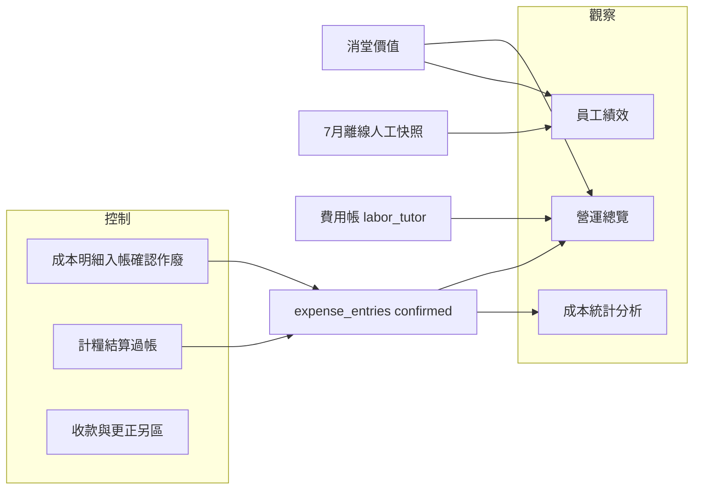

# 智能分析三頁 IA／管理者視角審視

| 欄位 | 值 |
| --- | --- |
| 狀態 | `open`（2026-08-24 分析已寫；**未拍板唔實作**） |
| 優先 | 中 |
| 範圍 | 側欄「智能分析」下：**營運總覽**／**員工績效**／**成本統計**——分類是否合理；管理者能否觀察／控制成本與利潤 |
| 不含 | 本檔唔開工改碼；KPI 實作仍跟各母題；阿Po／AI 報表 |
| 索引 | [`BACKLOG.md`](../BACKLOG.md) |
| 立案 | 2026-08-24（2026-08-29 由舊對話還原；從未入 git） |
| 路由 | `/MgmtDashboard`、`/StaffPerformance`、`/HkExpenses`（manager／alien） |

## 開工閘（agent 必讀）

**本檔＝產品／IA 審視，唔當工程開工令。** 未拍板優先項前**唔改碼**。若用戶點名落某一優先項，轉去對應母題（或新開實作 plan），並先讀該母題開工閘。

| 若要做… | 轉去 | 備註 |
| --- | --- | --- |
| 統一毛利人工真源 | 新 plan 或掛 [`hk-expense-cost-stats.md`](./hk-expense-cost-stats.md)＋績效頁 | 績效改接費用帳／計糧過帳 |
| 總覽現金↔消堂對帳、KPI 1–7／8–14 | [`mgmt-dashboard-overhaul.md`](./mgmt-dashboard-overhaul.md)＋[`mgmt-dashboard-kpi-spec.md`](./mgmt-dashboard-kpi-spec.md) | 規格已有、未落地 |
| 按金 void／非老師人工 | [`hk-expense-cost-stats.md`](./hk-expense-cost-stats.md) | 已在該題下一步 |
| 側欄命名／finance 入口 | [`nav-capability-entry.md`](./nav-capability-entry.md) | IA1 |

## 目標（一句）

鎖清三頁應否重組、缺咩、管理者控利潤時邊度唔夠——俾後續開工有優先序，唔靠 chat 記憶。

## 現況對照（一句）

三頁刻意分工：**店級營運＋毛／純利快照**｜**老師級毛利／人效**｜**HK 成本帳（可寫）**。拆法合理，但毛利兩處口徑唔齊、總覽混營運與財務、缺現金對帳／產品線貢獻，令管理者難單靠此組頁面可靠控利潤。

| 頁 | 主問題 | 收入腿 | 成本腿 | 可寫？ |
| --- | --- | --- | --- | --- |
| 營運總覽 `/MgmtDashboard` | 整體健康＋店級毛／純利 | 消堂價值＋另列已收款 | 費用帳已確認開支 | 否（只讀） |
| 員工績效 `/StaffPerformance` | 邊個老師賺／蝕人工 | 同消堂公式按老師拆 | **靜態 2026-07 人工** | 否 |
| 成本統計 `/HkExpenses` | 開支結構＋入帳 | 無 | 全科目日記帳 | **是**（新增／確認／作廢） |

產品計劃已鎖此分工：[員工績效計劃](../plans/2026-08-02-staff-performance-analytics.md)（總覽＝營運；績效＝每人盈利；成本＝全成本日記帳）；[成本統計分題](./hk-expense-cost-stats.md)明寫唔同績效總人工自動對賬。

---

## 1. 分類是否合理？

### 結論：三分法合理，命名與邊界有摩擦

對照市面常見結構（教培後台／服務業 SaaS）：

| 市面常見層 | 本專案對應 | 評價 |
| --- | --- | --- |
| Executive / Ops dashboard | 營運總覽 | 對 |
| Labor／tutor contribution margin | 員工績效 | 對（但名過闊） |
| Expense ledger／cost analytics | 成本統計 | 對（兼帳本，比純報表更完整） |
| Cash／AR／收款對帳 | 部分散落總覽欠費＋收費區 | **缺獨立分析位** |
| Product／class line P&L | 無 | **缺** |
| Full P&L 報表頁 | 規格寫另題；總覽只有 KPI | **刻意未做** |

### 重疊（概念重、來源危）

- **消堂／「收入」**：總覽「消堂價值」與績效「總收入」同一套 `unitPriceForConsumedLesson`——重用正確，UI 用詞唔統一，易當兩套數。
- **毛利**：兩邊都叫毛利，人工來源不同——總覽跟費用帳 `labor_tutor`＋僱主 MPF；績效跟 `staffLaborJuly2026` 離線檔。非 7 月或計糧未過帳時，**店級毛利與老師毛利可系統性不一致**（最危險的假重疊）。
- **人工數字**：成本統計「人工（計糧過帳）」與總覽毛利減項對齊；與績效「總人工」刻意不對平——工程正確，管理者易以為三頁應加總對平。

### 重複（可接受）

- 總覽已有毛／純利首屏＋走勢；成本頁再拆直接／間接／科目——層級不同，唔算廢頁。
- 兩邊都有科目／導師／班型篩選——維度重用，唔係功能重複。

### 缺失（相對市面＋已點名規格）

| 缺口 | 說明 |
| --- | --- |
| 現金 vs 消堂對帳 | 規格 KPI 1–7、收堂 vs 消堂（[`mgmt-dashboard-kpi-spec.md`](./mgmt-dashboard-kpi-spec.md)）未落地；利潤用消堂、現金另列，無對帳視圖 |
| 優惠／贈堂成本 | 規格有；UI 無 |
| 班型／科目貢獻毛利 | 欄位預留；無產品線 P&L |
| 出席／請假／補堂營運 KPI | 規格 8–14 未做（影響控運營損耗） |
| 非老師人工產品流 | 科目有、人手補；影響純利完整度 |
| 「員工」範圍 | 績效＝導師毛利；行政／財務人效不在此頁——名稱過闊 |
| 預算／目標 | 收款目標仍 placeholder |
| 功輔班 | 績效收入排除功課班；總覽篩選可見班型差異——產品線不齊 |

### 應否重組？（建議，未拍板）

**維持三頁，微調邊界與命名，唔建議合併成一頁。**

1. **保留三分**：觀察單位不同（店／人／帳本），合併會變成 God page。
2. **改名或副標**（優先）：「員工績效」→「導師毛利」或「人效與毛利」；副標寫清「消堂 − 可歸因人工；非純利」。
3. **毛利單一真源**：績效人工改接計糧過帳／費用帳（與總覽同腿）。
4. **總覽內部分層**：首屏＝錢（消堂／毛／純／收款）；其下＝招生／負荷／警示（結構可留，文案分區）。
5. **成本統計定位寫死**：分析＋入帳；總覽純利只消費 `confirmed`；交叉連結「睇成本結構 → 成本統計」。
6. **不必另開純利頁**（現階段）：總覽 KPI 15–20 已落地；缺對帳與口徑一致，唔係多一個純利路由。
7. **中期第四分析面**（總覽 tab 或新葉）：現金／權益對帳（收學費 vs 消堂 vs 欠費）＝規格 1–7——比再拆利潤頁更有管理價值。

「智能分析」組名偏行銷；實務＝**管理儀表＋成本帳**。可接受；若要更準可改「管理分析」。

---

## 2. 管理者角度：觀察／控制成本與利潤

### 結論：可「粗觀察」；不足以「可靠控制」

| 能力 | 現況 | 足夠？ |
| --- | --- | --- |
| 睇本月店級毛／純利與走勢 | 總覽首屏＋圖（窗 ≥2026-07） | 粗夠 |
| 睇成本結構與入帳／作廢 | 成本統計分析＋明細 | 夠（控帳本） |
| 睇邊個老師拖低毛利 | 績效散點／排行／異常 | 粗夠（人工腿弱） |
| 對齊「賺咗幾多現金」vs「消咗幾多堂」 | 兩卡並列、無對帳 | **不足** |
| 信三頁毛利／人工同一套 | 兩套人工來源 | **不足** |
| 預算、目標、預警閉環 | 目標 placeholder；警示偏營運欠費 | **不足** |
| 產品線（專科／私人／功輔）貢獻 | 篩選有、貢獻報表無 | **不足** |
| 非導師人力成本入純利 | 未產品化 | **不足** |

### 不足清單（按管理決策優先）

**A. 數字可信（控利潤前提）**

1. 店級毛利 vs 老師毛利人工來源不一致（費用帳 vs 7 月靜態檔）。
2. 未結算／未過帳月：總覽毛利「—」，績效多月「未有月結」——無法用同一套數做月中決策。
3. 7 月按金仍待 UI 作廢（產品已決不作成本）；待覆核掛帳削弱對「總成本」信任。
4. 非老師人工未入系統化流程 → 純利 hint 已承認「可能未齊」。
5. 分析窗由 2026-07 起：同比／歷史趨勢有限（產品已決，管理上仍是限制）。

**B. 觀察利潤**

6. 無「收學費堂數 ↔ 消堂」對帳（規格有、未做）。
7. 無優惠／贈堂／試堂成本拆解。
8. 無班型／科目／校舍貢獻毛利或純利下鑽。
9. 已收款與消堂價值雙軌並存，無應收／預收／消堂關係說明或報表。
10. 績效「續報率」＝enroll÷(enroll+withdraw) 簡化；「授課時數」實為堂次——易誤判人效。
11. 總覽規格 KPI 8–14（出席率、補堂比、師生請假、欠費最長）未做。

**C. 控制成本與利潤**

12. 成本可入帳／確認／作廢——**帳本控制有**；無預算上限、科目預算、異常超支規則。
13. 導師人工控制在 `/Payroll`；分析頁唔驅動結算／調費率；績效異常只連老師詳情。
14. Manager **無**側欄收款入口（收款屬 admin）——現金端控制唔在智能分析組（角色設計如此，利潤閉環不完整）。
15. 無由純利 KPI → 成本明細／老師毛利的一貫 drill-down（要人手跳頁、自對月份）。
16. 無 what-if 或成本／毛利目標差距行動清單（欠費跟進有）。

**D. 資訊架構／角色**

17. 「員工績效」不含非教學職員；名實不符。
18. Finance 有部份 `expenses.record` 但無側欄（IA1）。

---

## 建議優先序（拍板後再開工）

1. **統一毛利人工真源**（績效接費用帳／計糧過帳）——消滅最大誤導。
2. **文案／命名**：消堂價值 ≠ 已收款；績效＝導師毛利；三頁互鏈與「唔自動對平」說明。
3. **現金↔消堂對帳**（規格 1–7）。
4. **按金 void＋非老師人工產品化**——純利完整度。
5. **科目／班型貢獻**與優惠成本。
6. 規格 8–14、預算目標——第二層營運與控制。

## 相關

- 營運總覽重整：[`mgmt-dashboard-overhaul.md`](./mgmt-dashboard-overhaul.md)
- KPI 規格：[`mgmt-dashboard-kpi-spec.md`](./mgmt-dashboard-kpi-spec.md)
- HK 成本統計：[`hk-expense-cost-stats.md`](./hk-expense-cost-stats.md)
- 員工績效計劃：[`../plans/2026-08-02-staff-performance-analytics.md`](../plans/2026-08-02-staff-performance-analytics.md)
- 側欄／能力：[`nav-capability-entry.md`](./nav-capability-entry.md)
- 管理層角色：[`mgmt-manager-role.md`](./mgmt-manager-role.md)
