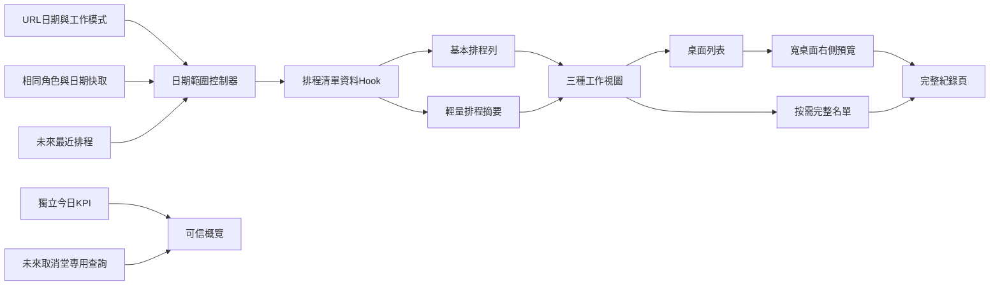

# 排程管理頁架構與介面更新

| 欄位 | 值 |
| --- | --- |
| 狀態 | `in_progress`（波次 3–4 已落地；人工營運驗收尚未完成） |
| 優先 | 中 |
| 範圍 | `/Schedule` 清單、日期與 URL、快取、資料載入、可信統計、三種工作視圖、桌面右側預覽及 `/Schedule/:scheduleId` 完整紀錄頁 |
| 不含 | 排程、點名、補堂、代堂或功課輔導班佔室規則變更；2627 時間表資料；`makeup_of=` 標記；側欄 IA／授權模型 |
| 索引 | [`BACKLOG.md`](../BACKLOG.md) |
| 依賴 | [`list-data-cache.md`](./list-data-cache.md) 已完成；開工前須對齊校舍假期修正的最新主線 |
| 方案日期 | 2026-09-02；2026-09-03 依技術及行政營運審閱修訂 |
| 審閱 | [`schedule-manage-page-refactor-review.md`](./schedule-manage-page-refactor-review.md)；[`schedule-manage-page-refactor-admin-ops-review.md`](./schedule-manage-page-refactor-admin-ops-review.md) |

## 1. 決策摘要

這次不會只把 `ScheduleManagePage.tsx` 拆成較小檔案，也不會直接複製學生／班別管理頁。排程管理的本質是「按日期處理課堂及課室」，與學生／班別的穩定實體清單不同，因此只沿用合適的管理頁模式：

- 沿用：清單快取、固定工作區、共用表頭排序／篩選、桌面右側預覽、完整紀錄頁、流動裝置 bottom sheet、錯誤與未儲存保護。
- 不照搬：學年式軟封存開關、單一表格布局、從目前清單列直接推算全域統計、把所有視圖強制塞入同一 DataTable。
- 保留：按日期、桌面列表、日視圖（手機含七日日期導覽）三種工作視圖，以及現有排程寫入與點名能力；本題不新增完整週視圖。
- 改善：首屏只載入排程基本列；全區間只載入輕量摘要；完整學生名單改為按需載入。
- 統計：今日 KPI 與未來取消堂不依賴目前 14 日清單，也不依賴尚未完成的分段載入。
- 未來取消堂：現有資料沒有「已跟進／已結案」欄位，因此 UI 不再稱為「待處理」。點擊 KPI 後顯示今天起全部真正取消堂，但不冒充可結案的工作佇列。

現有共用元件足以完成本方案，不計劃新增 TanStack Table、TanStack Query 或其他通用狀態框架。

### 1.1 審閱後修訂決定

採納：

- 主動作按視圖分工：按日期保留展開名單；列表才以預覽／詳情為主；日視圖以課室與時段操作為主。
- 排程右側預覽第一波只在 `xl` 以上桌面列表啟用，避免壓縮日視圖及中型畫面。
- 完整詳情由四個分頁收斂為兩個工作分頁。
- 未來取消堂使用固定模式橫幅、單一返回按鈕及獨立篩選契約。
- 詳情返回時恢復原 URL、日期、視圖、篩選、選定排程及捲動位置。
- 寫入成功後先局部更新已知結果，再背景核對；核對失敗不得重新顯示舊值。
- 完整 roster context 第一波只在元件生命週期內重用，不做跨頁快取。
- 「上堂學生」改名為「今日學生人次」，反映同一學生同日兩堂會計兩次。
- 摘要未完成時，包含人數的匯出不可當成完整正式資料。
- 加入現有操作保留契約及人工營運驗收。

部分採納：

- 主文件仍保留技術附錄、檔案邊界及測試矩陣，因本文件本來就是交給工程同事審閱的詳細方案；但核心互動決定集中於 §§1–4，後段視為技術附錄。
- 右側預覽保留共用角色規則，只限桌面行政／外星人。管理層具備寫入 capability 不代表必須改變全域預覽 IA；是否擴大角色另題驗證。

不採納：

- 不在本題新增取消堂結案生命週期。這需要處理狀態、方式、負責人及完成時間等新產品模型，已超出頁面重整；本題以正確改名處理語意問題。
- 不新增完整週視圖。現有手機「週曆」只是七日日期導覽加單日課室排程。

## 2. 為何需要重整

### 2.1 現況

截至 2026-09-02 工作樹：

- `src/components/schedule/ScheduleManagePage.tsx` 約 3,325 行。
- 同一元件同時管理：
  - 日期初始化及 URL 雙向同步；
  - 14 日排程查詢及課室查詢；
  - 全區間點名名單 context；
  - 今日統計；
  - 狀態、老師及問題篩選；
  - 按日期、列表、日視圖；
  - 展開名單、快速詳情、點名；
  - 新增、取消、代堂、移動、一鍵分配及功輔佔室。
- 已抽出的 `DayViewGrid`、`MobileDayViewGrid`、`CancelReasonDialog`、`AssignSubstituteDialog` 邊界合理，應保留。

行數不是唯一問題。主要風險是互相獨立的責任共用大量 state 與 effect；一項日期或載入改動容易影響 URL、快取、統計、名單及寫入後重載。

### 2.2 現有載入成本

目前一般 reload：

1. 並行取得 14 日排程基本列及全部課室。
2. 先顯示 `enrollCount = null` 的基本列。
3. 對 14 日內所有排程呼叫 `get_teacher_schedule_roster_context`。
4. 在前端計算每堂人數、試堂／請假／補堂提示及點名資格。
5. 今日 KPI 另外再拉一次今日排程名單。
6. 日視圖、展開名單及快速詳情仍可能再作額外查詢。

`get_teacher_schedule_roster_context` 是完整點名契約，包含排程、報讀、暑期期數、試堂、請假、出席及宣告等資料。它適合點名紙與單堂詳情，但用於 14 日清單摘要時，資料量及前端處理均過重。

### 2.3 已確認的正確行為

以下行為不可在重構中退步：

- 日期來源優先次序：有效 URL → 同角色且同範圍快取 → 未來最近排程 → 今天。
- 日視圖必須等待日期初始化完成後才寫回 URL。
- 名單未知時不得把人數顯示為 0，也不得標示「沒有學生報讀」。
- 統計查詢失敗時顯示未知，不得以 0 代替。
- 校舍假期不建立排程列，不是取消堂；未來取消堂統計必須排除歷史誤建的校舍假期取消列。
- 代堂只改該堂 `schedules.teacher_id`；不得改 `classes.teacher_id`。
- `makeup_of=<取消堂id>` 必須保留。

## 3. 第一性設計

### 3.1 排程頁有三種不同工作

三種視圖不是純外觀切換，而是三種業務工作：

1. **按日期**
   - 適合查看未來數日的課堂、名單提示及逐堂操作。
   - 手機及老師最容易使用。
2. **列表**
   - 適合桌面批量檢視、排序、欄位篩選及匯出。
   - 只有此模式需要套用共用 sticky table 規範。
3. **日視圖（手機含七日日期導覽）**
   - 適合按課室與時段編排、拖曳、衝突檢查及一鍵分配。
   - 必須保留自己的橫向／縱向捲動模型，不應強制套用一般清單表格。
   - 手機可在七日列切換日期，但畫面只展示所選一日；不是完整週排程。

因此，本方案保留三種視圖及使用者既有偏好，只統一頁首、日期範圍、篩選、載入狀態與紀錄入口。

### 3.2 基本列、摘要及完整名單必須分層

資料分成三個成本層級：

1. **基本列**
   - 排程、班別、老師、課室、時間、狀態及備註。
   - 首屏必需，應先返回。
2. **輕量摘要**
   - 每堂點名冊人數；
   - 是否有試堂、請假、來此補堂；
   - 是否有可點名對象；
   - 摘要是否已完成。
3. **完整 context**
   - 學生姓名、聯絡資料、報讀資格、單堂選擇、請假、補堂及出席明細。
   - 只在選定日、展開名單、右側預覽、完整詳情或點名時載入。

此分層不只是提高體感速度，也避免尚未載入的資料被誤當為真 0。

### 3.3 全域 KPI 與清單範圍必須分開

今日堂數、今日學生人次及今天起未來取消堂是營運 KPI；目前畫面可能瀏覽其他日期。KPI 不可從目前 14 日列計算。

目標契約：

- KPI 有獨立 `loading | ready | error` 狀態。
- `error` 顯示「—」及錯誤提示。
- 清單 stale-while-revalidate 時，不會令 KPI 沿用清單舊數字。
- 「未來取消堂」KPI 的數字與專用結果使用同一份已查詢資料或同一 SQL 謂詞。

## 4. 目標使用者體驗

### 4.1 頁首及概覽

- 頁首保留「排程管理」、目前資料範圍及角色範圍。
- 第一層只放今日堂數、未來取消堂、今日學生人次三張 KPI 卡，並可整組收合。
- 概覽可收合；手機預設收合，桌面保留使用者選擇。
- 「目前日期範圍」內的未編課室／未指派老師不另做大型概覽卡，改為篩選列旁的輕量計數或 chip。
- 已套用的篩選數量在篩選控制旁顯示，不與 KPI 混合。
- 背景更新期間顯示「正在更新」，不以不透明的淡化效果暗示資料已是最新。

### 4.2 日期及篩選

- 日視圖使用單日日期；手機七日導覽只負責切換該單日。
- 按日期及列表使用 `displayStart` 至 `rangeEnd`。
- 狀態、問題及老師篩選繼續以 `usePersistentState` 保存。
- 手機使用 `MobileFilterSheet`；桌面使用 inline 篩選。
- 依賴摘要的「沒有學生報讀」篩選，在摘要完成前 disabled 並顯示原因。
- 包含點名冊人數的 CSV 匯出在摘要完成前 disabled 並顯示原因；匯出檔須記錄日期範圍、套用篩選及產出時間。未來取消堂匯出使用專用查詢的完整結果，不只匯出目前已渲染列。

### 4.3 列及卡片互動

主動作按工作視圖分工，不採用全頁一刀切：

- 按日期：卡片主區保留展開／收合名單，維持老師、手機及行政查看名單的高頻路徑；另設清楚的「排程詳情」入口。
- 列表：主列開啟右側預覽或完整詳情；展開名單是獨立而足夠明顯的按鈕，不只使用細小 chevron。
- 日視圖：拖曳、移動及課室／時段操作維持主動作；格內「詳情」屬次要入口，不因選取預覽改變格線寬度。
- 課室、狀態、點名、代堂等高頻操作：保留在就近操作區，並阻止事件冒泡。
- 已選右側預覽的排程：清單列顯示選取高亮。
- 摘要尚未完成時，展開名單仍可使用；展開後立即按需載入完整 context，內文顯示 skeleton。摘要人數欄則維持未知，兩者互不阻塞。

### 4.4 桌面右側預覽

沿用 `RecordPreviewRail` 的角色分流，但收窄排程的第一波入口：

- `xl` 以上桌面列表的行政／外星人：點選排程後開右側預覽，主內容同步縮窄。
- 中等寬度桌面、按日期及日視圖：不開右側 rail，維持原工作空間或進完整詳情。
- 管理層、財務、老師及流動裝置：直接進完整詳情。
- 預覽定位為「快速判斷及觸發既有操作」，不是第二套完整編輯頁。

預覽內容：

- 日期、時間、班別、老師、課室及狀態；
- 點名冊人數及試堂／請假／補堂提示；
- 取消原因、代堂及加堂標記；
- 前往完整詳情、班別及老師的捷徑；
- 依 capability 顯示點名、代堂及取消觸發器；實際流程仍使用現有共用 sheet／dialog。

預覽不放入完整備註編輯、名單挑選、取消流程或刪除流程，避免兩套編輯表單日後分叉。

### 4.5 完整排程紀錄頁

`/Schedule/:scheduleId` 改用學生／班別詳情的紀錄頁語言：

- 桌面：一般完整頁面，無遮罩及 portal。
- 手機：`AdaptiveDetailLayer` bottom sheet，頂部有明確關閉。
- 頁首：`RecordPageHeader`，顯示日期、時間、班別、狀態及主要操作。
- 分頁以 `?tab=` 同步，使用 `replace`，保留其他 query。

分頁收斂為兩個：

1. **概覽與操作**
   - 班別、實際授課老師、原任老師、課室、狀態、取消原因、加堂及名單政策；
   - 教學紀錄、排程備註、狀態、代堂及刪除。
2. **名單與出席**
   - 當堂學生、單堂未選學生、加堂挑選名單及已存檔點名；
   - 請假、來此補堂、錄影及網課提示。

核心排程先載入；完整 context 只在需要的分頁載入一次。備註有未儲存內容時，切分頁、返回或關閉均使用既有未儲存保護。

### 4.6 前線一日路徑

1. **老師早上**
   - 進入按日期視圖 → 查看今天 → 點卡片展開名單 → 核對請假／試堂／補堂 → 開啟點名。
2. **行政處理取消堂**
   - 從任何日期點「未來取消堂」→ 進入固定專用模式 → 查看最早日期項目 → 執行需要的現有操作 → 返回原日期、視圖、篩選及位置。
3. **行政調整課室**
   - 進入日視圖 → 拖曳或使用「移動到……」→ 確認衝突 → 畫面立即反映成功結果；一般情況不需要開詳情或右側預覽。

### 4.7 詳情返回契約

由清單進入完整詳情時保存：

- 原 pathname 及 query；
- 視圖、日期及持久篩選；
- 選定排程 ID；
- 排程列／卡片 anchor；
- 可恢復的垂直捲動位置。

返回時先以相同 key 快取還原清單，再把選定排程捲回可見範圍並短暫高亮。日視圖水平捲動不作第一波硬保證；進入詳情前不得依賴它維持課室編排工作，因此日視圖詳情只作次要入口。

## 5. 目標技術架構



### 5.1 日期與 URL controller

從 `ScheduleManagePage.tsx` 抽出日期及 URL controller，負責：

- 解析有效 `view`、`date` 及未來取消堂模式；
- 計算 canonical cache key；
- 決定初始日期；
- 管理 `displayStart`、`dayViewDate`、`rangeEnd` 及初始化狀態；
- 初始化後才把日視圖日期寫回 URL；
- 日期跨日或頁面重新取得焦點時，一併刷新今日 KPI、今天標記、未來取消堂 `asOf` key 及相關校舍假期提示；
- 返回一般模式時恢復原日期、視圖、篩選及位置。

建議 URL：

- 一般日視圖：`/Schedule?view=day&date=YYYY-MM-DD`
- 未來取消堂：`/Schedule?scope=future-cancelled`
- 點名深連結：保留現有 `schedule_id`、`rollcall=1` 及可選 `date`

有效 URL 永遠高於 sessionStorage 及記憶體快取。

### 5.2 清單資料 hook

新增 `useScheduleListData`，輸入 canonical key，輸出：

- `rows`
- `rowSummaries`
- `rooms`
- `loading`
- `summaryLoading`
- `stale`
- `error`
- `reload`
- `invalidateAndReload`

載入規則：

1. key 完全相符且快取 fresh：直接顯示，不打清單網路。
2. key 完全相符但過期：先顯示舊列，標示更新中，背景重抓。
3. key 不符：不得顯示上一日期或上一老師範圍的列。
4. 基本列完成、摘要未完成：可以顯示基本列，但摘要欄顯示 skeleton／未知。
5. 只有基本列及摘要均完成，快取才可標為 fresh。
6. 任一寫入成功後 invalidate；如重抓失敗，舊快取仍為 stale，不得重新標為 fresh。

### 5.3 請求競態

以下請求各自使用 generation token 或等價 abort 機制：

- 日期範圍基本列；
- 排程摘要；
- 今日 KPI；
- 未來取消堂；
- 日視圖完整名單；
- 展開名單；
- 右側預覽；
- 完整詳情分頁 context。

請求完成時必須同時核對 generation 及查詢 key。只使用 effect cleanup 的 `cancelled` boolean 不足以表達跨 hook 的 key 契約。

## 6. 輕量摘要查詢

### 6.1 目的

最大效能改善不是把現有完整 roster RPC 放入另一個 hook，而是避免每次清單 reload 下載整份學生資料。

建議新增單一 migration，提供批量排程摘要 RPC。概念回傳：

```ts
type ScheduleManageRowSummary = {
  scheduleId: string
  rosterCount: number
  hasTrial: boolean
  hasLeave: boolean
  hasMakeup: boolean
  canTakeAttendance: boolean
}
```

錄影提示可繼續由基本列 `remarks` 在前端判斷，不需要加入 RPC。

### 6.2 正確性要求

摘要不可使用簡化的「班別就讀中報讀數」代替點名名單，否則會漏算或誤算：

- 暑期第一期／第二期；
- 單堂指定排程；
- 試堂及來此補堂；
- 加堂挑選名單；
- 宣告繼承；
- `makeup_of=` 對 26SM 期數判斷；
- 退讀生效日期。

實作時必須選擇以下其中一種可驗證方式：

1. 從現有 `get_teacher_schedule_roster_context` 的同一資料契約聚合摘要；或
2. 抽出資料庫內共用 eligibility helper，讓完整 context 與摘要 RPC 共用同一判斷。

不接受在新 RPC 另寫一套近似規則。若共用 helper 的風險或成本高於預期，第一波應退回「縮短完整 context 的 schedule id 範圍」，不可用錯誤摘要換取速度。

### 6.3 權限與安全

新 RPC 必須：

- 只接受 UUID 陣列，不接受自由 SQL 條件；
- 限制每次 ID 數量，前端沿用 chunk helper；
- 驗證呼叫者為管理職員或有權讀取指定排程的老師；
- 老師只可讀現任或原任排程；
- 財務可以讀取摘要但不能寫入排程；
- 固定 `search_path`；
- 明確 revoke `public`／`anon`，只 grant 必要角色；
- 不擴闊 `students`、報讀或出席基礎表的 RLS；
- 補 SQL 權限及角色範圍測試。

建立 migration 後只套用該檔，並實際以 Data API／RPC 測試、檢查 advisor；不得全量 `db push`。

## 7. 未來取消堂專用範圍

### 7.1 現有問題

現有 KPI 計算「今天起全部真正取消堂」，但標示為「待處理」，而資料庫沒有已跟進、處理方式或完成時間，不能判斷是否已結案；點擊後又只在目前 14 日列套用取消篩選。因此既有名稱過度承諾，數字與結果亦可能不一致。

### 7.2 新契約

- UI 名稱統一為「未來取消堂」，不宣稱這是可結案待辦。
- `fetchFutureCancelledSchedules` 使用今天起、取消狀態、排除校舍假期取消原因及角色範圍。
- KPI 數字由同一查詢結果長度提供，避免 count 與 rows 使用兩套前端條件。
- 查詢只選清單需要的窄欄位及關聯，不載入完整 roster。
- 摘要再按返回的 schedule ids 批量取得。
- 結果另設 canonical key：`scope=future-cancelled + teacherScopeId + asOf`。
- 進入後顯示固定橫幅「未來取消堂（今天起）」及單一「返回原日期及視圖」按鈕。
- 專用模式固定使用按日期列表並按最早日期排序，不提供日視圖。
- 原有狀態、問題及老師 UI 篩選保留但暫停套用，離開專用模式後原樣恢復，避免「正常」等不相容條件把結果清空。
- 查詢失敗時 KPI 及結果同時顯示未知，不顯示 0。

校舍假期 SQL 修正已在進行中主題建立；本題只沿用，不修改其產品定義。

## 8. 快取設計

### 8.1 一般範圍 key

```ts
type ScheduleListCacheKey = {
  scope: "range"
  teacherScopeId: string | null
  displayStart: string
  rangeEnd: string
}
```

### 8.2 未來取消堂 key

```ts
type FutureCancelledScheduleCacheKey = {
  scope: "future-cancelled"
  teacherScopeId: string | null
  asOf: string
}
```

### 8.3 快取內容

- 基本排程列；
- 排程摘要；
- 課室及顯示選項；
- 目前 key；
- 是否完整；
- fetchedAt。

完整學生名單不放入主清單快取。第一波只在目前展開區域、預覽或詳情元件的生命週期內重用；關閉或離開後不保留跨頁 context 快取。待所有點名、請假、試堂、補堂、加堂名單及宣告寫入均有集中失效機制後，才另行評估跨頁短期快取。

空結果是否可快取必須明確處理。一般共用 helper 預設把空列視為不可用，但排程空日是正常結果；本題應以「查詢成功且 key 相符」判斷空結果可短期快取，避免反覆查詢真正空白日期。

## 9. 軟封存的正確套用

排程管理不採用班別頁的 `includeOlderYears`：

- 排程列表按使用者選定日期範圍查詢。
- 舊日期 URL、舊日點名及 `/Schedule/:scheduleId` 必須繼續可讀。
- 不因學年在日常營運窗外而隱藏所選日期的排程。
- 不顯示「包含封存排程」開關。
- 不建立 archive 表，也不刪除資料。

間接套用：

- 新增排程的班別 picker 繼續使用 `fetchClassesForOpsList()`，即日常營運窗。
- 未來取消堂專用查詢不套用學年窗，避免使用者選定日期以外的取消堂因年份被隱藏。
- 校舍假期資料只查目前日期範圍所需年份／日期，不在 mount 時讀取所有學年。

這符合 [`SOFT_ARCHIVE.md`](../../policies/academic/SOFT_ARCHIVE.md) 的既定規則：「排程日曆仍按所選日期範圍載入」。

## 10. UI 元件與檔案邊界

預計保留或新增以下邊界，實際檔名可在實作時按責任微調：

- `ScheduleManagePage.tsx`
  - 只保留頁面編排、跨區塊狀態及操作 dialog 掛載點。
- `scheduleManageDateState.ts`／對應 hook
  - URL、日期、範圍及初始化決策。
- `scheduleListState.ts`
  - canonical key、TTL、fresh／stale、invalidate。
- `useScheduleListData.ts`
  - 基本列、摘要、課室及 reload generation。
- `ScheduleOverview.tsx`
  - 可收合 KPI；不自行查詢資料。
- `ScheduleFilters.tsx`
  - 桌面 inline 及手機 FilterSheet 共用同一 filter state。
- `ScheduleByDateList.tsx`
  - 日期分組卡片及獨立展開名單控制。
- `ScheduleListTable.tsx`
  - 共用 sticky table、排序、表頭篩選及列選取高亮。
- `scheduleListColumns.ts`
  - 排程欄位取值、排序及篩選純函式。
- `ScheduleDayViewPanel.tsx`
  - 日視圖日期控制、手機七日日期導覽、完整名單載入及移動操作。
- `SchedulePreviewPanel.tsx`
  - 右側讀取優先摘要及捷徑。
- `ScheduleDetailView.tsx`
  - 紀錄頁 shell、分頁及分頁級資料載入。

既有 `DayViewGrid`、`MobileDayViewGrid`、`AssignSubstituteDialog`、`CancelReasonDialog`、`ExtraLessonRosterPicker`、`RollCallSheet` 繼續沿用。

## 11. 角色及操作邊界

必須按 capability，而不是 `localStorage.mgmt_role`，控制實際能力：

- `schedule.read`
  - 行政、管理層、財務、老師、外星人可讀。
- `schedule.reschedule`
  - 行政、管理層、外星人可新增、移動、取消及代堂。
- `attendance.take`
  - 行政、管理層、老師、外星人可點名。
- 財務
  - 可以檢視排程、摘要及詳情；
  - 不可顯示可寫入的課室、狀態、代堂或刪除控件。
- 老師
  - 只查現任或原任排程；
  - 不顯示其他老師篩選；
  - 仍可依 capability 點名。

右側預覽的角色沿用現有產品決定：只限行政／外星人；排程第一波再限制為 `xl` 以上桌面列表，不因本題擴大至管理層或財務，也不壓縮日視圖。

### 11.1 現有操作保留契約

未列入新版主要畫面的能力不得默認刪除。實作及驗收須逐項對照：

- 全頁：新增排程、日期與老師衝突提示、CSV 匯出。
- 按日期：展開完整名單、個別學生通知、課室、狀態、取消原因、請假、補堂／試堂、代堂、點名、刪除、班別及完整詳情捷徑。
- 列表：上述適用操作、排序、表頭篩選、右側預覽及目前篩選匯出。
- 日視圖：拖曳、移動到指定格、課室衝突檢查、一鍵分配、非標準時段、學生及異常提示。
- 完整詳情：加堂名單挑選、標記加堂、請假、補堂、錄影、網課、出席、教學紀錄、排程備註、狀態、代堂及刪除。
- 點名：空名單保護、單堂、試堂、補堂及連堂入口。
- 功輔佔室：不可點名、取消或刪除；改課室同步當日編更；加開／收起第二房仍由當值編更處理。

驗收矩陣至少覆蓋按日期／列表／日視圖、桌面／手機，以及行政／管理層／財務／老師／外星人。能力可因 role/capability 隱藏，但不可因拆檔遺失。

## 12. 錯誤、載入及寫入契約

- 每個失敗區塊有頁內紅色錯誤狀態。
- PostgREST／RPC 錯誤使用 `formatUnknownError`。
- 使用者可見失敗使用 `reportUserFacingError`。
- Async 寫入按鈕使用 loading／disabled，成功後才顯示 Banner。
- 取消及刪除繼續使用全域 Confirm Dialog。
- 所有寫入只經 `src/services/`。
- 寫入成功後：
  1. 先以服務回傳結果或已確認 payload 局部更新／移除目前列及對應快取；
  2. invalidate 一般範圍快取；
  3. 如影響取消狀態，同時 invalidate 未來取消堂快取；
  4. 如影響名單，清除目前元件內的該堂 context；
  5. 以目前 canonical key 背景核對。
- 核對失敗時保留已知成功的新值並標示「已儲存，但未能重新核對最新列表」；不得重新顯示舊值，也不得令使用者重複操作。
- 如某項寫入無法安全局部 patch，成功後至少鎖定該列並顯示「變更已儲存，正在更新」，直至核對完成。

## 13. 測試策略

專案目前沒有 React Testing Library，第一波以純函式、state 及 service contract 測試為主，不為本題新增大型測試框架。

### 13.1 日期與 URL

- 有效 URL 日期優先於快取。
- URL 日期與快取日期不符時不 hydrate。
- 無 URL 且快取完全相符時 hydrate。
- 無可用快取時先查最近排程，再回退今天。
- 初始化前不寫回 URL。
- 日視圖切換不造成重複導航或重複載入。
- 跨午夜／重新取得焦點後「今天」、三項 KPI、未來取消堂 `asOf` key、今天標記及校舍假期提示一併更新。
- 未來取消堂模式返回後恢復原日期、視圖、篩選及排程 anchor。
- 完整詳情返回後恢復相同 query，並把原排程 anchor 捲回可見範圍。

### 13.2 快取

- 日期、老師或 scope 任一不同即不 fresh。
- 相同 key 過期時先顯示 stale，再背景更新。
- 基本列完成但摘要未完成時不 fresh。
- invalidate 保留列但下次必須重抓。
- 成功空結果可以短期快取。
- 寫入失效一般及未來取消堂快取，並清除元件內按需 context 的正確範圍。
- 取消、移動、代堂、加堂或刪除成功後先局部更新；背景核對失敗仍保留已知新值。

### 13.3 競態

- 快速切換日期時，舊基本列不能覆蓋新日期。
- 快速切換老師範圍時，舊摘要不能覆蓋新 scope。
- 快速展開兩堂時，先發後到的舊名單不能覆蓋目前排程。
- 快速切換詳情分頁時，舊 context 不能寫入目前排程。
- KPI 與清單請求互不覆蓋。

### 13.4 統計及摘要

- 任一 KPI 必要查詢失敗時整項未知，不是 0。
- 摘要未知時不套用「沒有學生報讀」結果。
- 摘要與完整 roster 在暑期期數、單堂、試堂、補堂、挑選名單及退讀日期案例結果一致。
- 未來取消堂 KPI 數字等於專用結果列數。
- 校舍假期取消原因不計入未來取消堂。
- 今日學生人次逐堂加總；同一學生同日兩堂計兩次，名稱不得誤寫成不重複學生數。

### 13.5 UI 純邏輯

- 列表欄位排序及表頭篩選。
- 狀態、老師及問題篩選疊加。
- 財務唯讀、老師 scope 及行政／外星人操作可見性。
- 按日期、列表、日視圖使用同一 canonical 範圍資料。
- 按日期卡片點擊展開名單；列表列點擊開預覽／詳情；日視圖操作不被詳情入口攔截。
- 名單、預覽及就近操作按鈕不互相冒泡。
- 摘要未知時可展開並按需載入名單，但匯出人數 disabled。

### 13.6 人工營運驗收

自動測試之外，開發環境須由行政按桌面及手機尺寸完成並記錄：

1. 早上查看今天：基本列先出現，摘要未知不是 0；展開名單、點名及返回位置正常。
2. 未來取消堂：KPI 與結果一致；原「正常」篩選不會清空結果；返回原日期、視圖、篩選及位置。
3. 課室調整：拖曳及「移動到……」均檢查衝突；成功後立即顯示新值；核對失敗不回復舊值。
4. 一鍵分配：已佔課室、取消堂及功輔佔室沿用既定規則，成功與失敗數量清楚。
5. 代堂及取消：連堂、原任／實際老師、取消原因、soft cancel、校舍假期及功輔佔室限制不退步。
6. 名單及點名：暑期期數、單堂、試堂、來此補堂、加堂挑選、請假及連堂結果與完整點名紙一致。
7. 角色：行政／管理層／財務／老師／外星人的可見範圍及控件符合 capability。
8. 手機：七日日期導覽、展開名單、詳情關閉、返回位置及未儲存備註保護正常。
9. 競態及失敗：快速切換日期／老師／排程；分別模擬 KPI、基本列、摘要及寫入後核對失敗。
10. 中型及寬桌面：右側預覽只在 `xl` 列表出現；sticky 表頭、橫向捲動及日視圖寬度正常。

依使用者規則不使用 Browser MCP；本項由真人手動驗收，不以 build 成功代替。

### 13.7 驗證指令

- `npm run test`
- `npm run typecheck:test`
- `npm run lint`
- `npm run ui:check`
- `npm run build`

交付時須同時列明自動指令結果及人工營運驗收結果；若尚未完成真人驗收，必須清楚標示。

## 14. 實作波次

### 波次 0：基線與測試

- 對齊最新 `origin/main`（`e365cab1`）。
- 確認校舍假期已在主線：PR #87、`20260902040000`／`20260902043000`、`get_schedule_manage_stats`、日視圖校舍假期提示。清單快取 PR #82 已完成。
- 更新本分題狀態為 `in_progress`。
- 先補日期、URL、快取及競態測試。

完成條件：未搬 UI 前，核心行為已有可失敗的測試。

**落地（2026-09-03）**：日期／URL／快取／競態純函式與測試已補；頁面已接 controller。

### 波次 1：日期 controller 及快取契約

- 抽出日期／URL controller。
- 建立 canonical cache key。
- 支援成功空結果快取。
- 加入跨午夜更新，涵蓋 KPI、未來取消堂 `asOf`、今天標記及校舍假期提示。

完成條件：URL、快取、最近排程及今天的優先次序固定。

**落地（2026-09-03）**：`scheduleManageDateState.ts`、canonical key、空結果可 fresh、跨午夜刷新 KPI／今天標記。清單 key 不符時不再顯示上一範圍列。

### 波次 2：輕量摘要及資料 hook

- 建立 summary RPC migration 及 SQL 測試。
- 單檔套用 migration，驗證 Data API、角色範圍及 advisor。
- 建立 `useScheduleListData`。
- 完整 roster 改為按日／按堂載入。
- 建立未來取消堂專用查詢及 key。

完成條件：一般 14 日載入不再下載完整學生名單；所有摘要仍與點名契約一致。

**落地（2026-09-03）**：摘要由現有 `get_teacher_schedule_roster_context` 在前端聚合（`summarizeScheduleManageRows`），與點名人數／試堂／請假／補堂／可點名契約同一套函式，不另寫 SQL 資格規則。清單快取只留摘要，不留完整名單；日視圖按當日載入 context。已加 `fetchFutureCancelledSchedules`。KPI 文案已改為「未來取消堂」「今日學生人次」。14 日清單計算摘要時仍會呼叫既有 roster RPC（隨即丟棄學生列）；若要改成不下載學生資料，需另抽資料庫 eligibility helper。

### 波次 3：清單及三種工作視圖

- 重整頁首、概覽、日期、篩選及載入狀態。
- 抽出按日期、列表及日視圖 panel。
- 列表使用共用 sticky table、排序及表頭篩選。
- 按視圖落實主動作與展開名單分工。

完成條件：三種視圖功能不減少，日期與篩選一致。

**落地（2026-09-03）**：未來取消堂改為 `?scope=future-cancelled` 專用模式（固定橫幅、暫停篩選、強制按日期、KPI 數字用同一查詢列數）。概覽可收合；背景更新改顯示「正在更新」。摘要完成前停用未有學生報讀篩選及含人數 CSV。抽出 `ScheduleOverview`／`ScheduleFilters`／`ScheduleByDateList`／`ScheduleListTable`／`scheduleListColumns`／`ScheduleDayViewPanel`。列表主列開預覽／詳情，展開名單為獨立按鈕；按日期主區仍展開名單並另設「排程詳情」。

### 波次 4：右側預覽及完整詳情

- 擴充 `RecordPreviewKind` 支援 schedule。
- 新增 `SchedulePreviewPanel`，只接入 `xl` 以上桌面列表。
- 完整詳情使用 Adaptive Detail、Record Header 及 URL tabs。
- 加入未儲存備註保護。

完成條件：`xl` 以上桌面列表的行政／外星人可右側預覽；其他寬度、角色及手機使用完整詳情。

**落地（2026-09-03）**：`RecordPreviewKind` 增加 `schedule`；`useOpenScheduleRecord` 另設閘（僅 xl + 列表），不走通用 `useOpenRecord`。`/Schedule/:scheduleId` 改 `AdaptiveDetailLayer`＋`RecordPageHeader`，分頁 `概覽與操作`／`名單與出席`（`?tab=` replace），備註未儲存用既有對話及 `useNavGuard`。返回時帶 highlight 與原 search。

### 波次 5：回歸及文件關帳

- 跑全套品質指令。
- 完成並記錄人工營運驗收。
- 覆核所有 cache invalidation。
- 覆核角色、校舍假期、功輔佔室、代堂、補堂及 `makeup_of=`。
- 更新本分題驗收及狀態。
- Feature 分支不修改 `BACKLOG.md`；合入主線後才更新索引。

## 15. 主要風險與控制

### 摘要與點名資格分叉

風險最高。控制方法是共用資料庫 eligibility 契約並加入摘要對完整 roster 的資料庫案例測試。無法證明一致時，不上線簡化摘要。

### 分段載入造成錯誤數字

基本列、摘要及 KPI 使用不同狀態；未知一律顯示 skeleton／「—」，不使用 `?? 0`。快取只在摘要完成後標為 fresh。

### 日期或角色快取串資料

canonical key 必含 scope、老師及日期。key 不符時不顯示上一份 stale rows。

### UI 重整影響高頻操作

保留三種視圖及就近操作；以漸進拆分取代整頁重寫。每一波均需通過既有寫入回歸。

### 與其他進行中主題衝突

校舍假期及非常規排程可能修改相同檔案。開工前先對齊最新主線；本題保留已落地行為，不在同一波改其產品規則。

### Migration 權限過闊

新 RPC 不擴闊基礎表 RLS，固定 `search_path`，使用最小 grants，並以老師、財務及未授權帳戶測試。

## 16. 驗收標準

- 返回 `/Schedule` 時，相同 key 的 fresh 快取可立即顯示；不重抓基本列。
- URL 深連結不閃現上一日期或上一老師資料。
- 一般 14 日載入不再取得全區間完整學生名單。
- 名單摘要未完成時不顯示錯誤 0、不誤標空班。
- 今日 KPI 不受目前瀏覽日期、清單快取或分段載入影響。
- 未來取消堂 KPI 與專用結果數量一致，且不被一般篩選清空。
- 較舊請求不能覆蓋新日期、新老師、新排程或新分頁。
- 桌面列表使用共用表頭排序／篩選；日視圖捲動及拖曳正常。
- `xl` 以上桌面列表的行政／外星人有右側排程預覽；其他寬度、管理層、財務、老師及手機進完整詳情。
- 按日期卡片維持高效展開名單；詳情返回後原排程仍在可見範圍。
- 寫入成功後立即反映已知新值；背景核對失敗不重新顯示舊值。
- 今日學生 KPI 明確標示為人次；跨午夜後 KPI、日期標記及未來取消堂 scope 一併更新。
- 摘要未完成時，包含人數的匯出不可成為不完整正式檔案。
- 財務維持唯讀；老師只看到獲授權排程。
- 舊日期及已知排程深連結仍可開啟。
- 校舍假期、功輔佔室、代堂、補堂、點名及 `makeup_of=` 行為不變。
- 全套 test、typecheck、lint、UI check 及 build 通過，並完成記錄式人工營運驗收。

## 17. 審閱重點

請審閱者集中檢查：

1. 輕量摘要是否能確實共用點名 eligibility，而不是複製近似規則。
2. 未來取消堂專用範圍、名稱及返回契約是否符合前線使用方式。
3. 三種工作視圖的保留與主點擊／展開名單分工是否合理。
4. 右側預覽只讀取摘要、完整編輯集中於紀錄頁的邊界是否清晰。
5. canonical key、空結果快取及寫入後失效是否完整。
6. 財務唯讀、老師 scope 及 admin／manager／alien 寫入 capability 是否維持。
7. 新 RPC 的函式安全、grants、角色測試及 advisor 驗證是否足夠。

## 18. 明確不做

- 不更改排程、點名、補堂、代堂、功輔佔室或課室衝突的產品規則。
- 不更改 2627 時間表資料或方案文件。
- 不刪除或改寫 `makeup_of=<取消堂id>`。
- 不把校舍假期改成取消堂。
- 不新增另一套通用資料模型或狀態管理框架。
- 不修改側欄 IA、路由 capability 或角色授權政策。
- 不以檔案行數下降作唯一完成條件。
