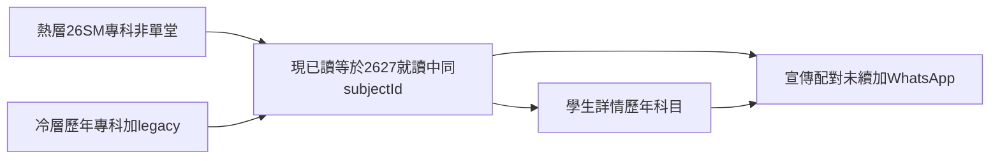

# 歷年科目（銷售回流）

| 欄位 | 值 |
| --- | --- |
| 狀態 | `open` |
| 優先 | 中 |
| 範圍 | 擴充宣傳配對「曾讀本科」口徑（熱／冷）與按學生未續科目；學生詳情唯讀「歷年科目」；預覽深連結 |
| 不含 | 學生清單第二套銷售篩選或未續標籤；功輔／私人配進 2627 專科班；改在讀／活躍／`isCollectableEnrollment`；試堂流失／人數報表／增退紀錄當回流名單；學期末自動催續、預測分、招生廣播 |
| 索引 | [`BACKLOG.md`](../BACKLOG.md)（合入 `main` 後才搬列） |
| 立案 | 2026-09-19 |
| 上次更新 | 2026-09-19：採納顧問評審，收窄口徑後再開工。同日確認四項需求：冷層按需載入、未續無班照列、常設工具、常數滾動清單 |
| 用語 | 本分題以繁體書面語書寫。 |
| 評審 | [`student-enrollment-history-sales-consulting-review.md`](./student-enrollment-history-sales-consulting-review.md)（外部顧問，非定案；本檔已吸收其採納項） |

## 一句

專科未續跟進只走宣傳配對，且「未續」與「現未讀本科」用同一條規則；曾讀分熱／冷，冷層按需載入；學生檔看歷年科目；清單不加第二張銷售名單。

## 開工閘

宣傳配對與學生詳情「報讀班別」已上線，程式上無擋路工程。**口徑未統一前不開工。** 本檔「已拍板產品句」即該統一；實作不得把日曆用的 `isCollectableEnrollment` 套到未續／預覽標籤。

### 資料核對（2026-09-19 production）

| 項目 | 結果 | 對方案的影響 |
| --- | --- | --- |
| `legacy_student_subject_enrollments` | 142 列、102 名學生、10 科 | 2526 科目真源在此表，必須納入「冷」層 |
| 科目分佈 | 數 48、英 30、中 28、生 12、物 8、綜合科學 5、企會財 4、化 3、M2 2、功課輔導（HWK）2 | 專科曾讀**排除 HWK** |
| `student_class_enrollments` 掛 2526 班 | **0 列** | 「2526 正式報讀科目」目前不存在；冷層 2526 只靠 legacy |
| 2627 `classes.course_id` 為空 | 專科 73 班皆有 course | 假陽性風險目前低；程式仍須：`subjectId` 為空**不得**判未續 |
| `class_kind` 異常 | 26SM 有 1 班科目「功課輔導」、代碼 `26SM-HWKP6001-A`、`class_kind=group` | 曾讀本科不得只信 `group`；HWK／HWKP 一律排除 |
| 26SM 報讀形式 | 兩期全報 44、單堂 25、第二期 17、第一期 9、空值 3 | **單堂不算曾讀**（否則約四分之一是噪音） |
| 2627 專科班學年標籤 | **待核**：73 班是否皆有 `academic_years.label = 2627` | 若有空值，該班學生會被誤判未續。私人班排除後，這是**唯一剩餘**的假陽性來源 |

## 產品意圖

銷售要看見兩種人：目標學年完全沒報該專科的舊生，以及目標學年有報其他科、但缺了以前讀過的專科。目標是精準回流，不是再做一張營運報讀表。

完整閉環是 **宣傳配對（行動）＋學生檔歷年科目（語境）**，兩邊對「這科現在有沒有報」必須同一答案。

## 使用時機

**常設工具，全年可用**，不設季節性開關或 campaign 期限。銷售隨時可開宣傳配對找未續對象；熱層常數（`26SM`）只定義「幾新為之熱」，不是使用期限。驗收不假設特定開學期——7–8 月與學期中一樣可用。

## 顧問評審：哪些有用

評審對現況四條缺口的核實全部成立，應保留。以下為採納與不採納。

| 意見 | 採納？ | 理由 |
| --- | --- | --- |
| 未續與「現未讀本科」必須同一 predicate；勿用日曆 `isCollectableEnrollment` | **採納** | 兩套 predicate 會讓兩個畫面講相反的話；7–8 月尤其嚴重（招生旺季名單被清空） |
| 7–8 月日曆把 26SM 算「本學年」 | **採納** | 宣傳配對寫死 2627；未續必須跟同一目標學年常數 |
| 「曾讀」無時間下限會變長而準 | **採納（分層）** | 預設維持高 recency 熱層；歷年＋legacy 放冷層，不作為預設 WhatsApp 名單 |
| 單堂不算曾讀 | **採納** | 26SM 單堂佔約四分之一；誤觸家長代價高 |
| 暑期單期也不算？ | **不採納** | 第一期／第二期是報讀包裝，不是單堂；算曾讀 |
| 私人中文不算已續專科中文 | **採納（防守性）** | 私人班現時 `course_id = null`、本無 `subjectId`，此條暫屬空轉；保留為將來私人班若掛 course 時仍成立 |
| `subjectId` 為空不得判未續 | **採納** | 寧可漏、不可叫同事追已報讀的人 |
| legacy 撐不起「學年、老師、報讀日期齊」 | **採納** | 另定舊紀錄顯示，不造假欄位 |
| `class_kind=group` 不是「非功輔」保證 | **採納** | production 已有 26SM-HWKP 反例 |
| 清單「未續：中文」與現有課程代碼標籤粒度不夾 | **採納** | 清單本期不加未續標籤 |
| 詳情取老師名要 join `teachers` | **採納**（實作註） | 報讀班別現時不顯示老師 |
| 改 `isCollectableEnrollment` | **不採納** | 繳費頁仍用它；另立宣傳／歷年專用 predicate |
| 學期末自動催續、預測分 | **不採納** | 原本就不做 |

## 為何不在學生清單另開工作台

曾考慮在學生管理加「本學年未報讀／有曾讀未續」篩選。與已上線能力重疊，且比宣傳配對更不完整（無配班、無時段衝突、無 WhatsApp）。清單標籤若再用日曆口徑，會與宣傳配對打架。

| 畫面 | 已有 | 本題做法 |
| --- | --- | --- |
| 宣傳配對 `/PromotionMatch` | 按班／按學生；預設「曾讀本科、現未讀本科」；年級＋時段衝突；WhatsApp／海報 | **銷售真源**；統一 predicate；曾讀分熱／冷 |
| 宣傳配對 · 按學生 | 「尚未報讀 2627」「有報讀 2526」「暑期有讀」 | 補**未續科目**（同一 predicate） |
| 學生詳情「報讀班別」 | 本學年／過往學年卡片＋退讀／轉時間 | 營運操作，**不改**（可繼續用日曆分區） |
| 活躍名單 | 說明用於找出未續報 | 只保證人還在名單；**不加**未續標籤 |
| `legacy_student_subject_enrollments` | 只用 `student_id` 標「有讀過 2526」 | 冷層納入 `subject_id`；HWK 排除；不另開 UI |
| 試堂流失、增退紀錄、人數報表、營運總覽退讀 | 轉換／審計／人頭 | **不混入** |

## 已拍板產品句

### 單一口徑（約束 1 與 5）

宣傳配對、學生詳情「歷年科目」上段未續、預覽連出去的語意，**同一條**：

- **現已讀該專科**（即「現未讀本科」的否定）＝ `status = 就讀中` 且學年為宣傳目標年（現為 `2627`）且 `class_kind = group` 且 `subjectId` 相同且非空。
- **未續該專科**＝曾讀該專科（見下）且現在未讀該專科。
- 私人課程、功課輔導班**不**使「該專科已續」為真。
- `subjectId` 為空的報讀：**不得**用來判未續或現已讀（寧可漏）。
- **禁止**把 `isCollectableEnrollment`（日曆＋私人永遠進行中）用於上述判斷。

**私人課程註記**：私人班建立時 `course_id` 與 `academic_year_id` 皆為 `null`（`privateTutoringQueries.ts:435`），故私人班本無 `subjectId`，永遠配不到任何科——「私人不使已續為真」現階段屬**防守性條款**，保留是為將來私人班若掛 course 時仍成立。顧問評審 §3.1 曾以「2526 私人中文」作反例，**該例子不成立**；但同節的 7–8 月日曆問題不受影響，仍為採納項。

### 其餘

1. **專科銷售跟進只走宣傳配對。** 試堂不算。預設篩選維持「曾讀本科、現未讀本科」，且預設只算**熱層**曾讀。
2. **曾讀分兩層**（照宣傳配對既有冷熱分層習慣）：
   - **熱（預設）**：來源學年（現為 `26SM`）專科班正式報讀，就讀中或已退讀；單堂不算；HWK／HWKP 不算。
   - **冷（可選）**：目標學年以外所有學年的專科班正式報讀（同樣排除單堂、HWK／HWKP），**加上** legacy 2526 科目（排除 HWK）。
   - **冷層按需載入**：未切換到冷層前，不得發出全學年報讀或 legacy 科目明細查詢；預設只載熱層。
3. **單堂不算曾讀。** 常規報讀（`enrollment_period` 空）、暑期第一期／第二期／兩期全報算曾讀。**不可**用 `isFullTermEnrollment`（`promotionMatch.ts:34`）判斷——它只認「空或兩期全報」，會誤殺第一期／第二期，須另寫「非單堂」判斷。
4. **按學生視圖列出未續科目**，其下才是可宣傳的 2627 專科班（沿用年級／衝突／WhatsApp）。支援 `?studentId=`，帶入後自動選中該生。切換熱／冷時，未續科目與預設篩選一併切。未續科目若 2627 無可宣傳班別（未開班／年級不符），**仍照列**並標示「2627 暫無班別」，不靜默隱藏；科目名用 `subjects.name_zh`。
5. **功課輔導班與私人課程不配進 2627 專科班。** 目標班維持 `isPromotableTargetGroupClass`（必須 `class_kind = group`）。其歷程只在學生詳情「歷年科目」顯示，**不**標成專科未續。曾讀／已讀判斷的功輔排除一律以**科目**為準（`subjects.code = 'HWK'`）及班別代碼前綴 `HWKP`，**不**依賴 `class_kind`——production 已有 `26SM-HWKP6001-A` 為 `class_kind = group` 的反例。
6. **學生詳情新分頁「歷年科目」**，插在「報讀班別」之後：三條產品線分列。正式報讀列顯示學年、任教老師（`classes.teacher_id`，須 join 老師姓名）、報讀日期、狀態。上段未續（與宣傳配對同一 predicate、預設熱層，可看冷層）、下段目標學年仍報的專科。專科未續提供「去宣傳配對」。
7. **legacy 列另式顯示**：科目名稱＋期間（`period_start`–`period_end`），標「舊紀錄」；不填任教老師、不造學年標籤、不要求報讀日期。不得與正式報讀列共用「欄位齊」驗收。
8. **學生清單不加未續標籤、不加第二套篩選。** 預覽可連到歷年科目或宣傳配對（`?studentId=`）。
9. **不改** `在讀`／`活躍生`、不改 `isCollectableEnrollment`、不改「報讀班別」營運卡片、不新建資料表。

科目對齊用 `subject_id`（中四中文與中五中文同一科）。零報讀的準學生不算回流對象。

**已知取捨**：預設熱層＝預設看不見「只讀 legacy 2526」的 102 名學生，而他們正屬產品意圖第 (a) 類「目標學年完全沒報的舊生」。冷層入口須明顯（例如標示冷層未續人數），否則該群會長期不被看見。若日後發現默認熱層令可用名單太窄，再議是否把 legacy 併入熱層。

## 實作步驟（開工時跟；口徑未寫進本檔前不開工）

1. 另立宣傳／歷年用 predicate（現已讀／曾讀熱／曾讀冷／未續），**不**呼叫 `isCollectableEnrollment`。單測：私人課程不視為專科已續；7–8 月仍以 2627 為「現已讀」；`subjectId` 空不產生未續；單堂不進曾讀；HWKP 班不進曾讀；legacy HWK 不進專科曾讀。
2. 擴充宣傳配對：熱層為預設「曾讀本科」；冷層可選並**按需載入**；legacy 改讀 `student_id, subject_id`（排除 HWK）。按學生列出未續科目，無班者標「2627 暫無班別」。支援 `?studentId=` 並自動選中該生。說明改為「熱層預設＝26SM 曾讀該專科、尚未報讀 2627 該科」。
   - `fetchActiveEnrollmentsForStudents` 現寫死 `.eq("status", "就讀中")`（`promotionMatchQueries.ts:135`）——熱層要收已退讀，必須放寬該 filter。
   - `PromotionEnrollmentRow` 現時不帶 `classKind`；select 雖已取 `class_kind`（`promotionMatchQueries.ts:128`），型別要補。
   - `PromotionMatchView` 現時完全無讀 URL 參數（`PromotionMatchView.tsx`），`?studentId=` 是新接線。
3. 學生詳情新分頁 `enrollmentHistory`／「歷年科目」；正式列 join 老師姓名；legacy 用舊紀錄樣式。預覽只加連結，不加與課程代碼並排的未續標籤。
   - `ENROLLMENT_CLASS_EMBED`（`studentQueries.ts:750`）現有 `teacher_id` 但**無** `teachers(full_name)`，要加 join 才顯示得到任教老師。
   - 新分頁插在「報讀班別」之後，即 `STUDENT_DETAIL_TABS`（`studentDetailTabs.ts:14`）第 3 位，其後分頁與手機分頁列一併後移。
4. 清單不改標籤查詢。

## 每年滾動清單（開學前人手改）

本題不引入日曆推導，目標學年與熱層來源年沿用寫死常數（與宣傳配對既有做法一致）。每年 9 月前須一併改：

| 常數 | 現值 | 位置 | 下年（舉例） |
| --- | --- | --- | --- |
| `PROMOTION_TARGET_YEAR_LABEL` | `2627` | `promotionMatch.ts:8` | `2728` |
| `PROMOTION_SOURCE_YEAR_LABEL`（熱層來源） | `26SM` | `promotionMatch.ts:10` | `27SM` |

冷層定義為「目標學年以外所有學年＋legacy」，故滾動時**無須另改**：舊目標年（`2627`）會自動落入冷層。

另註：按學生既有「有報讀 2526」篩選用 `PROMOTION_PRIOR_YEAR_LABEL = 2526`（`promotionMatch.ts:12`），同樣會逐年過時。本題不改該篩選，但滾動時應一併檢視。

## 不做

- 學生清單第二套銷售篩選或「未續：中文」標籤
- 把功輔／私人配進宣傳配對班別
- 用日曆「本學年」驅動銷售未續
- 季節性開關、campaign 期限，或冷層自動預載
- 用 `isFullTermEnrollment` 判斷曾讀（語意不符，見拍板句 3）
- 學期末自動催續、預測分、招生廣播工作台
- 改人數報表／試堂流失／增退紀錄當回流名單
- 在 feature 分支改 `BACKLOG.md` 索引表

## 驗收

- 宣傳配對按班（熱層預設）：26SM 非單堂曾讀中文、2627 未讀中文仍出現；26SM 只單堂中文者不因單堂進名單。
- 冷層開啟：legacy 中／英／數等同科可出現；legacy 功課輔導（HWK）不出現；26SM-HWKP 功輔班不當作專科曾讀。
- 同一學生：宣傳配對「現未讀本科」與詳情上段未續一致；私人課程中文不消除專科中文未續。
- 7–8 月（日曆為 26SM）模擬：只讀 26SM、未報 2627 者，未續仍在。
- 按學生：可見未續科目；WhatsApp 與配班仍可用。
- 詳情：正式報讀列學年、任教老師、報讀日期；legacy 只顯示科目＋期間＋「舊紀錄」；功輔／私人不與專科混科、不進入專科未續。
- 清單沒有新的主篩選列、沒有未續標籤。
- `subjectId` 為空的報讀不產生未續標或「現未讀」假陽性。
- 冷層按需：未切換冷層前，不應發出全學年報讀或 legacy 科目明細查詢（可觀察網絡請求）。
- 未續科目無對應 2627 班時，顯示「2627 暫無班別」，不靜默隱藏。
- 常設：非開學期（含 7–8 月）一樣開得，無季節性 gate。
- 滾動：把常數改成 `TARGET=2728`、`SOURCE=27SM` 後，`26SM` 自動落冷層、`2627` 亦落冷層，無須另改冷層定義。
- `?studentId=` 由預覽／詳情跳入時，該生自動選中。
- 2627 專科班若 `academic_years.label` 為空，其學生**不得**被判未續（開工前先核 production，見開工閘資料核對）。
